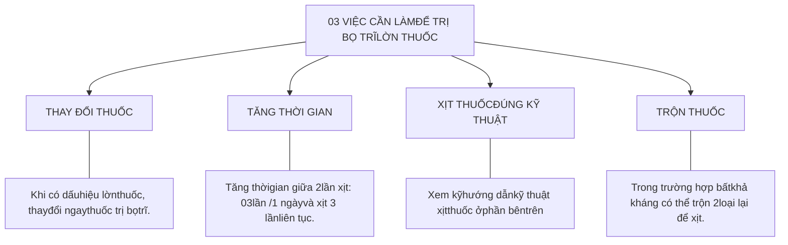
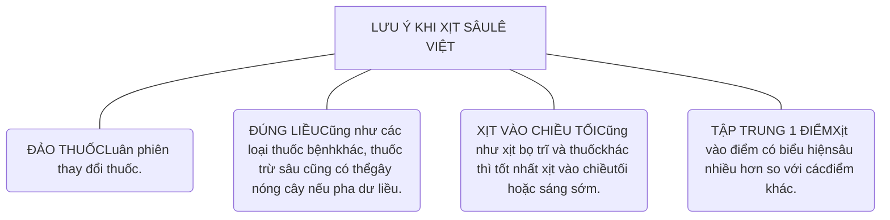
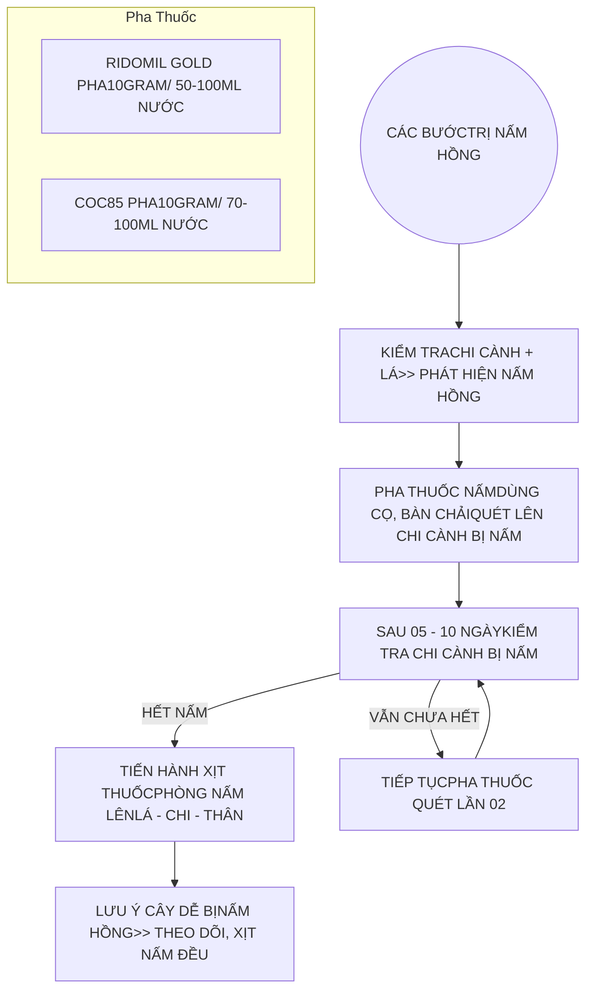
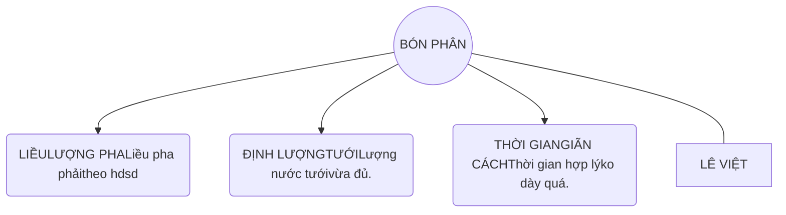
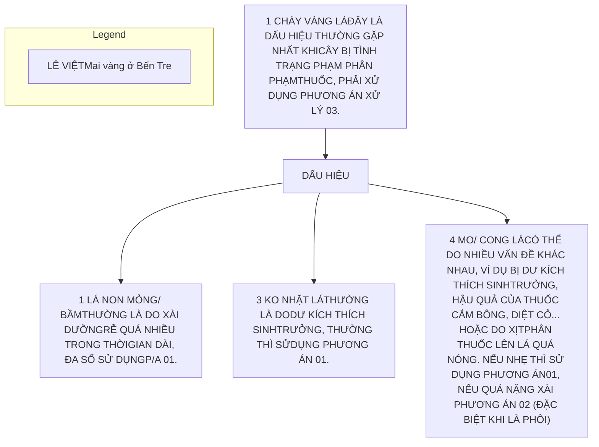

Lời ngỏ

Chào Quý Cô Chú Anh Chị,

Em là **Lê Việt - Mai Vàng & Bonsai**, xin gửi lời chào trân trọng đến Quý Cô Chú Anh Chị từ một nhà vườn chuyên về mai ghép tại Quận 12, Sài Gòn. Với nhiều năm kinh nghiệm trong việc nuôi ghép và chăm sóc cây mai vàng, em hiểu rõ những khó khăn mà người mới chơi mai thường gặp phải.

Việc chăm sóc cây mai vàng không hề đơn giản, đặc biệt đối với những ai mới bắt đầu, khi mà mỗi giai đoạn phát triển của cây mai đều đòi hỏi kinh nghiệm và hướng dẫn từ người đi trước.

Bộ 99 câu hỏi về chăm sóc cây mai vàng này được viết với mục đích giúp Quý Cô Chú Anh Chị giải quyết những thắc mắc và khó khăn trong quá trình chăm sóc cây mai. Đặc biệt là những câu hỏi thường gặp mà người chơi mai mới gặp phải.

Bộ hướng dẫn này sẽ giúp Quý Cô Chú Anh Chị cách tra cứu theo mục lục để tìm kiếm những thông tin cần thiết một cách nhanh chóng. Mỗi câu hỏi đều được sắp xếp theo đề mục rõ ràng và dễ dàng tham khảo. Nếu trong quá trình tìm hiểu, Quý Cô Chú Anh Chị còn bất kỳ thắc mắc nào, đừng ngần ngại liên hệ với em qua Zalo: 0938934323. Em luôn sẵn sàng hỗ trợ Quý Cô Chú Anh Chị trong việc chăm sóc cây mai vàng.

Chúc Quý Cô Chú Anh Chị có những trải nghiệm tuyệt vời và thành công trong việc chăm sóc cây mai vàng của mình!

Trân trọng,

LÊ VIỆT Mai vàng & Bonsai signature

Bộ 99 câu hỏi về Chăm Sóc Mai Vàng

# PHẦN III : XỬ LÝ SÂU - BỆNH

### RỆP SÁP

MỘT SỐ VỊ TRÍ DƯỚI TÁN LÁ, DƯỚI RỄ CÓ CHÙM BỌC, CHỈ DỪA, RƠM... CÓ THỂ XUẤT HIỆN BỌ TRĨ.
KO CẦN XỊT PHÒNG NHƯNG THƯỜNG XUYÊN KIỂM TRA

### BỌ TRĨ

BUỘC XỊT QUANH NĂM 5-10 NGÀY / 1 LẦN.
KHI GẶP BỌ TRĨ KHÁNG THUỐC THÌ XEM PHẦN HƯỚNG DẪN BÊN DƯỚI

### NHỆN ĐỎ

XỊT KHI LÁ GIÀ ĐỂ PHÒNG KHOẢNG ĐẦU THÁNG 5 ÂM LỊCH TRỞ ĐI ĐẾN TẾT. 01 THÁNG / 1 LẦN.

### HỆ RỄ

NẤM RỄ, ÚNG THỐI RỄ, TUYẾN TRÙNG, SÙNG...
THƯỜNG PHẢI PHÒNG KHI CÓ THAY CHẤT TRỒNG, TRƯỚC & TRONG MÙA MƯA

### NẤM LÁ

GỌI CHUNG CỦA MẤY BỆNH RỈ SẮT, THÁN THƯ, ĐỐM LÁ, CHÁY LÁ DO NẤM...
GỌI CHUNG LÀ NẤM TRÊN LÁ. PHÒNG TRỪ KHI BƯỚC VÀO MÙA MƯA, TRONG MÙA MƯA...

Các Bệnh hay gặp

### SÂU

SÂU ĂN LÁ, SÂU ĐỤC THÂN... THƯỜNG ANH EM XỊT TRĨ SẼ KHÔNG CÓ SÂU ĂN LÁ, TUY NHIÊN NẾU CÓ PHẢI CÓ THUỐC ĐẶC TRỊ PHÙ HỢP.
SÂU ĐỤC THÂN LÀ PHÒNG CHỨ KHI THẤY LÀ HƯ CÂY.

### NẤM THÂN

NẤM & BỆNH TRÊN THÂN CÓ THỂ KỂ RA NHƯ SÂU ĐỤC THÂN, RÊU, ĐỊA Y, NẤM HỒNG...
THƯỜNG KHI VÀO MÙA MƯA HOẶC CÂY BỊ TÁN LÁ LỚN LÂU NGÀY

*Cần phải phòng trị trong 1 năm*
*và tên thuốc trị kèm theo*
*chi tiết xem tại các trang bên dưới*

LÊ VIỆT Mai vàng & Bonsai logo

<page_number>2</page_number>

Tài liệu lưu hành nội bộ

<u>Bộ 99 câu hỏi về Chăm Sóc Mai Vàng</u>

Lê Việt Mai vàng & Bonsai logo

**CÂU HỎI SỐ 013**

# Bao lâu thì xịt thuốc BỌ TRĨ một lần?

Để phòng & ngừa bọ trĩ trên cây mai vàng, em xin chia sẻ một số kinh nghiệm như sau: Nếu đã xác định chơi mai vàng, thì việc xịt thuốc bọ trĩ bắt buộc phải biết & cần phải xịt gần như hàng tuần. Bởi vì bọ trĩ là thiên địch của cây mai, và gần như phải xịt thuốc bọ trĩ quanh năm, từ tháng Giêng cho đến tháng 12, Quý Cô Chú Anh Chị cần xịt thuốc phòng ngừa bọ trĩ đều đặn, ngay cả thời điểm sau khi lải lá chơi tết, và cây đã lên nụ xanh thì cũng cần xịt phòng bọ trĩ chích hút nụ xanh.

✓ Về thời gian bao lâu thì xịt thuốc, có hai phương án để áp dụng:

- **Phương án 1:** là xịt theo lịch định kỳ, từ 07 đến 10 ngày một lần. Phương án này thích hợp cho quý cô chú anh chị mới bắt đầu chơi mai, hoặc những ai không có nhiều thời gian theo dõi cây.

- **Phương án 2:** là xịt khi phát hiện có bọ trĩ, hoặc sau khi xịt định kỳ mà cây vẫn bị trĩ nặng thêm. Nếu đã có kinh nghiệm nhìn cây, thấy lá có dấu hiệu bọ trĩ, dù mới xuất hiện ít, thì Quý Cô Chú Anh Chị có thể xịt ngay lúc đó không cần xịt theo lịch. Ngoài ra, nếu đã xịt theo lịch định kỳ mà vẫn tiếp tục phát hiện bọ trĩ, hoặc bọ trĩ phát triển nhiều hơn, thì lúc này chúng ta cần phải tăng liều lượng thuốc và tần suất xịt, chứ không thể chỉ xịt theo lịch thông thường được. Xem hướng dẫn xịt bọ trĩ lờn thuốc ở câu số 4 (trang 07).

Lê Việt Mai vàng & Bonsai 0938.93.43.23

<page_number>3</page_number>

Tài liệu lưu hành nội bộ

Bộ 99 câu hỏi về Chăm Sóc Mai Vàng

Illustration of a bonsai tree with a calendar icon

# XỊT ĐỊNH KỲ

- **XỊT BỌ TRĨ ĐỊNH KỲ 7-15 NGÀY 01 LẦN.**

- **CÓ LỊCH THAY ĐỔI THUỐC TRỊ CỤ THỂ.**
ví dụ 3-4 lần xịt, thay đổi 01 lần.

Phải cố gắng theo dõi xem sau khi xịt có xuất hiện bọ trĩ hay không? nếu có phải tăng liều/ thời gian xịt.

Illustration of spraying a bonsai tree

# XỊT KHI CÓ TRĨ

- **THEO DÕI LÁ, CHỈ XỊT KHI CÓ DẤU HIỆU TRĨ.**

- **CÓ KỸ NĂNG, THỜI GIAN QUAN SÁT VÌ BỌ TRĨ RẤT DỄ BỊ LÂY LAN NHANH.**

Chỉ dành cho anh em có kinh nghiệm, vì chỉ cần 2-3 ngày có thể hư cả bộ lá non.

Illustration of spraying a bonsai tree with a calendar and cross icon

# TRỊ BỌ TRĨ LỜN THUỐC

Thường sẽ phải thay đổi thuốc, tăng liều lượng & thời gian xịt thuốc, xịt thật đẫm thuốc... để trị bọ trĩ hiệu quả.

Xem chi tiết cách trị bọ trĩ lờn thuốc bên dưới.

LÊ VIỆT logo with phone number 0938.93.43.23

<page_number>4</page_number>

Tài liệu lưu hành nội bộ

Bộ 99 câu hỏi về Chăm Sóc Mai Vàng

LÊ VIỆT Mai vàng & Bonsai logo

# CÂU HỎI SỐ 02:

# Một số loại THUỐC TRỊ BỌ TRĨ nhà vườn LÊ VIỆT sử dụng

Đây là danh sách một số loại thuốc bọ trĩ sử dụng hiệu quả mà nhà vườn bên em đã, và đang sử dụng. Thứ tự xếp theo ưu tiên từ trên xuống dưới cho Quý Cô Chú Anh Chị tham khảo.

*Quý Cô Chú Anh Chị nên có 02-03 loại thuốc bọ trĩ trong túi phân thuốc của mình để luân phiên sử dụng tránh trường hợp lờn thuốc.*

<table>
  <thead>
    <tr>
        <th>TT</th>
        <th>TÊN THUỐC</th>
        <th>LIỀU PHA THAM KHẢO</th>
    </tr>
  </thead>
  <tbody>
    <tr>
        <td>01</td>
        <td>BUGATTEE SUPER hoặc BUGATTEE GOLD</td>
        <td>PHÒNG NGỪA: 0.5-0.75ml/ 01 Lít nước. ĐIỀU TRỊ: 01ml/ 01 Lít nước.</td>
    </tr>
    <tr>
        <td>02</td>
        <td>CHLOFERAN 240SC</td>
        <td>PHÒNG NGỪA: 0.5-0.75ml/ 01 Lít nước. ĐIỀU TRỊ: 01ml/ 01 Lít nước.</td>
    </tr>
    <tr>
        <td>03</td>
        <td>MAP JONO 700WP</td>
        <td>PHÒNG NGỪA: 01gram/ 08-10 Lít nước. ĐIỀU TRỊ: 01gram/ 04-05 Lít nước.</td>
    </tr>
    <tr>
        <td>04</td>
        <td>RADIANT 60SC</td>
        <td>ĐIỀU TRỊ: 01 bịch 16ML/ 15-20 Lít nước.</td>
    </tr>
    <tr>
        <td>05</td>
        <td>STUN 20SL</td>
        <td>PHÒNG NGỪA: 0.5-0.75ML/ 01 Lít nước. ĐIỀU TRỊ: 01ML/ 01 Lít nước.</td>
    </tr>
    <tr>
        <td>06</td>
        <td>DIZORIN 35EC</td>
        <td>PHÒNG NGỪA: 1ml/ 01 Lít nước. ĐIỀU TRỊ: 2-3ml/ 01 Lít nước.</td>
    </tr>
    <tr>
        <td>07</td>
        <td>TASIEU 1.9EC hoặc TASIEU 5WG</td>
        <td>DẠNG BỘT 5wg: 01gram/ 2.5 - 05 lít nước. DẠNG NƯỚC 1.9ec: 01 gram/ 02-03 Lít nước</td>
    </tr>
    <tr>
        <td>08</td>
        <td>CONFIDOR</td>
        <td>PHÒNG NGỪA: 0.5-0.75ML/ 01 Lít nước. ĐIỀU TRỊ: 01ML/ 01 Lít nước.</td>
    </tr>
    <tr>
        <td>09</td>
        <td>THUỐC TRỪ SÂU BẠCH HỔ 150SC</td>
        <td>PHÒNG NGỪA: 0.5-0.75ml/ 01 Lít nước. ĐIỀU TRỊ: 01ml/ 01 Lít nước.</td>
    </tr>
  </tbody>
</table>

LÊ VIỆT Mai vàng & Bonsai 0938.93.43.23

<page_number>5</page_number>

Tài liệu lưu hành nội bộ

Bộ 99 câu hỏi về Chăm Sóc Mai Vàng

# CÂU HỎI SỐ 03:

LÊ VIỆT Mai vàng & Bonsai logo **Kỹ thuật XỊT THUỐC BỌ TRĨ hiệu quả!**

**A. PHUN SƯƠNG: DÀNH CHO CÂY MỚI RA CHỒI, TƯỢC & KHI XỊT PHÒNG.**

Illustration of spraying technique from a distance
Spray nozzle diagram
Tree icon

1. XỊT KHOẢNG CÁCH XA.
2. QUƠ VÒI XỊT THUỐC NHANH QUA.
3. LÁ ƯỚT NHẸ.
LÊ VIỆT Mai vàng & Bonsai logo

**B. PHUN ĐẪM: KHI CÂY BỊ NẶNG & CÂY BỊ LỜN THUỐC BỌ TRĨ**

**BƯỚC 01: XỊT MẶT TRÊN LÁ**
Illustration of spraying top of leaves

**BƯỚC 02: XỊT MẶT DƯỚI LÁ**
Illustration of spraying underside of leaves

Tree icon
**BƯỚC 03: XỊT THÂN CÀNH, MẶT CHẬU, CƠ DƯỚI NỀN & CƠ DƯỚI ĐẤT (NẾU CÓ)**

1. XỊT KHOẢNG CÁCH GẦN.
2. QUƠ VÒI XỊT KỸ THUỐC ƯỚT THÂN - CÀNH - LÁ; MẶT CHẬU & CƠ DƯỚI ĐẤT (NẾU CÓ).
3. THÂN - CÀNH - LÁ ƯỚT ĐẪM.
LÊ VIỆT Mai vàng & Bonsai logo

LÊ VIỆT 0938.93.43.23 logo <page_number>6</page_number> Tài liệu lưu hành nội bộ

Bộ 99 câu hỏi về Chăm Sóc Mai Vàng

LÊ VIỆT Mai vàng & Bonsai logo

# CÂU HỎI SỐ 04:

# Cách TRỊ BỌ TRĨ bị LỜN THUỐC (Kháng thuốc)

Khi cây mai bị bọ trĩ quá nặng và thuốc đang sử dụng xịt không hiệu quả, Quý Cô Chú Anh Chị có thể áp dụng quy trình dưới đây để xử lý bọ trĩ triệt để.

## 1. THAY ĐỔI THUỐC XỊT & XỊT THUỐC BỌ TRĨ ĐÚNG CÁCH:

- Đầu tiên, thay đổi loại thuốc xịt & tiến hành xịt thuốc bọ trĩ theo **hướng dẫn sử dụng của mỗi loại thuốc đã nêu** ở câu số 02 (trang 05). *Để tránh trường hợp cây mai bị lờn thuốc Quý Cô Chú Anh Chị nên có 2 loại thuốc bọ trĩ trở lên trong túi thuốc của mình.*

- Nếu có nhiều cây mai, hoặc lập vườn, thì có nhiều loại thuốc bọ trĩ để xoay vòng xịt là bắt buộc. Xem kỹ cách xịt đẫm thuốc ở câu số 3 (trang 06).

## 2. TĂNG TẦN SUẤT XỊT THUỐC:

- Trong phương án xịt phòng ngừa bọ trĩ hàng tuần, và khi cây chưa bị bọ trĩ nặng, thì tần suất xịt thuốc bọ trĩ là từ 7 đến 10 ngày một lần.

- Tuy nhiên, đối với cây mai bị bọ trĩ nặng, cần tăng cường xịt thuốc **MỖI 3 NGÀY MỘT LẦN**. Cần **XỊT LIÊN TỤC TRONG 03 LẦN LIÊN TIẾP** và đảm bảo thuốc xịt ướt đẫm toàn bộ cây.

- Mỗi lần xịt, có thể thay đổi loại thuốc để đảm bảo hiệu quả diệt bọ trĩ.

## 3. KẾT HỢP THUỐC ĐỂ TĂNG HIỆU QUẢ

- Trong trường hợp không thể thay đổi thuốc bọ trĩ, có thể trộn hai loại thuốc khác nhau chung 01 bình thuốc để tăng cường khả năng diệt bọ trĩ thêm một bậc mới.

LÊ VIỆT 0938.93.43.23 logo

<page_number>7</page_number> Tài liệu lưu hành nội bộ

<u>Bộ 99 câu hỏi về Chăm Sóc Mai Vàng</u>

- Cách này giúp tăng hiệu quả trị bọ trĩ và tránh tình trạng bọ trĩ kháng thuốc. Tuy nhiên, xịt kiểu kết hợp 02 loại thuốc lại sẽ dễ dẫn đến nóng cây, Quý Cô Chú Anh Chị cần lưu ý **khi bất khả kháng** rồi mới nên sử dụng cách làm này.

Lê Việt Mai Vàng Bonsai logo

<page_number>8</page_number>

Tài liệu lưu hành nội bộ

Bộ 99 câu hỏi về Chăm Sóc Mai Vàng

### CÂU HỎI SỐ 05:

LÊ VIỆT Mai vàng & Bonsai logo

# Lưu ý khi XỊT THUỐC TRĨ vào MÙA NẮNG và MÙA MƯA

## 1. MÙA NẮNG

*   **Thời gian xịt:** Nên xịt vào chiều tối (từ khoảng 05–09 giờ tối). Đây là lúc không khí đã mát hơn, trời không còn nắng, thuốc sẽ có thời gian bám dính trên lá và phát huy hiệu quả suốt đêm đến rạng sáng.

*   **Không nên xịt sáng sớm:** Vì lúc này lá thường có sương, thuốc khó bám dính, hiệu quả thấp.

*   **Không nên xịt buổi trưa:** Nắng gắt dễ làm lá non bị cháy, giảm hiệu quả và gây hại cho cây.

## 2. MÙA MƯA

*   Mưa thường rơi vào buổi chiều tối — khung giờ lý tưởng để xịt thuốc. Vì vậy cần điều chỉnh cách xịt:

    - **Xịt buổi sáng sớm:** Nếu lá còn ướt do mưa đêm, nên tăng nồng độ thuốc đậm hơn một chút để bù lại (thêm từ 20-30% liều lượng so với bình thường) hoặc sử dụng chất bám dính thuốc trừ sâu.

    - **Xịt giữa buổi sáng (09–10 giờ) hoặc đầu giờ chiều (03–04 giờ).** Nên xịt nhẹ, pha loãng còn 6-70% liều lượng & xịt sương, không quá đẫm).

    - Nếu buộc phải xịt đẫm, cần chấp nhận rủi ro lá có thể bị "nóng". Tuy nhiên, việc diệt bọ trĩ quan trọng hơn, vì bọ trĩ gây hại lá rất nhanh.

***Tóm lại:** Ưu tiên xịt khi trời mát, chọn thời điểm phù hợp với bản thân. Nếu bắt buộc phải xịt ngoài khung giờ đẹp, nên giảm nồng độ và chấp nhận một số rủi ro nhẹ để đảm bảo hiệu quả trị bọ trĩ.*

LÊ VIỆT 0938.93.43.23

<page_number>9</page_number>

Tài liệu lưu hành nội bộ

Bộ 99 câu hỏi về Chăm Sóc Mai Vàng

LÊ VIỆT Mai vàng & Bonsai logo

## CÂU HỎI SỐ 06:

# Cần phải XỊT PHÒNG/ TRỊ BỌ TRĨ Vào KHOẢNG THỜI GIAN nào?

Nếu chơi mai mà không biết cách phòng trừ bọ trĩ thì cây mai khó mà phát triển tốt. Bọ trĩ gây hại ở nhiều giai đoạn, nên việc xịt phòng và diệt trừ gần như quanh năm. Đặc biệt, đây là một số giai đoạn cần lưu ý vì thường mọi người sẽ quên:

## 1. KHI MỚI CÂY RA MẦM, CHỒI, LÁ NON

* Ngay khi cây mới ghép, mới cắt đôn bắt đầu ra mầm, chồi, lá non, phải xịt phòng ngừa bọ trĩ ngay lập tức. Sau khi chơi tết, nếu không cắt đôn cây liền mà nuôi xanh lá rồi mới cắt đôn, thì cũng cần xịt bọ trĩ ngay.

* Nếu không xịt kịp thời, bọ trĩ sẽ chích hút làm lá xoăn, biến dạng, ảnh hưởng trực tiếp đến sức sinh trưởng của cây.

* Thời điểm cây ra lá non nên xịt đều, lịch xịt ngắn để phòng ngừa lá non bị bọ trĩ chích hút làm hư lá.

## 2. SAU KHI LẶT LÁ:

* Đây là giai đoạn cực kỳ quan trọng mà dễ bị bỏ quên. Lúc này trên cây chỉ còn nút nụ, bọ trĩ thường chích hút ngay tại thời điểm nút lột vỏ trấu bung nụ xanh. Khi nụ chuyển sang màu xanh, hoặc nụ xanh chuẩn bị bung thành bông thì bọ trĩ sẽ gây hư nụ, bông → dẫn đến bông nhỏ, bông dị dạng hoặc nở không đạt chất lượng.

* Trước khi đưa cây vào nhà (thời điểm cận nở), phải xịt phòng bọ trĩ để đảm bảo nụ và bông không bị hư.

Lê Việt logo with phone number 0938.93.43.23

<page_number>10</page_number>

Tài liệu lưu hành nội bộ

Bộ 99 câu hỏi về Chăm Sóc Mai Vàng

LÊ VIỆT Mai vàng & Bonsai logo

# CÂU HỎI SỐ 07:

# NHỆN ĐỎ : PHÒNG NGỪA như thế nào ?

## 1. THỜI ĐIỂM CẦN CHÚ Ý:

* Khi cây mai có lá non thì chú ý bọ trĩ, khi cây bắt đầu có lá già thì là nhện đỏ. Do đó, khoảng từ tháng 04 âm lịch đến gần Tết: đây là giai đoạn cần đặc biệt chú ý xịt phòng nhện đỏ.

## 2. TÁC HẠI CỦA NHỆN ĐỎ:

* Nhện đỏ chích hút trên lá già, làm mất diệp lục, giảm khả năng quang hợp.

* Lá bị lão hóa nhanh hơn bình thường → các nút trên cây phát triển nhanh, mau mập nhưng không đủ dinh dưỡng. Hoặc lá bị già sớm, rụng sớm hơn so với bình thường, dẫn đến tình trạng nở sớm.

* Hệ quả: khi nút bung ra thành nụ xanh thì nụ nhỏ, bông nhỏ, nở xấu.

## 3. PHÒNG NGỪA NHỆN ĐỎ:

* Bắt đầu từ tháng 04 âm lịch trở đi, nên xịt phòng định kỳ khoảng 01 tháng/ 01 lần bằng các loại thuốc đặc trị nhện đỏ.

* Hoặc nếu phát hiện dấu hiệu nhện đỏ trên lá thì phải xịt thuốc ngay, tránh để lây lan. Vì NHỆN ĐỎ lây lan rất nhanh, chỉ trong 01 tuần có thể làm hư hại toàn bộ lá già.

## 4. KHẢ NĂNG PHỤC HỒI LÁ SAU BỊ BỊ NHỆN ĐỎ:

LÊ VIỆT 0938.93.43.23 logo

<page_number>11</page_number>

Tài liệu lưu hành nội bộ

<u>Bộ 99 câu hỏi về Chăm Sóc Mai Vàng</u>

*   **Khác với bọ trĩ:** lá non bị bọ trĩ chích vẫn có thể tiếp tục phát triển, dù hơi dị dạng. Nhưng **lá bị nhện đỏ thì không thể khắc phục** – chỉ còn chờ thay lá mới. $\rightarrow$ Do đó, phòng ngừa nhện đỏ là ưu tiên số một, vì khi đã bệnh rồi lá không thể phục hồi xanh tốt trở lại.

## 5. LƯU Ý ĐẶC BIỆT:

*   Có một số “mẹo” của người chơi lâu năm: cố tình để nhện đỏ ở giai đoạn tháng 8–10 âm lịch nhằm thúc nút phát triển nhanh, và mau già.

*   Tuy nhiên:

    - Đây chỉ phù hợp cho người chơi có kinh nghiệm. Người mới chơi không nên áp dụng.

    - Nếu để nhện đỏ xuất hiện sớm (tháng 5–7 âm lịch), cây dễ bị rụng lá & già lá sớm, nụ phát triển không ổn định.

# KIỂM SOÁT NÚT NỤ NỞ SỚM & ĐẠT CHẤT LƯỢNG

Lá là phần quan trọng nhất để kiểm soát chất lượng nút nụ, chất lượng bông nở vào dịp Tết. Thường kiểm soát tốt lá xanh thì sẽ dễ dàng hạn chế nở sớm, nếu biết cách làm lá già nhanh đúng thời điểm thì nút nụ đạt chất lượng tốt nhất.

# NHỆN ĐỎ có làm SUY CÂY hay không?

Nếu cây đang sung khỏe, không bệnh tật thì thường sẽ không ảnh hưởng nhiều đến sức khỏe của cây, sau khi xịt xong thuốc trị thì cây sẽ trở lại bình thường. Tuy nhiên, nếu cây đang có vấn đề khác, tổng hợp luôn NHỆN ĐỎ thì có thể làm suy cây rất nhanh.

Mai Vàng Bonsai Lê Việt logo

<page_number>12</page_number>

Tài liệu lưu hành nội bộ

Bộ 99 câu hỏi về Chăm Sóc Mai Vàng

Lê Việt Mai vàng & Bonsai logo

## CÂU HỎI SỐ 08:

# Thuốc Trị NHỆN ĐỎ & cách xịt thuốc HIỆU QUẢ.

<table>
  <thead>
    <tr>
        <th>TT</th>
        <th>TÊN THUỐC</th>
        <th>LIỀU PHA THAM KHẢO</th>
    </tr>
  </thead>
  <tbody>
    <tr>
        <td>01</td>
        <td>ORTUS 5SC</td>
        <td>ĐIỀU TRỊ: 01ml/ 1 Lít</td>
    </tr>
    <tr>
        <td>02</td>
        <td>PESIEU 500SC</td>
        <td>ĐIỀU TRỊ: 1.0 - 1.5 ml/lít nước.</td>
    </tr>
    <tr>
        <td>03</td>
        <td>NILMITE 550SC</td>
        <td>ĐIỀU TRỊ: 01ml/ 3 Lít nước. Dùng phòng tốt hơn trị.</td>
    </tr>
  </tbody>
</table>

## LƯU Ý KHI XỊT NHỆN ĐỎ PHẢI XỊT KỸ THEO PHƯƠNG PHÁP DƯỚI ĐÂY

Illustration of spraying the top of the leaves

**BƯỚC 01: XỊT MẶT TRÊN LÁ**

Illustration of spraying the underside of the leaves

**BƯỚC 02: XỊT MẶT DƯỚI LÁ**

Illustration of spraying the trunk and branches

**BƯỚC 03: XỊT THÂN CÀNH, MẶT CHẬU, CƠ DƯỚI NỀN & CƠ DƯỚI ĐẤT (NẾU CÓ)**

1. XỊT KHOẢNG CÁCH GẦN.

2. QUƠ VÒI XỊT KỸ THUỐC ƯỚT THÂN - CÀNH - LÁ; MẶT CHẬU & CƠ DƯỚI ĐẤT (NẾU CÓ).

3. THÂN - CÀNH - LÁ ƯỚT ĐẪM.

Lê Việt Mai vàng & Bonsai logo with phone number 0938.93.43.23

<page_number>13</page_number>

Tài liệu lưu hành nội bộ

Bộ 99 câu hỏi về Chăm Sóc Mai Vàng

Lê Việt Mai vàng & Bonsai logo

# CÂU HỎI SỐ 09:

# RỆP SÁP : PHÒNG NGỪA như thế nào ?

Rệp sáp chích hút làm cây suy yếu, lá vàng, bông nhỏ, cây càng ngày càng yếu. Nếu không có phương án diệt rệp sáp kịp thời, cây sẽ suy dần theo thời gian.

- **Vị trí thường thấy:** Mặt dưới lá, Cuống lá, kẽ lá, kẽ nhánh, nơi khuất ánh sáng ở trên cành, thân cây. Lấy tay chà lên vị trí nghi bệnh, nếu có dịch nhầy là rệp.

Đặc biệt: **bộ rễ** – rệp sáp thường gặp nhiều ở cây phôi, cây đã lâu không xử lý chất trồng. Khi phá bầu, thay chậu cần quan sát kỹ rễ. Nếu có rệp sáp phải xử lý ngay bằng thuốc đặc trị.

## 2. LIÊN QUAN ĐẾN KIẾN & NẤM BỒ HÓNG

Kiến **“nuôi”** rệp sáp: kiến thích dịch ngọt do rệp tiết ra $\rightarrow$ bảo vệ và tha rệp từ nơi khác lên cây mai.

* **Vì vậy:**

- Nếu chỉ diệt rệp mà không diệt kiến $\rightarrow$ rệp sẽ tái xuất hiện nhanh chóng.

- Khi thấy có kiến nhiều quanh gốc, hoặc trong vườn, phải xử lý đồng thời bằng thuốc trừ kiến hoặc xử lý trực tiếp bằng cách xịt thuốc sâu/ trị trực tiếp vào ổ kiến, hoặc tưới dưới chất trồng.

Nếu xử lý thuốc trị rệp sáp sớm, nấm bồ hóng sẽ không xuất hiện, tránh trường hợp **XUẤT HIỆN** nấm bồ hóng sẽ xử lý rất phiền phức.

## 3. CÁCH PHÒNG RỆP SÁP HIỆU QUẢ:

LÊ VIỆT 0938.93.43.23

<page_number>14</page_number>

Tài liệu lưu hành nội bộ

<u>Bộ 99 câu hỏi về Chăm Sóc Mai Vàng</u>

Không cần xịt phòng rệp sáp định kỳ, thay vào đó:

* Theo dõi thường xuyên những vị trí khuất nắng, kẽ lá, kẽ nhánh, bộ rễ. Khi phát hiện có rệp sáp $\rightarrow$ xịt thuốc ngay. Đối với phôi mai bứng từ đất lên, khi về cần kiểm tra kỹ bộ rễ & tàng nhánh lá.

* Kết hợp phòng kiến: xử lý ổ kiến quanh vườn nhà, gốc mai, trong chất trồng. Phòng ngừa nấm bồ hóng: tập trung diệt rệp sáp từ sớm để tránh hình thành nấm.

# MỘT SỐ THUỐC ĐIỀU TRỊ RỆP SÁP HIỆU QUẢ:

**Lưu ý:** Rệp sáp dễ tái đi tái lại trong môi trường ẩm ướt, khu vực sân rộng nhiều cây, ổ kiến nhiều... do đó cần tạo môi trường thông thoáng, nắng đủ và diệt kiến trong vườn.

<table>
  <thead>
    <tr>
        <th>TT</th>
        <th>TÊN THUỐC</th>
        <th>LIỀU PHA THAM KHẢO</th>
    </tr>
  </thead>
  <tbody>
    <tr>
        <td>01</td>
        <td>MARSHAL 200SC</td>
        <td>ĐIỀU TRỊ: 01ml-02ml/ 01 lít nước.</td>
    </tr>
    <tr>
        <td>02</td>
        <td>MOVENTO 150OD</td>
        <td>ĐIỀU TRỊ: 1.0 ml/ 01 lít nước.</td>
    </tr>
    <tr>
        <td>03</td>
        <td>SHEBA 50EW</td>
        <td>ĐIỀU TRỊ: 02-03ml/ 01 lít nước.</td>
    </tr>
  </tbody>
</table>
<table>
  <thead>
    <tr>
        <th>TT</th>
        <th>TÊN</th>
        <th>THAM KHẢO</th>
    </tr>
  </thead>
  <tbody>
    <tr>
        <td>01</td>
        <td>DUNG DỊCH TỎI, ỚT, GỪNG</td>
        <td>\* <strong>Công thức:</strong> Giã nát 1 củ tỏi, 1 trái ớt (nếu có ớt cay càng tốt), một miếng gừng nhỏ. Ngâm hỗn hợp này vào 1 lít nước qua đêm (hoặc đun sôi để nguội). Lọc bỏ bã, pha thêm 1-2 muỗng cà phê nước rửa chén. \* <strong>Cách làm:</strong> Xịt lên cây. Mùi hăng của tỏi, ớt, gừng sẽ xua đuổi rệp sáp. Xịt định kỳ 3-5 ngày/lần.</td>
    </tr>
    <tr>
        <td>02</td>
        <td>DUNG DỊCH NEEM (NEEM OIL)</td>
        <td>Pha 5-10ml dầu Neem nguyên chất với 1 lít nước ấm và 1-2ml nước rửa chén hữu cơ.</td>
    </tr>
  </tbody>
</table>

## PHƯƠNG PHÁP HỮU CƠ

LÊ VIỆT logo with phone number 0938.93.43.23

<page_number>15</page_number>
Tài liệu lưu hành nội bộ

Bộ 99 câu hỏi về Chăm Sóc Mai Vàng

LÊ VIỆT Mai vàng & Bonsai logo

# CÂU HỎI SỐ 10:

# SÂU ĐỤC THÂN : PHÒNG NGỪA như thế nào ?

Sâu đục thân ăn từ bên trong thân, cành, nhánh → khi phát hiện thì phần gỗ đã bị bọng, cây yếu nhanh, dễ gãy cành nhánh. Do đó, phòng nó ngay từ ban đầu để tránh hậu quả tốt hơn việc phát hiện rồi mới sử dụng thuốc.

## 1. GIẢI PHÁP PHÒNG NGỪA

**Rải thuốc Vifu Super (hoặc Furadan, Vibasu) định kỳ 02-03 tháng /01 lần:**

* Có khả năng lưu dẫn, nội hấp. Thuốc được rễ hấp thu → đi vào thân → tiêu diệt sâu ngay từ giai đoạn sớm.

* Nhờ vậy, hạn chế tình trạng sâu kịp đục rỗng thân → phòng ngừa tốt.

*Hoặc sử dụng các loại thuốc sau: Virtako 40WG, Shieldkill 200SC, Radiant 60SC, Vithadan 95WP, Incipio 200SC... để xịt ngừa định kỳ.*

## 2. CÂY MAI NÀO DỄ BỊ SÂU ĐỤC THÂN?

Mai Vàng, mai Tứ Quý đều có thể bị sâu đục thân. Trong đó, mai vàng trồng ngoài đất thường dễ bị hơn, nhất là ở vườn ít chăm sóc, không thường xuyên xịt thuốc.

Các cây phôi mai mua về cũng cần được rải vifu super ngay khi vào chậu, vì nếu có sâu ẩn trong thân thì chúng sẽ bị diệt sớm, không kịp gây hại thêm cho cây.

Ngoài ra sử dụng Vifu Super còn có khả năng phòng ngừa rệp sáp, tuyến trùng, sùng, hoặc các loại sâu đất khác. Cách sử dụng tương đối dễ, rải 20-50gram trên mặt chậu 60cm lọt lòng, định kỳ 02-03 tháng / 01 lần.

LÊ VIỆT Mai vàng & Bonsai 0938.93.43.23 logo

<page_number>16</page_number>

Tài liệu lưu hành nội bộ

Bộ 99 câu hỏi về Chăm Sóc Mai Vàng

LÊ VIỆT Mai vàng & Bonsai logo

# CÂU HỎI SỐ 11:
# Các loại SÂU trên CÂY MAI và THUỐC TRỪ SÂU hiệu quả

Vì sao cần tách riêng sâu hại trên cây mai thành 1 chủ đề dù đã có nói rõ về bọ trĩ, sâu đục thân...:

## 1. HIỂU ĐÚNG VỀ SÂU:

Nhiều người mới chơi thường nghĩ sâu chỉ ăn lá non hoặc chỉ xuất hiện khi cây có lá non. Thực tế thì sâu có thể ăn lá, nút và cả nụ xanh của cây mai:

- Khi cây ra lá non → sâu xuất hiện.

- Khi cây ra nút → sâu vẫn có.

- Khi nút bung vỏ trấu, chuyển sang nụ xanh → sâu cũng có thể tấn công.

## 2. XỊT PHÒNG BỌ TRĨ CÓ HẾT SÂU HAY KHÔNG?

- Khi cây được xịt phòng bọ trĩ thường xuyên và đúng cách, khả năng xuất hiện sâu cũng giảm đáng kể.

- Tuy nhiên, giống như bọ trĩ, thì sâu cũng có khả năng kháng lại thuốc. Vì vậy, nếu chỉ dùng thuốc phòng bọ trĩ thì chưa đủ để kiểm soát sâu trong mọi giai đoạn phát triển của cây mai.

## 3. CÁCH XỬ LÝ SÂU HẠI

Không cần xịt thuốc phòng sâu định kỳ - liên tục, chỉ cần kiểm tra thường xuyên:

- Mỗi ngày hoặc 2–3 ngày quan sát lá, nụ, cành. Nếu phát hiện có sâu → tiến hành xịt ngay thuốc trừ sâu đặc trị.

LÊ VIỆT 0938.93.43.23 logo

<page_number>17</page_number>

Tài liệu lưu hành nội bộ

Bộ 99 câu hỏi về Chăm Sóc Mai Vàng

**Lý do:** thuốc trừ bọ trĩ không còn hiệu quả khi sâu đã kháng thuốc $\rightarrow$ cần thuốc chuyên dụng mới diệt được.

## MỘT SỐ LOẠI THUỐC PHÒNG SÂU HIỆU QUẢ:

<table>
  <thead>
    <tr>
        <th>TT</th>
        <th>TÊN THUỐC</th>
        <th>LIỀU PHA THAM KHẢO</th>
    </tr>
  </thead>
  <tbody>
    <tr>
        <td>01</td>
        <td>KARATE 2.5EC</td>
        <td>ĐIỀU TRỊ: 01ml-1.5ml/ 01 lít nước.</td>
    </tr>
    <tr>
        <td>02</td>
        <td>DELFIN 32WG</td>
        <td>ĐIỀU TRỊ: 1.0 gram/ 01 lít nước.</td>
    </tr>
    <tr>
        <td>03</td>
        <td>FASTAC 5EC</td>
        <td>ĐIỀU TRỊ: 01ml/ 01 lít nước.</td>
    </tr>
    <tr>
        <td>04</td>
        <td>SUMI-ALPHA 5EC</td>
        <td>ĐIỀU TRỊ: 03ml/ 01 lít nước.</td>
    </tr>
  </tbody>
</table>

## CÁC LƯU Ý KHI XỊT THUỐC SÂU:

Lê Việt logo with phone number 0938.93.43.23

<page_number>18</page_number>

Tài liệu lưu hành nội bộ

Bộ 99 câu hỏi về Chăm Sóc Mai Vàng

Lê Việt Mai vàng & Bonsai logo

# CÂU HỎI SỐ 12:

# Một số loại BỆNH NẤM TRÊN LÁ của CÂY MAI

## 1. ĐẶC ĐIỂM CHUNG

Các bệnh nấm và vi khuẩn xuất hiện trên lá thường được em gọi chung là bệnh nấm lá để dễ chia sẻ và tư vấn cho Quý Cô Chú Anh Chị.

Một số bệnh phổ biến:

- Đốm lá.

- Thán thư.

- Rỉ sắt.

- Nấm Hồng.

- Cháy lá do vi khuẩn.

Các bệnh được liệt kê bên trên nói riêng, và các bệnh trên lá đều có khả năng lây lan rất nhanh, đặc biệt trong mùa mưa, độ ẩm cao.

## 2. VÌ SAO CÓ CÂY MAI LẠI BỊ NẤM NHIỀU HƠN CÁC CÂY KHÁC

- **Do Thời tiết**: khu vực có mưa nhiều, độ ẩm cao.

- **Do Môi trường**: Cây trồng chỗ thiếu nắng, hoặc không gian chật hẹp, ít gió, không thông thoáng.

- **Do Cây Giống/ Giống ghép**: Một số giống mai sẽ có sức đề kháng không cao dễ bị bệnh hơn so với các giống khác.

## 3. SO SÁNH BỆNH NẤM LÁ VỚI NẤM Ở THÂN VÀ RỄ:

<page_number>
19
</page_number>

Lê Việt Mai vàng & Bonsai logo with phone number 0938.93.43.23

Tài liệu lưu hành nội bộ

*Bộ 99 câu hỏi về Chăm Sóc Mai Vàng*

Bệnh nấm lá có cơ chế phát sinh tương tự như nấm ở thân và hệ rễ, đa số đều do môi trường ẩm thấp, và do giống mai đề kháng kém.

Tuy nhiên, cách điều trị có sự khác biệt, cần phân biệt để ưu tiên xử lý đúng vị trí:

- *Nấm lá* → ưu tiên xịt trực tiếp trên lá.

- *Nấm thân, nấm rễ* → có cách xử lý riêng, dùng thuốc phù hợp và kỹ thuật khác. Xem chi tiết ở 02 câu hỏi tiếp theo bên dưới.

## 4. BIỆN PHÁP PHÒNG NGỪA

- **Phòng bệnh quan trọng hơn trị bệnh**: có biện pháp xịt nấm thường xuyên (**xem trang 29 có lịch xịt định kỳ trị nấm cho cây mai**).

- Người trồng nên có ít nhất 2 loại thuốc nấm khác nhau để luân phiên sử dụng, tránh hiện tượng kháng thuốc. Bên dưới em có hướng dẫn 03 loại thuốc nấm cụ thể cho cô chú anh chị sử dụng.

## 5. Lưu ý quan trọng

Quan sát kỹ hình ảnh minh họa bệnh lý (hoặc gửi hình ảnh thực tế trên cây cho em qua số Zalo 0938934323) để phân biệt bệnh cho chính xác.

> ### BỆNH THỰC TẾ TRÊN CÂY CỦA NGƯỜI MỚI
> Biểu hiện bệnh trên cây của người mới chơi mai đa phần sẽ cộng chung vài bệnh đi cùng nhau (do chưa có kinh nghiệm phòng bệnh), do đó khi xem xét cần kinh nghiệm thực tế hơn là qua hình ảnh của một bệnh đơn thuần.

LÊ VIỆT 0938.93.43.23 logo

<page_number>20</page_number>

Tài liệu lưu hành nội bộ

Bộ 99 câu hỏi về Chăm Sóc Mai Vàng

Lê Việt Mai vàng & Bonsai logo

# CÂU HỎI SỐ 13:

# Một số loại BỆNH NẤM TRÊN THÂN của CÂY MAI

## 1. CÁC LOẠI THƯỜNG GẶP:

* **Nấm hồng**

    * Nguy hiểm nhất, lây lan nhanh, làm cành – nhánh – lá mất diệp lục và khô chết.

* **Nấm đồng tiền (địa y)**

    * Xuất hiện thành từng mảng tròn như đồng xu trên thân, thường gặp ở nơi ẩm thấp.

* **Rêu xanh**

    * Thường bám trên vỏ thân cây, phát triển mạnh ở nơi ẩm ướt, thiếu ánh sáng. Không gây hại trực tiếp nhiều cho cây mai nhưng làm xấu dáng, che phủ vỏ cây và tạo điều kiện cho nấm khác phát triển.

* **Nấm bồ hóng**

    * Liên quan đến rệp sáp, rệp mềm $\rightarrow$ tiết dịch ngọt tạo điều kiện cho nấm phát triển.

    * Gây ra lớp đen phủ trên thân, ảnh hưởng đến quang hợp và làm cây yếu.

## 2. ĐIỀU KIỆN PHÁT SINH

* Thời tiết ẩm thấp, mưa nhiều.

* Cây tàn lá quá kín, không gian thiếu thoáng khí.

Lê Việt Mai vàng & Bonsai logo with phone number 0938.93.43.23

<page_number>
21
</page_number>

Tài liệu lưu hành nội bộ

<u>Bộ 99 câu hỏi về Chăm Sóc Mai Vàng</u>

* Nhiệt độ thấp và độ ẩm cao → là điều kiện lý tưởng cho nấm phát triển trên thân.

# 3. BIỆN PHÁP PHÒNG NGỪA

* **Xịt hoặc quét thuốc nấm định kỳ:**

    - Có thể dùng các loại thuốc nấm sử dụng cho lá để xịt lên thân – cành.

    - Ngoài ra, nên pha loãng thuốc nấm rồi quét trực tiếp lên thân vào các thời điểm:

        - Sau Tết.

        - Bắt đầu mùa mưa.

        - Cuối mùa mưa. icon

        → Trung bình 3 lần/năm để giảm nguy cơ nhiễm bệnh.

* **Tỉa cành, rong lá cho cây thông thoáng**, giảm độ ẩm trong tán. Nuôi cây ở khu vực thoáng gió, nắng nhiều.

### NẤM HỒNG là NGUY HIỂM NHẤT

Trong các loại nấm trên thân mai vàng, nấm hồng là nguy hiểm nhất, cần theo dõi và ưu tiên xử lý sớm khi phát hiện. Xem Hướng dẫn trị nấm hồng cụ thể ở câu số 18 (trang 33)

### NẤM trên THÂN CÂY gây HƯ DA THÂN

Các loại khác như nấm đồng tiền, bồ hóng, rêu xanh... tuy ít nguy hiểm hơn nhưng cũng cần kiểm soát để không tạo điều kiện cho bệnh nặng hơn.ôi và ưu tiên xử lý sớm khi phát hiện.

LÊ VIỆT logo

<page_number>22</page_number>

Tài liệu lưu hành nội bộ

Bộ 99 câu hỏi về Chăm Sóc Mai Vàng

LÊ VIỆT Mai vàng & Bonsai logo

# CÂU HỎI SỐ 14:

# Một số loại BỆNH NẤM TRÊN RỄ của CÂY MAI

Trong môi trường đất/ chất trồng/chậu bị ứ/ úng nước, thoát nước kém, hoặc trong mùa mưa kéo dài, độ ẩm cao, hoặc do chất trồng trong chậu bị lèn chặt qua thời gian nằm chậu lâu năm, dẫn đến thiếu oxy rất dễ gây ra bệnh nấm rễ. Thường các nguyên nhân gây ra suy cây thì do nấm rễ là xảy ra nhiều nhất.

Các loại nấm dưới rễ rất nhiều loại, ví dụ như: Phytophthora (gây thúi rễ, xì mủ gốc), Pythium (gây thúi rễ con), Fusarium (gây héo rũ, nghẽn mạch dẫn), Rhizoctonia (gây thúi gốc sát mặt đất)... nhưng do không có biểu hiện rõ ràng và không có tên tiếng Việt nên khó phân biệt. Khi xuất hiện, bệnh tiến triển nhanh và khó phát hiện bằng mắt thường cho đến khi cây đã suy yếu. Do đó trong phần này chỉ bàn đến việc phòng & trị, các bệnh gọi chung là nấm hệ rễ.

## 1. TÁC HẠI CỦA NẤM RỄ:

- Thúi rễ: rễ non, rễ cám bị hư → mất khả năng hút dinh dưỡng.

- Xì mủ gốc: phần rễ – gốc chảy dịch trắng, vỏ cây nứt, thúi nhũn.

- Thúi sát mặt đất: phần da thân gần gốc bị thúi nhũn, lõi gỗ hư, rỗng ruột.

- Héo chi cành: phần trên lá, cành héo dần dù đất vẫn ẩm.

- Khi biểu hiện ra trên lá (lá vàng bất thường, rụng nhanh, héo rũ...) thì cây gần như đã khó cứu dẫn đến tỷ lệ suy cây rất cao, do đó phòng nấm hệ rễ là việc quan trọng và cần làm thường xuyên.

## 2. MỘT SỐ PHƯƠNG ÁN PHÒNG NGỪA HIỆU QUẢ:

LÊ VIỆT Mai vàng & Bonsai 0938.93.43.23

<page_number>23</page_number>

Tài liệu lưu hành nội bộ

<u>Bộ 99 câu hỏi về Chăm Sóc Mai Vàng</u>

- **Chất trồng phù hợp**: thoát nước tốt, không giữ ẩm quá lâu & chậu mai không úng nước.

- **Tránh nén/ lèn chặt**: đất/chất trồng cần tơi xốp, nhiều oxy. Chất trồng cũ đã phân hủy quá lâu nên tiến hành thay chậu, thay chất trồng.

- **Sử dụng nấm đối kháng (Trichoderma)**: trộn chất trồng trước khi đưa vào sử dụng, hoặc dùng định kỳ để ức chế nấm hại (*xem trang 25*).

- **Quan sát bộ lá**: nếu thấy vàng lá (hoặc biểu hiện khác) bất thường → cần kiểm tra gốc/ rễ ngay.

### 3. THUỐC NẤM SỬ DỤNG THAM KHẢO:

Ridomil Gold icon **Ridomil Gold (Hợp chất Metalaxyl + Mancozeb)**: nội hấp, lưu dẫn, hiệu quả mạnh và dễ sử dụng vì còn có thể pha loãng để quét lên thân hoặc xịt lá → tiện lợi, đa dụng.

- Giá cao hơn so với các thuốc nấm phổ thông, nhưng nếu chơi vài cây mai thì rất xứng đáng.

#### HƯỚNG DẪN SỬ DỤNG RIDOMIL GOLD CƠ BẢN:

**1. Tưới gốc định kỳ (liều 2gram / 01 lít nước):**

- Tưới gốc đẫm đầu năm khi thay hoặc thêm chất trồng.

- Thời điểm trước, trong và cuối mùa mưa: Vào mùa tưới 1 cữ, trong mùa mưa khoảng 01-02 tháng / 1 lần, kết thúc mùa tưới 1 lần. Với liều lượng 2gram/ 1 lít, và khoảng 2-3 lít chậu 60cm lọt lòng.

**2. Xịt lên lá định kỳ (liều 01-02gram / 01 lít nước):**

- Khi lá xanh 1 cơi xịt 1 lần, tức là xanh cơi 1 và xanh cơi 2. Xịt liều nhẹ 1gram/ 1 lít và xịt sương mỏng. Có thể xài Anvil, Mancozeb.. thay thế.

- Khi vào mùa mưa thì khoảng 1 tháng xịt 1 lần, nếu mưa dầy thì 2 tuần xịt 1 lần. Liều 02 gram / 1 lít, xịt đẫm lá.

Lê Việt logo and phone number 0938.93.43.23

<page_number>24</page_number>

*Tài liệu lưu hành nội bộ*

Bộ 99 câu hỏi về Chăm Sóc Mai Vàng

LÊ VIỆT Mai vàng & Bonsai logo

# CÂU HỎI SỐ 15:

## So sánh TRICHODERMA-RIDOMIL GOLD trong PHÒNG – TRỊ NẤM

Trichoderma và Ridomil gold đều có thể sử dụng tưới chất trồng, có điểm hay điểm dở riêng.

## 1. TRICHODERMA (NẤM ĐỐI KHÁNG)

- Trichoderma là nấm có lợi, sống trong đất, có công dụng:

    * Ức chế các loại nấm hại rễ như Phytophthora, Pythium, Fusarium, Rhizoctonia...

    * Cạnh tranh dinh dưỡng & tiết enzyme phá vỡ tế bào nấm gây bệnh bệnh.

    * Giúp đất tơi xốp, cải tạo hệ vi sinh, kích thích rễ phát triển.

- Lưu ý khi dùng:

    * Chỉ dùng để phòng bệnh, hiệu quả chậm, không trị nhanh khi cây đã bệnh nặng.

    * Không kết hợp với thuốc nấm hóa học tưới gốc, vì thuốc hóa học sẽ diệt luôn Trichoderma.

    * Dùng tốt nhất khi cải tạo đất, thay chậu, hoặc định kỳ để giữ cho bộ rễ khỏe.

## 2. RIDOMIL GOLD (THUỐC NẤM HÓA HỌC)

- Thành phần: Metalaxyl + Mancozeb.

- Tác động: Nội hấp, lưu dẫn mạnh.

- Công dụng:

1. Diệt nhanh nấm gây bệnh rễ, thân và lá, đặc trị xì mủ, thúi rễ, bệnh thúi nhũn.

LÊ VIỆT 0938.93.43.23 logo

<page_number>25</page_number>

Tài liệu lưu hành nội bộ

Bộ 99 câu hỏi về Chăm Sóc Mai Vàng

2. Có thể dùng cho cả rễ, lá và thân.

3. Cách sử dụng Ridomil Gold (tham khảo câu hỏi số 14).

- **Quét thân**: 10g Ridomil Gold pha với 50–100ml nước, sau đó quét đều lên thân.

**LƯU Ý KHI DÙNG:**

* Ridomil Gold là thuốc nấm mạnh và nóng, không nên tưới thường xuyên → có thể gây "cháy rễ" hoặc ảnh hưởng cây nếu lạm dụng (có thể xem trang 44.). Nên dùng đúng liều, đúng lịch theo hướng dẫn.

* Nên luân phiên với các loại thuốc nấm khác để tránh tình trạng kháng thuốc.

## 3. SO SÁNH & CÁCH PHỐI HỢP

<table>
  <thead>
    <tr>
        <th>TIÊU CHÍ</th>
        <th>TRICHODERMA</th>
        <th>RIDOMIL GOLD</th>
    </tr>
  </thead>
  <tbody>
    <tr>
        <td>TÍNH CHẤT</td>
        <td>Nấm đối kháng có lợi</td>
        <td>Thuốc nấm hóa học (nội hấp)</td>
    </tr>
    <tr>
        <td>CÔNG DỤNG CHÍNH</td>
        <td>Phòng ngừa lâu dài, cải tạo đất</td>
        <td>Diệt nhanh nấm hại khi cây đã bệnh</td>
    </tr>
    <tr>
        <td>TỐC ĐỘ TÁC ĐỘNG</td>
        <td>Chậm, bền vững</td>
        <td>Nhanh, mạnh</td>
    </tr>
    <tr>
        <td>CÁCH DÙNG</td>
        <td>Trộn đất, bón gốc định kỳ</td>
        <td>Tưới gốc, xịt lá, quét thân</td>
    </tr>
    <tr>
        <td>HẠN CHẾ</td>
        <td>Không dùng cùng thuốc nấm hóa học tưới gốc</td>
        <td>Không dùng liên tục, dễ nóng, tốn chi phí</td>
    </tr>
    <tr>
        <td>PHÙ HỢP</td>
        <td>Người chăm mai lâu dài, đã có kinh nghiệm sử dụng.</td>
        <td>Sử dụng số lượng lớn, đơn giản quy trình.</td>
    </tr>
  </tbody>
</table>

Watermark logo

## 4. NGUYÊN TẮC QUAN TRỌNG KHI KẾT HỢP:

LÊ VIỆT logo

<page_number>26</page_number>

Tài liệu lưu hành nội bộ

<u>Bộ 99 câu hỏi về Chăm Sóc Mai Vàng</u>

**Không dùng Trichoderma cùng lúc với Ridomil Gold hoặc các thuốc nấm hóa học tưới gốc.**

**✓ Quy trình phối hợp 2 loại:**

- Nếu cây đang bệnh nặng → dùng Ridomil Gold trước để trị.

- Sau 7–10 ngày → bổ sung Trichoderma để tái tạo hệ vi sinh có lợi.

- Nếu cây khỏe → chỉ dùng Trichoderma phòng ngừa định kỳ, không cần sử dụng thuốc nấm hóa chất.

> ### CÁCH KẾT HỢP NHUẦN NHUYỄN
>
> **Trichoderma:** dùng để phòng và giữ đất khỏe.
>
> **Ridomil Gold:** dùng để trị khi bệnh nặng, không nên lạm dụng.
>
> Người chơi mai nên có cả hai loại: một để phòng ngừa lâu dài, một để xử lý cấp tốc khi cần.

Minh họa cây mai bonsai thế đổ trong chậu cao

Minh họa cây mai bonsai thế đổ trên đôn gỗ

02 mẫu bonsai thế đổ

Logo Lê Việt Mai Vàng Bonsai 0938.93.43.23

<page_number>27</page_number>

Tài liệu lưu hành nội bộ

Bộ 99 câu hỏi về Chăm Sóc Mai Vàng

LÊ VIỆT Mai vàng & Bonsai logo

# CÂU HỎI SỐ 16:

# Chia sẻ một số LOẠI THUỐC NẤM có thể sử dụng cho CÂY MAI VÀNG.

**01. NÊN CÓ VÀI LOẠI THUỐC NẤM** trong túi phân thuốc để luân phiên sử dụng, chống lờn thuốc và vận dụng tối đa hiệu quả của thuốc nấm.

**02. COMBO THUỐC NẤM ĐỀ XUẤT:** Ridomil Gold, Anvil, Coc85 (*cách sử dụng xem trang 28*). Đây là combo em thường xuyên sử dụng và tư vấn, bán cho khách hàng. Tiện dụng, hiệu quả và trị được đa số bệnh trên cây mai vàng.

## 03. DANH SÁCH 01 SỐ LOẠI THUỐC NẤM:

<table>
  <thead>
    <tr>
        <th>STT</th>
        <th>TÊN LOẠI THUỐC</th>
        <th>LIỀU DÙNG</th>
    </tr>
  </thead>
  <tbody>
    <tr>
        <td>01</td>
        <td>RIDOMIL GOLD 68WP</td>
        <td>01gram/ 01 lít nước ( liều mỏng). 02gram/ 01 lít nước (liều dày).</td>
    </tr>
    <tr>
        <td>02</td>
        <td>ANVIL 5SC</td>
        <td>01ml/ 01 lít nước ( liều mỏng). 02ml/ 01 lít nước (liều dày).</td>
    </tr>
    <tr>
        <td>03</td>
        <td>COC85</td>
        <td>01-02 gram/ 1 lít nước.</td>
    </tr>
    <tr>
        <td>04</td>
        <td>ANTRACOL 70WP</td>
        <td>01-02 gram/ 1 lít nước.</td>
    </tr>
    <tr>
        <td>05</td>
        <td>MANCOZEB XANH</td>
        <td rowspan="2">Xem trên bao bì vì đây là tên chất chứ không phải tên sản phẩm. Mỗi sản phẩm có thể có cách sử dụng khác nhau.</td>
    </tr>
    <tr>
        <td>06</td>
        <td>TRICHODERMA</td>
    </tr>
  </tbody>
</table>

LÊ VIỆT 0938.93.43.23

<page_number>28</page_number>

Tài liệu lưu hành nội bộ

Bộ 99 câu hỏi về Chăm Sóc Mai Vàng

### CÂU HỎI SỐ 17:

LÊ VIỆT Mai vàng & Bonsai logo

# HƯỚNG DẪN CHI TIẾT lịch PHÒNG NẤM trên CÂY MAI VÀNG

Combo thuốc nấm đề xuất: <mark>Ridomil Gold</mark>, Anvil, Coc85 (do đó trong hướng dẫn tham khảo này chỉ sử dụng 03 loại này). **Đây là combo em thường xuyên sử dụng và tư vấn, bán cho khách hàng.** Tiện dụng, hiệu quả và trị được đa số bệnh trên cây mai vàng.

### LỊCH TƯỚI THUỐC NẤM VÀO CHẤT TRỒNG (THAM KHẢO)

<table>
  <thead>
    <tr>
        <th>STT</th>
        <th>THỜI ĐIỂM</th>
        <th>CÁCH SỬ DỤNG</th>
    </tr>
  </thead>
  <tbody>
    <tr>
        <td>01</td>
        <td><strong>THỜI ĐIỂM SAU TẾT</strong> THAY CHẤT TRỒNG THÊM CHẤT TRỒNG</td>
        <td>Sau khi thay chất trồng/ thêm chất trồng sau Tết, thì tiến hành pha <strong>Ridomil Gold</strong> với liều lượng 02 gram/ 01 lít nước (liều cố định), tưới thật đẫm chất trồng cho chất trồng ướt đều thuốc nấm.</td>
    </tr>
    <tr>
        <td>02</td>
        <td><strong>THỜI ĐIỂM TRƯỚC KHI BẮT ĐẦU MÙA MƯA</strong></td>
        <td>- Từ khoảng thời gian sau tết (khoảng tháng 01 âm lịch) cho đến bắt đầu có mưa (khoảng cuối hoặc đầu tháng 04 âm lịch), <strong>thì không cần tưới thuốc nấm nếu sử dụng chất trồng có trấu hung.</strong> - Trường hợp không xài trấu hung, đặc biệt là trường hợp xài hỗn hợp chất trồng: <strong>Sơ Dừa &amp; Trấu Sống</strong>; thì cuối tháng 02, đầu tháng 03 tiến hành tưới thuốc nấm với liều lượng pha <strong>Ridomil Gold</strong> tưới chậu 60 lọt lòng khoảng 2-3 lít nước. Sau đó ngừng sử dụng, đợi vào mùa mưa tiến hành bước tiếp theo.</td>
    </tr>
  </tbody>
</table>

LÊ VIỆT 0938.93.43.23 logo

<page_number>29</page_number>

Tài liệu lưu hành nội bộ

<u>Bộ 99 câu hỏi về Chăm Sóc Mai Vàng</u>

<table>
  <tbody>
    <tr>
        <td>03</td>
        <td><strong>THỜI ĐIỂM BẮT ĐẦU MÙA MƯA</strong></td>
        <td>- Chất trồng có trấu hun: 02 tháng tưới 01 lần (với liều lượng pha <strong>Ridomil Gold</strong> tưới chậu 60 lọt lòng khoảng 2-3 lít nước). - Chất trồng khác: 01 tháng tưới 01 lần (với liều lượng pha <strong>Ridomil Gold</strong> tưới chậu 60 lọt lòng khoảng 2-3 lít nước). <strong>THỜI ĐIỂM MƯA DẦM: Tăng số lít tưới cho cây lên khoảng 4-5 lít nước/ 1 lần tưới cho chậu 60cm lọt lòng.</strong></td>
    </tr>
    <tr>
        <td>04</td>
        <td><strong>THỜI ĐIỂM KẾT THÚC MÙA MƯA ĐẾN TẾT</strong></td>
        <td>- Chất trồng có trấu hun: Tưới lần cuối khi kết thúc mưa và sau đó không cần tưới. - Chất trồng khác: Tưới lần cuối khi kết thúc mưa và sau đó 1.5-02 tháng tưới thêm 01 lần (với liều lượng pha <strong>Ridomil Gold</strong> tưới chậu 60 lọt lòng khoảng 2-3 lít nước).</td>
    </tr>
    <tr>
        <td>05</td>
        <td><strong>BỔ SUNG</strong></td>
        <td>- Trong những tháng mưa, có thể pha <strong>COC85</strong> với liều 01gram/ 01 lít nước, tưới chậu 60 lọt lòng khoảng 2-3 lít nước, sử dụng vài lần chen vào giữa lịch <strong>Ridomil Gold</strong>; <u>Lưu ý</u>: không trộn chung COC85 với bất kỳ cái gì khác. - Với chất trồng trộn có độ ẩm cao (sơ dừa nhiều, đất nhiều, chậu lớn, khu vực nuôi cây không thoáng...) thì có thể giảm thời gian giữa 2 lần tưới thuốc. &gt;&gt; <em>Ví dụ từ việc tưới 01 tháng 01 lần có thể giảm xuống 20-25 ngày/ 01 lần.</em> - Nếu thường xuyên sử dụng thuốc nấm để tưới gốc như hướng dẫn này, thì khả năng xuất hiện nấm trên lá khá thấp &gt;&gt; ít xịt lá hơn.</td>
    </tr>
    <tr>
        <td>06</td>
        <td><strong>LƯU Ý</strong></td>
        <td><strong>Ridomil Gold</strong> không phải là dưỡng rễ, không được tưới nhiều. Quý Cô Chú Anh Chị tham khảo trang 44.</td>
    </tr>
  </tbody>
</table>

Lê Việt logo

<page_number>30</page_number>

Tài liệu lưu hành nội bộ

Bộ 99 câu hỏi về Chăm Sóc Mai Vàng

# LỊCH XỊT THUỐC NẤM
# VÀO LÁ - THÂN CÂY (THAM KHẢO)

<table>
  <thead>
    <tr>
        <th>STT</th>
        <th>THỜI ĐIỂM</th>
        <th>CÁCH SỬ DỤNG</th>
    </tr>
  </thead>
  <tbody>
    <tr>
        <td>01</td>
        <td><strong>LỊCH XỊT THUỐC NẤM (PHÒNG BỆNH)</strong></td>
        <td>- Pha <strong>Anvil</strong> liều lượng 01ml (xịt mỏng), 02ml (xịt dày) / 01 lít nước. <strong>Ridomil Gold</strong> pha 01gram (xịt mỏng), 02gram (xịt dày) / 01 lít nước <em>(đây là liều lượng pha cố định)</em>. - Xanh lá cơi 02 (tùy thuộc vào thời gian cắt đôn), tiến hành <strong>xịt thuốc nấm Anvil lần đầu tiên</strong>. - Bắt đầu mùa mưa thì xịt <strong>Anvil tầm 01 tháng /01 lần</strong>. - Vào cao điểm mùa mưa có thể <strong>xen kẽ Anvil &amp; Ridomil Gold với lịch 20 ngày/ 01 lần</strong>. - Xịt đều theo lịch bên trên đến hết tháng 10 âm lịch. - Một số trường hợp có những cây mai (giống mai) sẽ bị nấm bệnh nhiều và dễ tái đi tái lại hơn những cây mai (giống mai) khác, do đó, khi xịt phòng ngừa thấy hiệu quả chưa đạt có thể <strong>giảm thời gian giãn cách giữa 2 lần xịt</strong>. <em>Ví dụ: từ 20 ngày xuống 02 tuần/ 01 lần.</em></td>
    </tr>
    <tr>
        <td>02</td>
        <td><strong>LỊCH XỊT THUỐC NẤM (trị BỆNH)</strong></td>
        <td>- Khi phát hiện bệnh trên lá thì tiến hành đảo thuốc sang <strong>COC85 ngay</strong>, sau vài lần xịt (cách nhau khoảng 7-10 ngày, thì chuyển sang <strong>Ridomil Gold với lịch 10-15 ngày/ 01 lần</strong>. - Sau khi bệnh đã ổn định (không có dấu hiệu lây lan, biểu hiện trên lá đã bớt nặng), thì quay trở về <strong>Anvil</strong>. - <em>Lưu ý: Khi cây bị bệnh nấm sẽ không hết (vị trí đã bị), xịt chỉ tránh lây lan và tình trạng nặng thêm.</em></td>
    </tr>
  </tbody>
</table>

# LỊCH QUÉT/ XỊT THUỐC NẤM
# VÀO THÂN CÂY (THAM KHẢO)

Lê Việt logo and phone number 0938.93.43.23

<page_number>31</page_number>

Tài liệu lưu hành nội bộ

Bộ 99 câu hỏi về Chăm Sóc Mai Vàng

<table>
  <thead>
    <tr>
        <th>STT</th>
        <th>THỜI ĐIỂM</th>
        <th>CÁCH SỬ DỤNG</th>
    </tr>
  </thead>
  <tbody>
    <tr>
        <td>01</td>
        <td><strong>LỊCH QUÉT THUỐC NẤM (PHÒNG BỆNH)</strong></td>
        <td>- Pha Ridomil Gold (<em>10gram / 100ml nước</em>) hoặc Coc85 (<em>10gram / 100ml-200ml nước</em>). - Dùng cọ/ bàn chải quét lên thân vào 02 thời điểm: <strong>Sau tết và trước khi/ sau khi mùa mưa kết thúc.</strong></td>
    </tr>
    <tr>
        <td>02</td>
        <td><strong>LỊCH QUÉT THUỐC NẤM (trị BỆNH)</strong></td>
        <td>- Khi phát hiện bệnh : nấm hồng, địa y... trên thân cây thì pha Ridomil Gold (<em>10gram / 50ml nước</em>) hoặc Coc85 (<em>10gram / 50ml-100ml nước</em>) quét trực tiếp vào vùng bị bệnh. - Sau 5-10 ngày thì tiến hành xịt thuốc nấm <strong>Anvil</strong> (hoặc Ridomil Gold) để khả năng tái bệnh xuống thấp nhất. <em>Các lần sau xịt phòng ngừa với lịch tăng thêm 20 ngày/ 01 lần.</em> <strong>KÈM THEO XỊT ƯỚT ĐẪM THÂN - CHI - CÀNH - LÁ</strong> để tránh tái lại các loại bệnh nấm trên thân chi cành của cây.</td>
    </tr>
  </tbody>
</table>

### CÓ NÊN QUÉT THUỐC NẤM VÀO RỄ HAY KHÔNG?

Thường thì không cần quét trực tiếp thuốc nấm vào rễ, vì sau khi vô chậu sẽ tưới đẫm thuốc nấm.

Tuy nhiên, 1 số trường hợp rễ cây bị thúi nhũn, có thể pha Ridomil Gold 10gram/ 100ml nước để quét những rễ đã bị tổn thương.

### CÂY BỊ LỘT DA THÂN CÓ NÊN QUÉT THUỐC NẤM?

Nên quét thuốc nấm định kỳ những vết thương hở: lột da thân, vết cắt đầu rễ có trồi lên trên chất trồng... để tránh nấm xâm nhập.

LÊ VIỆT 0938.93.43.23 logo

<page_number>32</page_number>

Tài liệu lưu hành nội bộ

Bộ 99 câu hỏi về Chăm Sóc Mai Vàng

LÊ VIỆT Mai vàng & Bonsai logo

# CÂU HỎI SỐ 18:

# Hướng Dẫn CHI TIẾT TRỊ NẤM HỒNG trên CÂY MAI

Nấm hồng là bệnh nấm phổ biến và nguy hiểm nhất (trên thân & lá) của cây mai, vì khác với nhiều bệnh nấm khác chỉ làm hư lá, nấm hồng có thể: **gây nứt da, lột vỏ, bỏ chi. Nó sẽ làm hư toàn bộ bộ lá trên chi cành bị bệnh** (các bệnh khác có thể chỉ ảnh hưởng đến vài lá). Và nếu không phát hiện và xử lý sớm, *chi cành bị nấm có thể khô & chết, và làm suy cây rất nhanh.*

## 1. BIỂU HIỆN NHẬN BIẾT:

**Trên lá:**

- Lá vàng, biến dạng tương tự một số bệnh khác (dễ gây nhầm lẫn). Do đó, khi xem hình ảnh minh họa bệnh lý & kiểm tra thực tế của cây, cần quan sát đồng thời trên lá và trên chi cành.

**Trên cành:**

- Có tơ/ vết nấm màu hồng nhạt hoặc hồng cam bám trên chi cành. Nếu nặng sẽ có dấu hiệu răn/ nứt vỏ tại vị trí đó.

- Khi nấm đã ăn sâu vào đường dẫn nhựa, lá trên cành đó có thể tiếp tục vàng và hư, dù chi cành bị nấm đã được xử lý thuốc và đã hết tơ/ vết nấm trên chi cành. Do đó, sau khi quét thuốc và hết vết nấm hồng thì **không cần lo lắng nhiều đến bệnh nữa.**

## 2. YẾU TỐ ẢNH HƯỞNG:

**GIỐNG CÂY/ GIỐNG GHÉP:**

LÊ VIỆT Mai vàng & Bonsai logo with phone number 0938.93.43.23

<page_number>33</page_number>

Tài liệu lưu hành nội bộ

<u>Bộ 99 câu hỏi về Chăm Sóc Mai Vàng</u>

- Một số giống mai dễ bị nấm hồng hơn các giống khác. Tức là khi chơi mai, Quý Cô Chú Anh Chị nếu đã phát hiện nấm hồng trên cây mai của mình, thì sau này khi chăm sóc cây đó, thì phải áp dụng biện pháp phòng ngừa với lịch thường xuyên hơn so với bình thường.

- *Ví dụ:* Một số giống mai đột biến như: mai dảo xoắn dảo cam, dảo cúc cam... hoặc mai vàng zin, thường nhạy cảm với nấm hồng hơn so với các giống mai thông thường.

**THỜI TIẾT MÙA MƯA & ĐỘ ẨM CAO:**

- Thời tiết ẩm thấp, mưa nhiều tăng khả năng tái phát nấm hồng & khi đó nấm hồng lây lan rất nhanh.

- Nếu cây trồng trong môi trường không thông thoáng, độ ẩm cao. Hoặc cây um tùm, tàng nhánh kín, thì khả năng tái phát nấm hồng cũng rất cao.

**XỬ LÝ SAO VỚI LÁ/ THÂN BỊ NẤM HỒNG:**

- Trường hợp lá đã bị nấm hồng thì không lải lá trừ 02 trường hợp: một là, lải lá/ rong lá vào giữa năm; hai là, hạ lá vào dịp Tết. Không nên lải lá vì nó xấu, vì lá có bệnh thì nó cũng quang hợp được vào tạo dinh dưỡng cho cây mai.

- Một số Quý Cô Chú Anh Chị nhờ e tư vấn có hỏi là có thể cắt bỏ cành nhánh bị nấm hồng đó hay không? Nếu tiện và không ảnh hưởng gì đến tàng nhánh cây mai, thì Quý Cô Chú Anh Chị hoàn toàn có thể cắt bỏ, nhưng lưu ý, cành nhánh đó phải được tiêu hủy (đốt) hoặc bỏ bao nilon đem đi bỏ ở xa vườn nhà.

### 3. CÁC BƯỚC TRỊ BỆNH NẤM HỒNG:

**BƯỚC 01:** Pha Thuốc Nấm (pha COC85 10Ggram/ 50ml nước). Có thể thay thế bằng CHAMPION 77WP nấm hồng.

Lê Việt logo and phone number

<page_number>34</page_number>

Tài liệu lưu hành nội bộ

<u>Bộ 99 câu hỏi về Chăm Sóc Mai Vàng</u>

**BƯỚC 02:** Dùng cọ/ bàn chải/ vải... quét hỗn hợp thuốc nấm đã pha lên thân/ cành (vị trí bị nấm hồng).

**Lưu Ý:** Mùa mưa thì xài COC85 ổn hơn, nếu mùa nắng thì xài CHAMPION 77WP nấm hồng hiệu quả hơn.

**BƯỚC 03:** Sau 05-10 ngày kiểm tra lại vết quét thuốc, xem nấm hồng đã cháy/ chết hay chưa. Nếu chưa tiếp tục quét thuốc, nếu đã cháy/ chết rồi thì tiến hành pha thuốc nấm (RIDOMIL GOLD hoặc Anvil) xịt lên thân cành lá để phòng nấm hồng.

**BƯỚC 04:** Sau khi đã diệt được nấm hồng thì lưu ý cây mai đó, khi xịt thuốc nấm thường xuyên xịt ướt thân cành gốc để phòng ngừa nấm hồng quay trở lại.

**<u>CÁC BƯỚC TRỊ BỆNH NẤM HỒNG:</u>**

**<u>SO SÁNH COC85 & CHAMPION</u>**

CHAMPION mạnh hơn, COC85 bám dính mạnh vào mùa mưa, Quý Cô Chú Anh Chị cân nhắc sử dụng cho phù hợp.

LÊ VIỆT Mai vàng Bình Tân logo

<page_number>35</page_number>

Tài liệu lưu hành nội bộ

Bộ 99 câu hỏi về Chăm Sóc Mai Vàng

LÊ VIỆT Mai vàng & Bonsai logo

## CÂU HỎI SỐ 19:

# CÂY đã BỆNH về LÁ Thì có PHỤC HỒI ĐƯỢC hay KHÔNG?

Các bệnh trên lá như bọ trĩ, nhện đỏ, nấm hay các bệnh nấm lá... thường gặp trên cây mai đã bị thì sẽ hết bệnh khi trị nhưng không thể hết biểu hiện trên lá (ví dụ vàng, nâu, đốm đen...). Khi xịt thuốc, mục đích là ngừng bệnh lan rộng và ngăn lá bị nặng thêm. Vì vậy Quý Cô Chú Anh Chị xịt phòng ngừa bệnh trên lá, như bọ trĩ, nhện đỏ và nấm... nên được thực hiện định kỳ: phòng tốt hơn trị.

Một số bệnh trên cây mai có thể tự lành, đặc biệt ở thân và rễ. Ví dụ, *thân bị trầy xước sẽ liền lại nhờ nhựa cây, hay rễ bị hư có thể sẽ mọc lại rễ mới.* Tuy nhiên, lá đã bị bệnh sẽ không hết biểu hiện trên lá và chỉ có thể mọc mới vào năm sau.

**HAI LƯU Ý QUAN TRỌNG:**

- **Thứ nhất**, khi cây mai bị bệnh, xịt thuốc chỉ giúp ngừng lây lan và không làm lá hết biểu hiện bệnh (tức là hết bệnh nhưng lá vẫn bị đốm/ cháy/ vàng). Trong quá trình đó, xem kỹ hướng dẫn sử dụng thuốc của nhà vườn, không nên xịt quá nhiều, liên tục, điều này chỉ làm hại cây.

- **Thứ hai**, nhiều Quý Cô Chú Anh Chị hay lặt bỏ lá bị bệnh, nhưng việc này chỉ nên thực hiện giữa năm (hoặc sau tết) để cây thông thoáng, tránh làm nút nụ sớm... Trong các giai đoạn khác, không nên lặt bỏ lá, vì dù bệnh, lá vẫn giúp cây quang hợp thành dưỡng chất và phát triển tốt hơn.

Decorative icon

## PHÒNG TỐT HƠN TRỊ

Trong việc chăm sóc mai, thì việc phòng bệnh, hoặc xử lý cây chuẩn từ đầu là phương pháp tốt nhất để giúp cây bền & khỏe. Tất cả các bước trị bệnh hoặc xử lý vấn đề đều không tốt cho cây mai.

LÊ VIỆT 0938.93.43.23

<page_number>36</page_number>

Tài liệu lưu hành nội bộ

Bộ 99 câu hỏi về Chăm Sóc Mai Vàng

LÊ VIỆT Mai vàng & Bonsai logo

# CÂU HỎI SỐ 20:

# Các VẤN ĐỀ về LỘT VỎ, NỨT THÂN trên CÂY MAI?

Nhiều quý cô chú, anh chị lần đầu tiếp xúc với cây mai vàng nên chưa hiểu rõ đặc tính của nó. **Ví dụ:** Cây mai Tứ Quý có khả năng tự lột vỏ (tự nhiên) để lớn lên, nhưng cây mai vàng thì không có lột vỏ nhiều như mai Tứ Quý.

Đối với cây mai vàng, hiếm khi vỏ/ da thân tự lột như cây tứ quý. Tuy nhiên, có một số cây mai vàng cũng có hiện tượng lột vỏ/ da khi lớn lên, nhưng trường hợp này ít gặp hơn. Nếu thấy cây mai vàng có dấu hiệu lột vỏ/ da, có thể do một số nguyên nhân sau:

<table>
  <thead>
    <tr>
        <th>NGUYÊN NHÂN</th>
        <th>BIỆN PHÁP</th>
        <th>LƯU Ý</th>
    </tr>
  </thead>
  <tbody>
    <tr>
        <td>LỘT VỎ do CÂY PHÁT TRIỂN NHANH</td>
        <td>Khi vỏ/ da cây lột ra, sẽ thấy lớp vỏ/ da non bên dưới. Đây là hiện tượng bình thường, chỉ cần dùng keo liền sẹo trét thường xuyên (01-02 tháng / 01 lần) lên vị trí đó để không ảnh hưởng đến sinh trưởng của cây.</td>
        <td>Trong quá trình nuôi phôi (đặc biệt là phôi mới bứng), việc giữ ẩm thân bằng cách quấn rơm, chỉ dừa hoặc trùm lưới lan là rất quan trọng để tránh khô da thân. Da thân bị khô cũng có thể gây nứt, và nấm dễ dàng tấn công qua vết nứt này.</td>
    </tr>
  </tbody>
</table>

LÊ VIỆT 0938.93.43.23 logo

<page_number>37</page_number>

Tài liệu lưu hành nội bộ

Bộ 99 câu hỏi về Chăm Sóc Mai Vàng

<table>
  <tbody>
    <tr>
        <td><strong>DO VA ĐẬP</strong> <strong>HOẶC TÁC</strong> <strong>ĐỘNG MẠNH</strong></td>
        <td>Nếu vỏ/ da bị lột và thấy phần lõi gỗ bên trong, <strong>cần cắt/ đục bỏ phần bị dập</strong>, sau đó dùng keo liền sẹo để quét lên thẹo, sau đó xử lý thêm bằng cách dán giấy bạc.</td>
        <td>Cần tháo giấy bạc ra kiểm tra thường xuyên, tránh để giấy bạc quá lâu làm ẩm mốc, bí hơi và gây nấm bệnh cho vùng gỗ được bảo vệ.</td>
    </tr>
    <tr>
        <td><strong>DO BỆNH NẤM</strong></td>
        <td>Khi cây bị nấm, vỏ/ da bị lột và có thể nứt nẻ. Trường hợp này khó tách vỏ/ da ra, và <strong>cần dùng thuốc trị nấm theo hướng dẫn tương tự như trị nấm hồng để</strong> trét lên vị trí bị hư da, sau đó 2-3 ngày, tiếp tục dùng keo liền sẹo trét lên vị trí đó để cây mau liền da.</td>
        <td><strong>Lưu ý</strong>, sau khi phòng bệnh, vẫn phải tiếp tục theo dõi nấm bệnh thường xuyên để đảm bảo vị trí nấm cũ không tái bệnh. <em>Thường xuyên xịt thuốc nấm lên thân và cành để phòng bệnh.</em></td>
    </tr>
    <tr>
        <td><strong>HƯ DA DO SUY</strong> <strong>YẾU SINH LÝ</strong></td>
        <td>Cây suy yếu hệ rễ (do Úng nước, Thối rễ, Nấm rễ) kéo dài, dẫn đến da thân khô, nhăn nheo, nứt dọc (không có nấm), hoặc bong tróc không đều do tụt nhựa.</td>
        <td>Nếu cây khỏe, mặt cắt phải đùn nhựa mạnh. Cây suy yếu có thể rút nhựa yếu, hoặc thậm chí không rút nhựa (tụt nhựa).</td>
    </tr>
  </tbody>
</table>

**DÙNG KEO LIỀN SẸO MỸ TIẾN & KEO NHẬT BẢN**

Đối với tất cả các vết thương hở (mặt cắt, lột da, vết da dập, nứt nẻ do nấm..) của cây mai vàng thì nên dùng keo chất lượng trét thường xuyên (01-02 tháng / 01 lần), để ngăn chặn nước mưa hoặc nấm bệnh xâm nhập vào phần gỗ non đang kéo da. Có thể dùng giấy bạc để hỗ trợ vết sẹo mau kéo sẹo tốt hơn.

Mai Vàng & Bonsai Lê Việt logo
**LÊ VIỆT** 0938.93.43.23

<page_number>38</page_number>

Tài liệu lưu hành nội bộ

Bộ 99 câu hỏi về Chăm Sóc Mai Vàng

Lê Việt Mai vàng & Bonsai logo

# CÂU HỎI SỐ 21:

# Các VẤN ĐỀ về THÚI RỄ, HƯ RỄ trên CÂY MAI?

Trong bộ môn chăm sóc cây mai vàng, bộ rễ là phần quan trọng nhất mà quý cô chú, anh chị cần lưu ý. Việc kiểm tra tìm bệnh và nhận biết các dấu hiệu hư rễ/ thúi rễ rất quan trọng để đảm bảo cây phát triển tốt, không bị suy yếu.

Có nhiều nguyên nhân gây thúi rễ và hư rễ, nhưng thường gặp nhất là:

1. **<u>NẤM BỆNH</u>**: Thực tế thì nấm bệnh ở hệ rễ của cây trồng nói chung và cây mai nói riêng có rất nhiều loại khác nhau, và nấm rễ là nguyên nhân gây ra suy yếu cho cây Mai Vàng nhiều nhất. Để phòng ngừa, Quý cô chú, anh chị có thể sử dụng Ridomil Gold để tưới dưới chất trồng, giúp ngăn ngừa thúi rễ và hư rễ hiệu quả rất hiệu quả. Quý Cô Chú Anh Chị nên xem kỹ trang 23, để có phương án phòng/ trị bệnh nấm hệ rễ hiệu quả.

2. **<u>DƯ NƯỚC/ ÚNG NƯỚC</u>**:

Cây Mai bị dư nước có thể là do một số nguyên nhân sau:

a) **Chất trồng giữ nước quá lâu**: Nếu chất trồng có giữ nước (giữ ẩm) quá cao/ lâu, cây sẽ rất dễ bị dư nước. Đặc biệt, khi sử dụng chất trồng sơ/ cám dừa, đất nhiều (hoặc do dùng chậu có kích thước quá lớn). Đây là hai nguyên nhân thường xuyên gặp nhất đối với Quý Cô Chú Anh Chị mới tập chơi Mai vàng.

Lê Việt Mai vàng & Bonsai 0938.93.43.23 logo

<page_number>
39
</page_number>

Tài liệu lưu hành nội bộ

<u>Bộ 99 câu hỏi về Chăm Sóc Mai Vàng</u>

b) **Tưới nước quá thường xuyên:** Tưới nước nhiều lần liên tục mà không kiểm soát lượng nước tưới và độ ẩm của chất trồng có thể làm chất trồng luôn trong tình trạng ẩm ướt, gây ra tình trạng hư/ thúi rễ.

c) **Nước đọng dưới đáy chậu gây úng nước:** Nếu đáy chậu *không xử lý lỗ thoát nước tốt, hoặc chất trồng bị lèn chặt, hoặc sình/ bùn tan ra từ đất trong chậu, thì nước rất dễ đọng lại dưới đáy, gây thúi rễ và ảnh hưởng đến sự phát triển của cây. Cần chú xử lý chậu và chất trồng theo đúng bài bản ngay từ đầu, có phương án kiểm tra lỗ thoát nước thường xuyên ...*

> Khi tiến hành lựa chọn chậu, xử lý chậu, thay & thêm chất trồng vào cây mai vàng cần theo đúng bài bản, kích thước và kỹ thuật. Thường nguyên nhân Quý Cô Chú Anh Chị tập chơi làm *cây mai bị suy ngay năm đầu chơi là do nguyên nhân không xử lý tốt phần này!*

d) **Thiếu oxy/ lèn chất trồng:** Sau một thời gian nằm trong chậu, chất trồng sẽ phân hủy, khiến nó trở nên cứng, bệt và không còn thoáng khí, dẫn đến tình trạng giữ nước quá nhiều và thiếu oxy trong bộ rễ. Điều này sẽ làm *ảnh hưởng đến sự sinh trưởng của cây.*

- Ngoài ra, nếu khi xử lý đáy chậu, quý cô chú, anh chị *không lót một lớp vật liệu thoáng khí dưới đáy để nước thoát ra dễ dàng*, thì chất trồng sẽ bị lèn chặt, thiếu oxy, và không thoát nước tốt. Đây là **nguyên nhân thường thấy dẫn đến các vấn đề về thúi rễ, hư rễ trên cây mai vàng** với người mới chơi.

> Nên xem thật kỹ hướng dẫn vô chậu ở phần bên dưới để tìm hiểu kỹ thuật bài bản & chính xác. Ngoài ra hàng năm nên xăm và thêm chất trồng để bổ sung thêm chất trồng mới cho cây mai (trong trường hợp không có thay chất trồng).

Lê Việt logo

<page_number>
40
</page_number>

Tài liệu lưu hành nội bộ

<u>Bộ 99 câu hỏi về Chăm Sóc Mai Vàng</u>

e) **Sụp/ bọng chất trồng:** Một nguyên nhân khác gây hư rễ là sụp/ bọng chất trồng, hay gặp khi sử dụng chất trồng mới như xơ dừa và trấu sống. Sau một thời gian sử dụng, xơ dừa và trấu sống phân hủy thành chất mùn, chất trồng bị trôi đi khi tưới nước, dẫn đến tình trạng chất trồng bị sụp và lún xuống.

- Khi chất trồng bị sụp xuống, bộ rễ sẽ không tiếp xúc được với chất trồng, dẫn đến khô rễ và chết rễ. Để tránh trường hợp này xảy ra, quý cô chú, anh chị nên thường xuyên kiểm tra chất trồng bằng cách nhấn tay xuống xung quanh thành chậu để kiểm tra độ lún của chất trồng.

- Đồng thời, khoảng 15-20 ngày thì Quý Cô Chú Anh Chị nên tưới đẫm nước, cho nước rỏ đít chậu khoảng 30-60 giây, để chất trồng dẻ/ lèn sâu, để tránh trường hợp bọng chất trồng.

Decorative graphic

## BỆNH Ở RỄ: PHÒNG TỐT HƠN TRỊ

Tất cả các bệnh, hoặc các vấn đề khác có thể xảy ra ở hệ rễ & chất trồng của cây Mai Vàng, thì đều nên dùng phương án Phòng hơn là Trị, vì khi phát hiện ra là mất thời gian nhiều để cây phục hồi, cũng như tỷ lệ cây suy yếu rất cao.

## BÀI BẢN – ĐÚNG KỸ THUẬT NGAY TỪ ĐẦU

Nên tìm hiểu kỹ bài bản ngay từ khâu chọn chậu, xử lý chậu, thêm chất trồng... để không xảy ra sai sót, vì thật sự bộ chậu & chất trồng cây mai cực kỳ quan trọng đến việc phát triển của cây mai vàng có tốt hay không.

Lê Việt logo with phone number 0938.93.43.23

<page_number>41</page_number>

Tài liệu lưu hành nội bộ

Bộ 99 câu hỏi về Chăm Sóc Mai Vàng

LÊ VIỆT Mai vàng & Bonsai logo

# CÂU HỎI SỐ 22:

# TUYẾN TRÙNG RỄ trên cây MAI VÀNG

Cây mai lâu ngày chưa thay chất trồng hoặc bị dư nước trong thời gian dài dễ bị tuyến trùng tấn công. Tuyến trùng làm cho cây mai bị lá vàng, lá nhỏ, cây suy yếu, chậm lớn và lá không căng bóng, thường xuyên bị héo.

- **Dấu hiệu nhận biết trên lá:** Lá nhỏ, dễ chuyển sang màu vàng, hay héo úa, lá rũ xuống.

- **Dấu hiệu nhận biết trên rễ:** có các u sần, đó là dấu hiệu của tuyến trùng.

Cũng như những chia sẻ trước đó, đối với những vấn đề bệnh liên quan đến rễ và bên dưới chất trồng thì Quý Cô Chú Anh Chị nên sử dụng phương pháp phòng tốt hơn trị, tức là: thường xuyên có lịch sử dụng thuốc nấm, tuyến trùng, và thường xuyên thăm /kiểm tra mặt trên và lỗ thoát nước xem có bọng & úng nước hay không.

## PHÒNG TUYẾN TRÙNG BẰNG VIFU SUPER

Các thời điểm trong năm (từ đầu mùa khô đến cuối mùa mưa) tức là sau Tết đến hết mưa nên thường xuyên rải <mark>Vifu Super</mark> để phòng ngừa tuyến trùng (khoảng 20-50gram cho chậu 60cm lọt lòng-khoảng 01-02 tháng / 01 lần). Ngoài ra, có thể trộn trong chất trồng mới, trước khi vô chậu.

Có khả năng phòng các loại gây hại cho cây trồng trong đất như <mark>sâu đục thân, muỗi hành, tuyến trùng, rầy nâu, rệp sáp, sùng đất...</mark>

LÊ VIỆT Mai vàng & Bonsai 0938.93.43.23 logo

<page_number>42</page_number>

Tài liệu lưu hành nội bộ

<u>Bộ 99 câu hỏi về Chăm Sóc Mai Vàng</u>

## Trị TUYẾN TRÙNG đối với cây bị nhẹ/ có chơi Tết

Đối với 01 số cây bị nhẹ (kiểm tra bằng cách cào nhẹ chất trồng và xem rễ), và đang trong lịch đi phân chơi Tết, thì có thể sử dụng phương án này, để vừa trị Tuyến Trùng vừa có khả năng chơi Tết.

LÊ VIỆT

Phương án này sử dụng Tervigo 20SC (pha 01-02ml/ 01 lít nước) để tưới đẫm toàn bộ chất trồng. Sau đó cách 7 ngày tưới lần hai, và lần ba cách lần hai 7 ngày nữa (tức là thực hiện liên tục 3 lần liên tục cách nhau 7 ngày). Phương pháp này giúp giảm bớt tuyến trùng, nhưng chỉ là giải pháp tạm thời. Sau Tết, cần nhổ cây lên và xử lý theo phương án

## Trị TUYẾN TRÙNG đối với cây bị NẶNG

<u>Bước 01</u>: Nhổ cây ra khỏi chậu hoặc đất >>> Làm sạch 100% đất (hoặc chất trồng) bám trên rễ >>> cắt bỏ các rễ bị sưng, u, thúi. >>> Ngâm bộ rễ vào dung dịch thuốc Tervigo 20SC (pha 02ml-05/ 01 lít nước tùy nặng nhẹ) trong 15-20 phút.

LÊ VIỆT

<u>Bước 02</u>: Thay 100% giá thế mới >>> sau đó tưới Tervigo (pha 01-02ml/ 01 lít nước) liên tục 07 ngày / 01 lần. tưới từ 3-5 lần liên tục.

<u>Bước 03</u>: Sử dụng thường xuyên Vifu-super hoặc các loại thuốc tuyến trùng khác (ví dụ: Furadan 3G; Mocap 10G, Nematoz-P...) để phòng bệnh.

### SAU KHI XỬ LÝ THÌ ĐƯA CÂY VỀ CHẾ ĐỘ PHỤC HỒI : DƯỠNG RỄ VÀ CHĂM SÓC, CANH NƯỚC THẬT KỸ ĐỂ CÂY MAU TỈNH.

LÊ VIỆT logo with phone number 0938.93.43.23

<page_number>43</page_number>

Tài liệu lưu hành nội bộ

Bộ 99 câu hỏi về Chăm Sóc Mai Vàng

LÊ VIỆT Mai vàng & Bonsai logo

# CÂU HỎI SỐ 23:

# Triệu chứng NÓNG RỄ do RIDOMIL GOLD & N3M

Triệu chứng nóng rễ do sử dụng dưỡng rễ N3M hoặc RIDOMIL GOLD không phải là bệnh mà do cây mai không phù hợp với các loại thuốc này hoặc do quá trình sử dụng bị quá liều, hoặc xài hàng giả/ nhái. Tình trạng này dẫn đến nóng rễ, gây vàng lá, biểu hiện rõ như nấm hồng.

* **Biểu hiện trên lá:** Nếu nhìn sơ qua, triệu chứng này có thể giống bệnh nấm hồng. Tuy nhiên, nếu quan sát kỹ, màu vàng trên lá sẽ cân đối hai bên lá, trong khi nấm hồng thường chỉ làm vàng một bên lá, còn bên kia ít bị hơn (xem hình minh họa nấm hồng & nóng rễ do N3M hoặc RIDOMIL GOLD).

Thêm vào đó, triệu chứng nóng rễ và vàng lá do RIDOMIL GOLD và dưỡng rễ N3M thường xuất hiện trên lá của toàn bộ cây hoặc phần lớn cành nhánh trên cây, không tập trung ở lá trên cành hoặc nhánh cụ thể như ở bệnh nấm hồng.

✓ Hiện tượng nóng rễ - vàng lá không phải là bệnh, mà do lạm dụng thuốc. Để khắc phục, quý cô chú, anh chị cần giảm hoặc ngừng hẳn sử dụng các loại thuốc này.

* Kiểm tra lại dưỡng rễ N3M hoặc RIDOMIL GOLD: xem hàng chính hãng hay không, có sử dụng quá liều hay không, có tưới nhiều không.

* Giảm liều lượng: Nếu đang pha 2 gam trên 1 lít nước (đối với cả hai loại), thì có thể giảm xuống còn khoảng 01 gam/lít. Hoặc, nếu tưới 02 lít đã pha thuốc cho cây chậu 60cm lọt lòng, thì giảm lại, chỉ tưới 01 lít trong các lần sau đó.

LÊ VIỆT Mai vàng & Bonsai 0938.93.43.23 logo

<page_number>
44
</page_number>

Tài liệu lưu hành nội bộ

<u>Bộ 99 câu hỏi về Chăm Sóc Mai Vàng</u>

*   **Tăng khoảng cách giữa các lần tưới:** Nếu lịch tưới là 7-10 ngày, có thể kéo dài ra khoảng 15-20 ngày giữa các lần tưới. Lưu ý **RIDOMIL GOLD** là thuốc phòng trị nấm không phải dưỡng rễ, chỉ sử dụng nhiều nhất 1 lần/ 1 tháng.

*   Kết hợp giảm liều lượng và kéo dài thời gian tưới sẽ giúp giảm triệu chứng nóng rễ.

- Nếu cây vẫn không cải thiện hoặc muốn thay đổi thuốc, có thể sử dụng các loại dưỡng rễ hữu cơ (**Root2, Terrasorb 4 Root, Rootplex...**) khác hoặc thuốc nấm tưới gốc Trichoderma hoặc Metalaxyl... để thay cho N3M và RIDOMIL GOLD.

Trong trường hợp cây bị trên diện rộng và cần xử lý ngay, quý cô chú, anh chị có thể tham khảo phương án sử dụng **B12** để xử lý cây bị ngộ độc phân thuốc hoặc thuốc diệt cỏ (ở trang 61). Cách làm này giúp cây nhanh chóng phục hồi, giảm thiểu tác hại do nóng rễ gây ra.

\*\*\* *Một số loại dưỡng rễ gốc NPK hoặc thuốc nấm tưới gốc khác cũng dẫn đến tình trạng bệnh tương tự.*

### HẬU QUẢ ĐỐI VỚI LÁ MAI BỊ BỆNH

Vàng lá do nóng rễ như trên, hoặc các bệnh khác có xuất hiện trên lá, tất cả đều làm giảm khả năng quang hợp làm cây không sung khỏe, ngoài ra, khả năng lá già sớm rất cao, dẫn đến tình trạng cuối năm nở bông sớm.

Lê Việt logo with phone number 0938.93.43.23

<page_number>45</page_number>

Tài liệu lưu hành nội bộ

Bộ 99 câu hỏi về Chăm Sóc Mai Vàng

# CÂU HỎI SỐ 24:

LÊ VIỆT Mai vàng & Bonsai logo

# CHÁY/ PHỎNG LÁ do NẮNG GẮT Hoặc NẮNG ĐỘT NGỘT

Hiện tượng cháy/ phỏng lá do nắng nóng trên cây mai xuất hiện nhiều trong khoảng 3 năm trở lại đây. Hiện tượng này thực tế không phải là bệnh, mà là do điều kiện thời tiết bất lợi và do những năm gần đây biến đổi khí hậu dẫn đến tình trạng nắng gắt và nhiệt độ cao vào buổi trưa.

## CÓ BỐN TRƯỜNG HỢP DỄ GẶP NHẤT:

1. Cây mai vừa ghép hoặc vừa vào chậu, khi lá còn non, hoặc cây mai vừa phục hồi sau Tết, ban đầu trồng ở khu vực mát mẻ ( ví dụ như ở dưới lưới lan, mái hiên...) nhưng sau đó đưa ra ngoài nắng gắt đột ngột. Một số trường hợp cây đang cành nhánh sum xuê mà tiến hành lọc chi cành & vô kẽm, những lá nằm ở phần tán bên trong của cây mai, đã quen với việc ít nắng, do thay đổi hướng đón nắng nhiều hơn cũng dễ xảy ra hiện tượng này.

2. Thời tiết chuyển nắng gắt cực đoan, đặc biệt vào buổi trưa dễ gây ra hiện tượng này. Một số Quý Cô Chú Anh Chị ở khu vực bắc miền trung & miền bắc do thời tiết nắng nóng & nhiệt độ cao cũng dễ xảy ra.

3. Cây mai bị yếu, đặc biệt là cây yếu rễ, dư nước, hoặc cây suy yếu vừa mới phục hồi... sẽ có bộ lá mỏng, vàng lá gân xanh... rất dễ xảy ra tình trạng cháy lá KHI THỜI TIẾT THAY ĐỔI BẤT THƯỜNG.

4. Một số trường hợp xịt thuốc sâu, bọ trĩ, nấm... vào buổi sáng khi trời đã lên nắng, do đó khi nắng gắt hơn mà nước & thuốc vẫn còn bám trên lá chưa bay hơi, thì cũng rất dễ xảy ra tình trạng này. Trường hợp này hay gặp ở trên các lá còn non, chưa chuyển già.

LÊ VIỆT 0938.93.43.23 logo

<page_number>46</page_number>

Tài liệu lưu hành nội bộ

<u>Bộ 99 câu hỏi về Chăm Sóc Mai Vàng</u>

**Cây mai trong một hoặc các điều kiện này dễ bị ảnh hưởng bởi nắng nóng, dẫn đến lá bị cháy/ phỏng lá.**

## HƯỚNG XỬ LÝ CHO CÁC TRƯỜNG HỢP TRÊN:

1. **Đối với cây mai vàng còn nhiều lá non, hoặc mai phôi, mai mới ghép đã để trong lưới lan, mái hiên... một khoảng thời gian dài, thì khi đưa ra nắng cần phải có sự chuẩn bị: một là đưa ra không gian ngoài trời vào buổi chiều tối, cho cây quen không khí và ăn sương sớm, trường hợp nếu qua ngày hôm sau nắng gắt thì có thể để cây phơi nắng vài tiếng và đem vô chỗ mát trở lại, hôm sau tiếp tục mang ra phơi nắng, và dài hơn hôm trước 1-2 tiếng rồi mang vào, làm liên tục vài ngày cây sẽ quen nắng. Hai là lựa chọn thời điểm không khí mát mẻ và trời ít nắng để mang ra (vào mùa mưa).**

2. Một số Quý Cô Chú Anh Chị ở khu vực nắng gắt, hoặc trồng ở sân thượng, sàn xi măng... thì nên có phương án kéo lưới lan che nắng vào những ngày nắng gắt.

3. Đối với những cây mai yếu... lá mỏng, vàng lá gân xanh... thì nên nuôi ở khoảng không gian có lưới lan trong thời gian dài, để cây thực sự tỉnh táo và khỏe mạnh mới tiến hành mang ra nắng.

4. Khi xịt thuốc cố gắng xịt vào buổi chiều tối khi nắng đã xuống và cây đã mát. Tránh tối đa việc xịt thuốc khi trời nắng. Trong trường hợp bất khả kháng cần xịt vào buổi sáng thì nên xịt vào khoảng 5-6h sáng (tránh nắng nóng), nếu không thể xịt vào giờ đó thì khi xịt thuốc lúc nắng đã lên, nên xịt mỏng hơn so với bình thường (và phải chấp nhận có khả năng cháy lá xảy ra).

## TĂNG KHẢ NĂNG ĐỀ KHÁNG CHO CÂY MAI:

Mai vàng & Bonsai LÊ VIỆT 0938.93.43.23 logo

<page_number>47</page_number>

Tài liệu lưu hành nội bộ

*Bộ 99 câu hỏi về Chăm Sóc Mai Vàng*

1. Khi cây mai thực sự mạnh khỏe, lá mai sẽ tự có khả năng đề kháng lại nắng nóng. Chăm cây mai thật sung khỏe thì sẽ hạn chế tối đa các khả năng bị cháy lá ở trên.

2. Sử dụng phân bón hợp lý, đi kèm hữu cơ và trung vi lượng đầy đủ. Phân trung vi lượng (Cambi Nhật) hoặc dưỡng rễ Rootplex (có kèm các nguyên tố trung vi lượng)... sẽ giảm thiểu tình trạng mỏng lá, vàng lá gân xanh, giúp lá xanh dày hơn.

3. Sử dụng các loại thuốc nấm có thành phần Mancozeb (Mancozeb xanh, Ridomil gold..), hoặc Antracol (có kèm tăng khả năng bảo vệ lá...), hoặc một số sản phẩm khác có trung vi lượng, để lá khỏe mạnh và xanh dày hơn.

## LÁ MAI BỊ PHỎNG NẮNG CÓ ẢNH HƯỞNG

Lá mai bị phỏng nắng ít khi ảnh hưởng nhiều đến cây mai trừ 02 trường hợp: một là, cháy lá trên diện rộng; hai là, thời điểm nhạy cảm gần tết dễ dẫn đến nở sớm. Do đó khi xảy ra việc cây mai bị cháy lá thì Quý Cô Chú Anh Chị không cần hoang mang hay lo lắng quá nhiều.

## BỔ SUNG TRUNG VI LƯỢNG

Nếu theo dõi hết cuốn 99 câu hỏi này, Quý Cô Chú Anh Chị sẽ có đầy đủ phân, thuốc, dưỡng... bao gồm cả trung vi lượng để sử dụng cho cây mai, hoàn toàn không cần lo lắng về loại dinh dưỡng này.

Mai vàng Bốn gàu LÊ VIỆT 0938.93.43.23 logo

<page_number>48</page_number>

Tài liệu lưu hành nội bộ

Bộ 99 câu hỏi về Chăm Sóc Mai Vàng

### CÂU HỎI SỐ 25:

LÊ VIỆT Mai vàng & Bonsai logo

# CÀNH LÁ bị ỐM, RỦ XUỐNG
# LÁ MAI không nhặt

Cành lá ốm, rủ xuống, không thẳng, không nhặt lá (khoảng cách giữa 2 lá xa nhau) thường do hai nguyên nhân chính:

* **Do giống mai:** Một số giống mai, đặc biệt là 1 số cây mai vàng zin, có đặc trưng là cành lá thưa, ốm, rủ xuống và không nhặt lá. Đây là đặc điểm tự nhiên của giống, với đặc trưng là giống Giảo Dây.

* **Do sử dụng phân bón không phù hợp:** Sử dụng phân có lượng đạm cao hoặc các loại kích thích sinh trưởng như Atonik, Comcat... hoặc một số loại kích rễ khác: khi dùng quá nhiều có thể gây ra tình trạng cành lá thưa, không nhặt lá.

**HƯỚNG XỬ LÝ:**

<table>
  <thead>
    <tr>
        <th>DO GIỐNG MAI</th>
        <th>VẤN ĐỀ TỪ PHÂN BÓN</th>
    </tr>
  </thead>
  <tbody>
    <tr>
        <td>- Nếu cây mai nhà mình bị thưa cành, ít lá là do bản chất của giống mai thì thật sự không có cách nào khắc phục triệt để.</td>
        <td>- Tìm hiểu kĩ các loại phân bón phù hợp với từng giai đoạn phát triển của cây, ví dụ như phân để dưỡng phôi, phân để nuôi cây chơi Tết.</td>
    </tr>
    <tr>
        <td>- Cách tốt nhất là mình ghép cành từ một giống mai khác có lá sum suê hơn.</td>
        <td><strong>Đặc biệt phải lưu ý:</strong>  - Không xài phân có hàm lượng đạm (N) cao trong thời gian dài hoặc dùng</td>
    </tr>
  </tbody>
</table>

LÊ VIỆT 0938.93.43.23 logo

<page_number>49</page_number>

Tài liệu lưu hành nội bộ

<u>Bộ 99 câu hỏi về Chăm Sóc Mai Vàng</u>

- Hoặc nếu cô chú, anh chị thích sưu tầm giống mai lạ, độc thì cứ để lại chơi.

với liều lượng quá nhiều, chẳng hạn như NPK 30-10-10, NPK 20-10-10, hay đạm cá, N3M...

- Tất cả các biện pháp phân bón, cắt đôn, bấm tỉa... đều chỉ hỗ trợ không khắc phục được nhiều loại mai này.

- Phải bổ sung thêm các loại phân bón có hàm lượng lân (P) và cao trong quá trình nuôi cây, ví dụ như DAP hoặc phân dơi... Thường xuyên bổ sung phân hữu cơ để cây mai phát triển khỏe mạnh.

Watermark graphic Watermark graphic

## CÁCH KIỂM TRA XEM DO GIỐNG HAY PHÂN

Tạm ngừng sử dụng toàn bộ các loại kích rễ, dưỡng rễ, phân bón... trong khoảng 2-3 tháng, nếu cây vẫn ốm cành nhánh thì là do giống.

Ngược lại, nếu trong khoảng thời gian gần có sử dụng kích thích sinh trưởng, hoặc phân có đạm cao thì khả năng lớn là do phân bón.

## CÁCH KHẮC PHỤC NẾU LÀ DO LẠM PHÂN

Tạm ngừng ngay việc sử dụng các loại kích rễ, dưỡng rễ, phân bón... trong khoảng 2-3 tháng, cho cây bình thường trở lại. Hoặc sử dụng B12 (có trong cuốn CẨM NANG này).

Sau đó tiến hành cắt đôn, bấm tỉa, vô kẽm để giảm độ yếu của cành nhánh, bổ sung phân có lân & kali cao (ví dụ như npk 21-21-21), hoặc phân hữu cơ.

Lê Việt logo

<page_number>50</page_number>

Tài liệu lưu hành nội bộ

Bộ 99 câu hỏi về Chăm Sóc Mai Vàng

## CÂU HỎI SỐ 26:

LÊ VIỆT Mai vàng & Bonsai logo

# ONG CẮT LÁ/ ONG XÉN LÁ

Ong cắn lá hay ong xén lá sẽ cắt lá mai của mình thành những hình tròn hoặc bầu dục rất đặc trưng, dễ dàng phân biệt với các kiểu sâu ăn lá khác.

Thật ra, loại ong này không gây hại nhiều cho cây mai. Chúng chỉ cắt lá nhiều làm bộ lá xấu đi, chứ không ảnh hưởng đến sức khỏe của cây (trừ trường hợp quá nhiều).

Nếu cô chú, anh chị muốn đuổi chúng đi, có thể dùng hai cách sau:

* **Bắt thủ công:** Nếu thấy ít, mình có thể bắt trực tiếp, thường sẽ xuất hiện vào khoảng 7-10 giờ đêm.

* **Dùng mùi hương:** Ong rất sợ mùi nồng. Mình có thể pha ớt, tỏi, gừng.. (với một ít nước rửa chén cho tăng bám dính) xem chi tiết ở câu về rệp sáp, trang 14, sau đó pha thêm nước và xịt lên lá. Mùi này sẽ làm ong không dám tới cắn lá nữa.

Minh họa ong cắt lá và lá mai bị cắt

LÊ VIỆT 0938.93.43.23 logo

<page_number>51</page_number>

Tài liệu lưu hành nội bộ

*Bộ 99 câu hỏi về Chăm Sóc Mai Vàng*

LÊ VIỆT Mai vàng & Bonsai logo

# CÂU HỎI SỐ 27:

# Bệnh CHÁY BÌA LÁ
# trên cây MAI VÀNG

Bệnh cháy bìa lá trên cây mai vàng là một bệnh không hiếm, nhiều Quý cô chú, anh chị khi mới tập chơi Mai Vàng hay gặp phải. Lá mai vàng khi bị cháy thì có nhiều kiểu khác nhau, nhưng nếu là cháy bìa lá thì thường do bốn **nguyên nhân chính** như sau:

1. **DO NƯỚC TƯỚI BỊ NHIỄM PHÈN HOẶC NHIỄM MẶN:** Đây là nguyên nhân hàng đầu hay gặp khi sử dụng nguồn nước tự nhiên (nước giếng, ao, hồ, sông...). Nếu Quý cô chú, anh chị dùng nước bị phèn nặng hoặc nước mặn để tưới mai lâu ngày, cây mai rất dễ bị cháy bìa lá. Mặn hay phèn đều làm rễ cây bị tổn thương, không hút nước được, nên lá mới bị cháy khô. Cần kiểm tra nguồn nước thật kỹ trước khi tưới vào cây mai.

2. **DO BỘ RỄ CỦA CÂY MAI BỊ VẤN ĐỀ:** Khi cây mai bị dư nước kéo dài, bộ rễ sẽ bị hư, thúi. Có thể là do bị nấm tấn công rễ, hoặc đơn giản là đất quá ẩm ướt làm rễ bị "ngộp". Nói chung, bộ rễ mà có vấn đề vì nhiều lí do khác nhau thì đều có thể dẫn đến cháy bìa lá (**ví dụ như phạm phân dạng nhẹ**). Đặc biệt với cô chú, anh chị mới tập chơi, thường hay tưới nước quá nhiều, hoặc vào mùa mưa mà chậu cây cứ ẩm thấp thì tình trạng này dễ xảy ra.

*Mai vàng & Bonsai*
**LÊ VIỆT** 0938.93.43.23

<page_number>52</page_number>

*Tài liệu lưu hành nội bộ*

<u>Bộ 99 câu hỏi về Chăm Sóc Mai Vàng</u>

3. **DO VI KHUẨN GÂY RA:** Cái này thì ít gặp hơn chút, nhưng cũng là một trong những nguyên nhân. Một số loại vi khuẩn cũng có thể gây ra bệnh cháy bìa lá trên cây mai. Nếu xác định đúng là do vi khuẩn, Quý Cô Chú Anh Chị có thể tìm mua những loại thuốc đặc trị cháy bìa lá trên lúa (Kamsu 2SL, Sasa 25WP, Kasagen 250 WP... có bán ở tiệm vật tư nông nghiệp) để xịt xịt cho mai là trị được.

4. **DO NẤM (*PESTALOTIA FUNEREA*) TẤN CÔNG:** Đây cũng là một nguyên nhân phổ biến gây cháy bìa lá trên mai. Loại nấm này sẽ làm xuất hiện các vết cháy khô từ rìa lá lan vào, có thể tạo thành các vùng lá bị hư màu nâu đen. Nếu do nấm này thì mình cần dùng thuốc trừ nấm để điều trị.

# CÁCH KIỂM TRA NGUYÊN NHÂN LÀ DO ĐÂU

Những bệnh cháy lá trên cây mai vàng nói chung, hay cháy bìa lá nói riêng, thì thường không phải do một nguyên nhân duy nhất, mà có thể là sự kết hợp của nhiều yếu tố gây ra tình trạng đó. Do đó, Quý Cô Chú Anh Chị nên làm theo các bước sau để rà soát lại từ đầu để tìm ra nguyên nhân và khắc phục:

## BƯỚC 1: KIỂM TRA LẠI NGUỒN NƯỚC TƯỚI VÀ TÌNH TRẠNG NƯỚC TRONG CHẬU MAI

Đầu tiên, Quý Cô Chú Anh Chị phải coi lại cái nguồn nước mà mình đang dùng để tưới cho cây mai có ổn không:

1. Kiểm tra nước tưới có bị phèn, bị mặn không:

Lê Việt logo

<page_number>
53
</page_number>

Tài liệu lưu hành nội bộ

<u>Bộ 99 câu hỏi về Chăm Sóc Mai Vàng</u>

- Nếu mình dùng nước giếng khoan hoặc nước sông, kênh rạch, thì phải kiểm tra xem nước có bị nhiễm phèn hay nhiễm mặn không. Nếu có thì phải cần lọc để sử dụng tưới mai.

- Trong trường hợp mình dùng nước máy (nước thủy cục), nên lắng nước khoảng 24 tiếng trong thùng, xô... trước khi tưới cho cây mai. Việc này giúp cho clo và các hóa chất khác trong nước máy bay hơi bớt, sẽ tốt hơn cho cây.

**2. Kiểm tra xem chậu mai có bị dư nước, úng nước hay không:**

- Quý Cô Chú Anh Chị dùng cách đơn giản nhất là thọt ngón tay xuống mặt chậu khoảng độ sâu 1 ngón tay. Nếu thấy chất trồng ẩm ướt lâu (ví dụ, tưới hôm trước mà 2-3 hôm sau còn ướt sũng nước) thì rất có thể là cây đang bị dư nước.

- Ngoài ra, mình còn có thể thọt ngón tay vào lỗ thoát nước dưới đáy chậu để kiểm tra. Nếu thấy dưới đáy chậu vẫn còn ứ nước, chất trồng sũng nước trong thời gian dài, có có sình/ bùn thì chắc chắn là chậu đang bị úng nước ở bên dưới, bộ rễ có nguy cơ bị úng & thúi rễ.

# BƯỚC 2: KIỂM TRA LẠI LỊCH TƯỚI THUỐC NẤM ĐỊNH KỲ CHO CÂY MAI

- Ở bước này, mình sẽ coi lại coi mình đã có tưới thuốc nấm cho cây mai định kỳ hay chưa. Thuốc nấm ở đây mình có thể dùng các loại như **Trichoderma, Ridomil Gold** hoặc những loại thuốc nấm khác có bán trên thị trường mà có thể sử dụng tưới gốc.

- Cái lịch tưới thuốc nấm đúng chuẩn để phòng bệnh cho cây, đặc biệt là bệnh nấm rễ trong chất trồng, cơ bản nhất là:

- Khi thêm hoặc thay chất trồng mới: Ngay sau khi mình thêm chất trồng vào chậu hoặc thay toàn bộ chất trồng, nên tưới một đợt thuốc nấm để diệt mầm bệnh có thể có trong chất trồng mới.

Mai vàng Lê Việt logo

<page_number>
54
</page_number>

Tài liệu lưu hành nội bộ

<u>Bộ 99 câu hỏi về Chăm Sóc Mai Vàng</u>

* **Trước, trong và sau mùa mưa: Đây là thời điểm cực kỳ quan trọng. Mình nên tưới thuốc nấm định kỳ mỗi lần vào đầu mùa mưa, giữa mùa mưa và cuối mùa mưa.** Lý do là vì trong mùa mưa, thời tiết ẩm thấp kéo dài sẽ tạo điều kiện lý tưởng cho nấm bệnh phát triển mạnh mẽ trong chất trồng, gây hại cho bộ rễ cây mai mình đó.

*Xem thêm lịch sử dụng thuốc nấm ở trang 29.*

# BƯỚC 3: KIỂM TRA LỊCH VÀ CÁCH BÓN PHÂN CHO CÂY MAI

Quý Cô Chú Anh Chị cần đặc biệt lưu ý ba điểm bên dưới, nhất là khi mình sử dụng các loại **phân vô cơ như NPK, DAP...** hay các loại phân bón hóa học khác:

1. **Kiểm tra liều lượng phân bón (bao nhiêu gram, ml pha 01 lít nước):** Quý cô chú, anh chị xem lại coi liều lượng phân bón mình đang dùng có đúng theo hướng dẫn sử dụng (trên bao bì hoặc theo bài phân của nhà vườn) hay không. Đa số trường hợp phạm phân là do Quý Cô Chú Anh Chị pha quá liều.

2. **Kiểm tra lịch bón phân có dày quá không:** Quý Cô Chú Anh Chị có bón phân quá thường xuyên & liên tục hay không? Cây mai cũng cần có thời gian để hấp thụ và nếu bón quá dày, rễ cây sẽ bị quá tải, dễ bị cháy rễ dẫn đến cháy lá.

3. **Kiểm tra lượng nước tưới (đã pha phân):** Kiểm tra lại lượng nước đã pha phân, mà Quý Cô Chú Anh Chị tưới vào cây có nhiều quá hay không. Ví dụ: chậu 60cm lọt lòng thường tưới khoảng 2-3 lít nước (với NPK được pha từ 1-2gram/ 1 lít nước), nếu Quý Cô Chú Anh Chị pha NPK 1gram/ 1 lít nước mà tưới từ 8-10 lít/ lần thì khả năng phạm phân vẫn xảy ra.

- **Khi đã loại trừ hết các nguyên nhân** về nước tưới, úng nước, bón phân sai cách và đã phòng ngừa nấm đầy đủ, mà cây mai vẫn bị cháy bìa lá, thì

Mai Vàng Bến Tre LÊ VIỆT logo

<page_number>
55
</page_number>

*Tài liệu lưu hành nội bộ*

<u>Bộ 99 câu hỏi về Chăm Sóc Mai Vàng</u>

lúc đó mình mới xét đến khả năng là cây mai đang bị **nhiễm vi khuẩn gây cháy bìa lá**. Khi đó, Quý Cô Chú, Anh Chị hãy tiến hành mua thuốc trị cháy bìa lá (loại mà em đã đề cập ở trên) về để sử dụng.

Minh họa hai loại đế mai vàng: Đế Nôm và Đế Quái Thú

*Hình hai loại đế của MAI VÀNG mà nhiều người ưa thích*

Minh họa hai dáng cây Bonsai: dáng trực và dáng xiêu

*Hình hai dáng trực & xiêu của Bonsai*

Logo Lê Việt 0938.93.43.23

<page_number>56</page_number>

*Tài liệu lưu hành nội bộ*

Bộ 99 câu hỏi về Chăm Sóc Mai Vàng

## CÂU HỎI SỐ 28:

LÊ VIỆT Mai vàng & Bonsai logo

# LÁ MAI bị XOẮN/ MO / CONG

Bệnh xoắn, mo, cong lá là tên gọi ở mỗi vùng miền có thể có tên khác nhau, nhưng ở đây em gọi chung là **mo lá** cho Quý Cô Chú, Anh Chị dễ hình dung.

- Bệnh này có thể do nhiều nguyên nhân, nhưng theo em thấy thì có ba nguyên nhân hay gặp nhất. Hướng khắc phục em sẽ tổng hợp lại ở phần cuối cùng Quý Cô Chú, Anh Chị.

## CÁC NGUYÊN NHÂN CHÍNH GÂY BỆNH XOẮN/ MO/ CONG LÁ (MO LÁ)

**1. Do cây mai bị dính phân, dính thuốc:**

- Nguyên nhân này thường thấy nhất sau Tết Nguyên Đán, khi những cơi lá đầu tiên của cây mai ra lại bị mo lá. Đó là do cây mai còn bị ảnh hưởng của phân còn tồn dư hoặc thuốc cầm bông mà Quý Cô Chú Anh Chị đã xài trước Tết.

**2. Do phôi hoặc bo ghép bị nhiễm thuốc kích thích sinh trưởng mạnh hoặc thuốc diệt cỏ:**

- Đây là trường hợp mà Quý Cô Chú, Anh Chị mình mới mua phôi về hoặc bo ghép về. Những phôi hay bo này có thể đã dính phải một trong các loại thuốc kích thích sinh trưởng mạnh hoặc thậm chí là thuốc diệt cỏ. Những chất này dính từ cây phôi hay từ bo ghép sẽ gây ra tình trạng lá bị mo, cong.

**3. Sử dụng thuốc kích thích sinh trưởng liều cao hoặc thuốc bọ trĩ nóng:**

- Trong một số trường hợp, Quý Cô Chú, Anh Chị mình dùng thuốc kích thích sinh trưởng liều quá cao, làm cây bị dư chất kích thích sinh trưởng, dẫn đến lá non bị mo.

LÊ VIỆT Mai vàng & Bonsai 0938.93.43.23 logo

<page_number>57</page_number>

Tài liệu lưu hành nội bộ

<u>Bộ 99 câu hỏi về Chăm Sóc Mai Vàng</u>

- Hoặc cũng có thể là do Quý Cô Chú Anh Chị xịt thuốc bọ trĩ quá nóng (gặp nắng nóng) làm cho lá bị quéo lại.

# HƯỚNG XỬ LÝ KHI CÂY MAI BỊ XOẮN MO CONG LÁ

## 01. TRƯỜNG HỢP NHẸ, ẢNH HƯỞNG KHÔNG NHIỀU:

- Quý Cô Chú Anh Chị có thể giãn bớt lịch bón phân hoặc dưỡng rễ. Ví dụ, nếu lịch tưới dưỡng rễ vào mùng 1, 15 và 30 hàng tháng, thì bây giờ tưới mùng 1 rồi bỏ qua ngày 15, đến ngày 30 mới tưới dưỡng rễ tiếp. Tức là mình giảm bớt một cữ bón phân để cây có thời gian "nghỉ ngơi" và hồi phục.

## 02. TRƯỜNG HỢP BỊ NẶNG (xem hướng dẫn chi tiết phần sau):

- Quý Cô Chú Anh Chị có thể sử dụng Vitamin B12 (loại dùng cho cây trồng hoặc loại dùng cho người, thú y) về để xịt hoặc tưới cho cây. Vitamin B12 có tác dụng giải độc cho cây, giúp cây hồi phục nhanh hơn, đặc biệt là khi bị ngộ độc do phân, thuốc hoặc chất kích thích sinh trưởng ...

Minh họa cây mai bonsai trong chậu với nhãn Lê Việt

Logo Lê Việt 0938.93.43.23

<page_number>58</page_number>

Tài liệu lưu hành nội bộ

Bộ 99 câu hỏi về Chăm Sóc Mai Vàng

LÊ VIỆT Mai vàng & Bonsai logo

# CÂU HỎI SỐ 29:

# Dấu hiệu cây bị DƯ PHÂN - DƯ THUỐC

Khi cây mai bị dư phân, dù là phân bón hữu cơ/ vô cơ, dưỡng rễ, kích rễ, hay các loại thuốc điều hòa sinh trưởng (*sau đây gọi tắt là phân bón*), các loại thuốc phòng & trị bệnh... cây sẽ có nhiều biểu hiện khác nhau trên lá. Tình trạng này có thể chưa đến mức phạm phân phạm thuốc nhưng vẫn gây ảnh hưởng không tốt.

Thật khó để liệt kê chi tiết từng biểu hiện dư phân cho từng loại cụ thể mà Quý cô chú, anh chị đang sử dụng. Vì vậy, em sẽ chỉ nêu ra một số biểu hiện dư phân dư thuốc cơ bản nhất để mọi người dễ tham khảo. Ngoài ra, em cũng sẽ hướng dẫn cách để tránh tình trạng dư phân dư thuốc một cách hiệu quả.

## CÁC DẤU HIỆU DƯ PHÂN DƯ THUỐC CƠ BẢN

>> Cành, nhánh thưa, ốm, rũ xuống, mắt lá không nhặt... biểu hiện của dư đạm (N) hoặc dư kích thích sinh trưởng (có nêu rõ ở trang 49).

>> Lá bị vàng đều thành hình răng ở 2 bên thành lá, lá vẫn xanh và dày... biểu hiện nóng rễ dư N3M hoặc RIDOMIL GOLD (có nêu rõ ở trang 44).

>> Mặt cắt đùn nhựa mạnh, nhiều, lỏng, có mầm non trên nhựa... biểu hiện ngộ độc keo liền sẹo.

>> Lá ra mỏng, có lên gân nhưng to bản, mép lá rủ... có thể là do dư dinh dưỡng trong các loại dưỡng rễ.

>> Lá ra to bản, đỏ bầm hay xanh đẹp nhưng có những vết màu đậm (bầm) hơn trong lá... có thể là do dư dinh dưỡng trong các loại dưỡng rễ, phân NPK.

LÊ VIỆT 0938.93.43.23 logo

<page_number>59</page_number>

Tài liệu lưu hành nội bộ

<u>Bộ 99 câu hỏi về Chăm Sóc Mai Vàng</u>

# CÁCH PHA PHÂN BÓN TƯỚI
# CỰC KỲ QUAN TRỌNG

Để tránh dư phân, bao gồm cả vô cơ và hữu cơ, tốt nhất Quý Cô Chú Anh Chị nên canh liều lượng pha, định lượng tưới và thời gian giãn cách giữa hai lần tưới thật chính xác.

1. **Liều lượng pha:** Là số gam hoặc số ml trên một lít nước khi pha phân để tưới cho cây. Nếu chưa biết, mọi người có thể tham khảo các bài chia sẻ rất nhiều trên YouTube, TikTok hoặc Facebook hoặc liên hệ em.

2. **Định lượng tưới:** Lượng nước đã pha phân tưới vào cây mai phải phù hợp với kích thước chậu, kích thước và độ tuổi của cây. Ví dụ, phân NPK chỉ nên pha với liều lượng 02 gram/ 1 lít nước, chậu 60cm lọt lòng chỉ tưới từ 2-3 lít nước / 1 lần tưới.

3. **Thời gian giãn cách:** Thời gian giữa hai lần tưới phân hoặc tưới thuốc dưỡng rễ phải đúng theo hướng dẫn của nhà sản xuất hoặc theo kinh nghiệm, bài phân của các nhà vườn.

LÊ VIỆT 0938.93.43.23

<page_number>60</page_number>

Tài liệu lưu hành nội bộ

Bộ 99 câu hỏi về Chăm Sóc Mai Vàng

LÊ VIỆT Mai vàng & Bonsai logo

## CÂU HỎI SỐ 30:

# Hướng XỬ LÝ cơ bản PHẠM PHÂN – PHẠM THUỐC

## PHA ĐÚNG LIỀU CHƯA CHẮC KHÔNG DƯ PHÂN

Pha đúng liều (ví dụ 02gram NPK/ 01 lít nước), nhưng tưới số lượng nước đã pha phân vào gốc mai quá nhiều (ví dụ chậu 60 mà tưới 07-08 lít nước), hoặc tưới quá nhiều lần trong 1 tháng (ví dụ tưới NPK 4-5 lần/ 01 tháng), thì cũng sẽ dẫn đến tình trạng dư phân, đặc biệt là xảy ra trong 01 thời gian dài.

Do đó, việc theo 01 bài phân bài bản là 01 phần quan trọng để chăm cây tốt hơn, đặc biệt là đối với Quý Cô Chú Anh Chị mới tập chơi. Tránh trường hợp xem anh A, anh B rồi kết hợp cả 2 bài phân của 02 anh vào chung, hoặc tưới theo cảm tính, không có hướng dẫn sử dụng cụ thể.

## DẤU HIỆU NHẬN BIẾT NHANH NHẤT LÀ QUA LÁ

Lá là phần biểu hiện nhanh nhất khi cây có vấn đề mà mắt thường có thể nhìn thấy, khác với rễ phải moi chất trồng lên xem, thân chi cành đến khi khô nứt mới thấy. Do đó, các biểu hiện bất thường của lá là cực kỳ quan trọng.

LÊ VIỆT 0938.93.43.23 logo

<page_number>61</page_number>

Tài liệu lưu hành nội bộ

<u>Bộ 99 câu hỏi về Chăm Sóc Mai Vàng</u>

Lê Việt logo

<page_number>62</page_number>

Tài liệu lưu hành nội bộ

<u>Bộ 99 câu hỏi về Chăm Sóc Mai Vàng</u>

## PHƯƠNG ÁN 01: HƯỚNG XỬ LÝ ĐƠN GIẢN

Giảm ngay lượng dưỡng rễ, kích rễ, phân bón... mà Quý Cô Chú Anh Chị đang sử dụng cho cây mai trong ít nhất 01 đến 02 tháng (chỉ xịt sâu, trĩ..). Nếu trường hợp bị *do thuốc sâu, trĩ thì giảm lại liều lượng pha hoặc xịt sương mỗi khi sử dụng.* LÊ VIỆT

Thường sau khoảng 01 đến 02 tháng, cơi tược mới sẽ trở lại bình thường. Nếu cơi tược mới vẫn bị (tức là *lượng dinh dưỡng còn quá nhiều, chúng ta sử dụng tiếp Phương Án 02*)

## PHƯƠNG ÁN 02: HƯỚNG XỬ LÝ DÙNG THUỐC

Mua b12 về pha tưới và xịt cho cây, lưu ý tưới đẫm gốc và xịt đẫm cây. **Lưu ý: Không được pha chung các loại khác.**

Sử dụng 01 viên/ tuýp 1000mcg pha cho 0.5 lít nước. Trường hợp mua các sản phẩm khác thì xem số đo liều lượng trên bao bì của loại B12 đang sử dụng mà tính lượng nước pha. **Ví dụ mua loại 01 viên/ tuýp 5000mcg thì pha 2.5 lít nước; mua loại 500mcg thì pha 0.25 lít nước.** LÊ VIỆT

## PHƯƠNG ÁN 03: BỊ NẶNG >> SỬ DỤNG LIÊN TIẾP

Tương tự như phương án 02 nhưng sử dụng liên tiếp 03 lần, mỗi lần cách nhau 03 ngày. Cách ly phân, dưỡng... ít nhất 2 tuần mới sử dụng tiếp.

LÊ VIỆT logo with phone number 0938.93.43.23

<page_number>63</page_number>

Tài liệu lưu hành nội bộ

Bộ 99 câu hỏi về Chăm Sóc Mai Vàng

Lê Việt Mai vàng & Bonsai logo

# CÂU HỎI SỐ 31:

## Hướng XỬ LÝ cơ bản CÂY MAI BỊ SUY YẾU

Cứu cây mai suy yếu là một chủ đề rất được quan tâm từ Quý Cô Chú Anh Chị mới chơi, tuy nhiên việc cứu cây rất khó, tỷ lệ thành công thấp, và cần thời gian rất dài. Ví dụ, 100 cây cứu thì có thể chỉ có vài cây phục hồi, trong ít cũng từ 1 năm đến vài năm tùy thể trạng cây. Cây sau khi cứu được thì cũng rất khó có thể đạt được tình trạng sung khỏe như ban đầu.

## PHẦN 01: QUY TRÌNH PHỤC HỒI SỨC KHỎE TỔNG THỂ

### 1. Cải tạo Chất trồng và Rễ:

- Việc phục hồi sức khỏe cây mai suy yếu phải bắt đầu bằng việc giải quyết nguyên nhân gốc rễ, thường là vấn đề ở môi trường rễ (*úng/ thúi rễ, nấm rễ, tuyến trùng, chai rễ do phân bón*).

- Đối với tình trạng úng nước mới chớm xuất hiện, cần phương án thoáng khí và thoát nước ngay lập tức: Có thể dùng que thép nhỏ (4-5 ly) **xăm nhiều lỗ đụng đáy chậu xung quanh bầu đất** để phá vỡ cấu trúc lèn chặt và tạo đường thoát nước. Nếu chậu quá lớn so với cây (*nguyên nhân phổ biến gây úng nước*), nên **moi bớt lớp chất trồng dư thừa ở các góc chậu**.

- Nếu cây suy yếu nặng do chất trồng bị lỗi (vón cục, sình bùn ), hoặc rễ bị nấm/tuyến trùng nặng, **cần phải xử triệt để: nhổ cây lên, phá bầu đất 100%, cắt bỏ rễ hư/thúi, và thay bằng chất trồng mới hoàn toàn** (chất trồng mới phải đảm bảo khô thoáng hơn chất trồng cũ).

Lê Việt Mai vàng & Bonsai 0938.93.43.23 logo

<page_number>64</page_number>

Tài liệu lưu hành nội bộ

<u>Bộ 99 câu hỏi về Chăm Sóc Mai Vàng</u>

- Trong quá trình phục hồi, cần ngăn ngừa sốc nhiệt và cháy rễ mặt bằng cách đặt cây ở nơi mát, thoáng gió, ví dụ dưới mái hiên, lưới lan, tán cây lớn...

## 2. Khôi phục Hệ rễ

**✓ Phòng trị Nấm và Tuyến trùng**

- Để xử lý nấm rễ (thối rễ, xì mủ), nên sử dụng thuốc nấm Ridomil Gold (Metalaxyl + Mancozeb) với liều lượng 02 gram/1 lít nước. Pha cùng Atonik liều 01ml / 02 lít nước. Nếu có tuyến trùng thì pha thêm Tervigo 1ml/ 1 lít.

- Ngâm toàn bộ rễ cây (sau khi đã phá toàn bộ chất trồng + cắt/ đục bỏ rễ hư thối, bệnh, nếu cây bị nặng, có thể ngâm cả cây (dùng vải thấm thuốc quấn lên thân), trong dung dịch đó từ 8-12 tiếng.

Minh họa cây mai được bọc nilon kín sau khi xử lý rễ

Khi vô chậu phù hợp, lấy hỗn hợp dung dịch trên tưới thật đẫm chất trồng. Sau đó dùng bọc nilon, bọc toàn bộ cây và chậu, bịt kín hơi và đặt cây nơi mát (tránh hoàn toàn nắng) trong ít nhất 15-30 ngày (ko tháo bọc nilon, không tưới bất kỳ cái gì).

Nếu chậu nhỏ ( từ dưới size 40cm lọt lòng) thì 15-20 ngày kiểm tra mầm tược - lá, nếu chậu lớn hơn (size 50 trở lên), thì từ 30 ngày trở lên. Nếu có mầm lá phát triển, thì tiến hành pha dung dịch trên tưới khoảng từ 2-5 lít tùy size chậu và bọc nylon như cũ, nếu không phát triển thì theo dõi tiếp.

LÊ VIỆT logo

<page_number>65</page_number>

Tài liệu lưu hành nội bộ

<u>Bộ 99 câu hỏi về Chăm Sóc Mai Vàng</u>

- Nếu khoảng 02 tháng cây không phát triển mầm, thì nhổ bỏ, vì cây đã mất khả năng phục hồi. Nếu cây có phát triển mầm, lá... thì theo dõi lá to bản cỡ 2 ngón tay thì tiến hành xả gió (đục 1-3 lỗ nhỏ cỡ đầu đũa), khoảng 10-15 ngày thì tháo bọc nylon ra khỏi chậu và cây. Chọn lựa thời điểm mát trời, chiều tối hoặc những ngày mưa mát. Nếu có dấu hiệu bọ trĩ thì xịt sương nhẹ qua lá để phòng.

- Sau đó tiến hành tưới dung dịch trên khoảng 15 ngày / 01 lần, tưới khoảng 3 lần liên tục và xả bỏ cây (tức là không sử dụng bất kỳ sản phẩm gì khác). Nếu cây có dấu hiệu ra cơi lá thứ 2 thì mới tiến hành bước tiếp theo.

**✓ Giải độc và Phục hồi mạch dẫn**

- Sử dụng Vitamin B12 (1000mcg pha 0.5L nước) để tưới gốc và xịt thân/lá là phương pháp hiệu quả. B12 không chỉ hỗ trợ giải độc mà còn kích thích khả năng chuyển hóa và hấp thụ, giúp cây nhanh chóng "tỉnh táo" và hồi phục. Xem chi tiết HDSD tại trang 61. Sử dụng liên tục 03 lần, mỗi lần cách nhau 03 ngày.

- Sau khi sử dụng B12, pha dưỡng rễ nhẹ (Terrasorb 4 Root hoặc Root2), với liều lượng khoảng 50% so với bình thường. Tưới khoảng 2-5 lít tùy size chậu lớn, nhỏ, tưới cách nhau khoảng 10 ngày trong 03 lần liên tục và ngừng, chờ cơi lá thứ 2 phát triển.

- **Trường hợp cơi lá 2 phát triển không đều:** tưới dưỡng rễ nhẹ với liều lượng khoảng 50% so với bình thường. Tưới khoảng 2-5 lít tùy size chậu lớn, nhỏ, tưới cách nhau khoảng 20 liên tục. Khoảng 3 tháng rồi ngừng và tùy tự nhiên.

- **Trường hợp cơi lá 2 phát triển đều:** Cây đã tỉnh táo và dùng phương án phục hồi ở trang 75.

Mai vàng & Bonsai LÊ VIỆT 0938.93.43.23 logo

<page_number>66</page_number>

Tài liệu lưu hành nội bộ