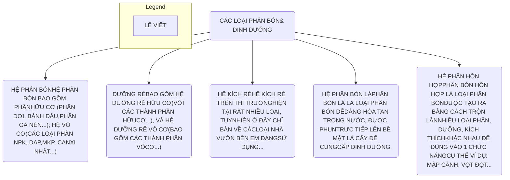

Bộ 99 câu hỏi về Chăm Sóc Mai Vàng

# PHẦN 02 : PHÂN BÓN & DINH DƯỠNG

Trên thị trường hiện nay, phân bón cho cây trồng nói chung và cho cây mai vàng nói riêng có rất nhiều loại, đến từ nhiều công ty và thương hiệu khác nhau. Do đó, trong phần này, em sẽ chỉ giới thiệu và nói rõ về những loại phân bón dưỡng rễ, kích rễ, điều hòa sinh trưởng và phân bón lá... mà vườn bên em đang trực tiếp sử dụng.

Lê Việt logo

<page_number>67</page_number>

Tài liệu lưu hành nội bộ

Bộ 99 câu hỏi về Chăm Sóc Mai Vàng

### CÂU HỎI SỐ 32:

LÊ VIỆT Mai vàng & Bonsai logo

# GIỚI THIỆU các loại
# PHÂN – DƯỠNG của NHÀ VƯỜN

Đây là toàn bộ sản phẩm bên em đang sử dụng.

**PHẦN 01: HỆ DƯỠNG RỄ**

**“DƯỠNG RỄ”** là 1 từ em tự đặt, dành cho các loại “phân bón lá” có thể dùng để tưới, với chức năng chính là hỗ trợ bộ rễ cây phát triển, ngoài ra còn *cung cấp 1 lượng dinh dưỡng cơ bản cho cây (đủ cho cây phôi, cây mới ghép, cây sau tết phát triển tốt, không cần bổ sung thêm phân bón).*

<table>
  <thead>
    <tr>
        <th>STT</th>
        <th>TÊN</th>
        <th>LIỀU PHA</th>
    </tr>
  </thead>
  <tbody>
    <tr>
        <td>01</td>
        <td>TERRASORB 4 ROOT</td>
        <td>02 ml/ 01 lít nước</td>
    </tr>
    <tr>
        <td>02</td>
        <td>ROOTPLEX</td>
        <td>02 ml/ 01 lít nước</td>
    </tr>
    <tr>
        <td>03</td>
        <td>N3M</td>
        <td>02 gram/ 01 lít nước</td>
    </tr>
    <tr>
        <td>04</td>
        <td>ROOT2</td>
        <td>02 ml/ 01 lít nước</td>
    </tr>
  </tbody>
</table>

**PHẦN 02: HỆ KÍCH RỄ**

Tương tự **“DƯỠNG RỄ”**, hệ **“KÍCH RỄ”** là 1 từ em tự đặt, là tên dành cho các loại <u>kích thích sinh trưởng có thể dùng để tưới, hoặc xịt lên lá, với chức năng chính là hỗ trợ cây yếu hồi phục, là “chất xúc tác” giúp cây mai sung hơn và phát triển theo ý muốn của mình.</u>

<table>
  <thead>
    <tr>
        <th>STT</th>
        <th>TÊN</th>
        <th>LIỀU PHA</th>
    </tr>
  </thead>
  <tbody>
    <tr>
        <td>01</td>
        <td>ATONIK</td>
        <td>01 ml/ 02 lít nước</td>
    </tr>
    <tr>
        <td>02</td>
        <td>COMCAT 150wp</td>
        <td>05 gram/ 16 lít nước</td>
    </tr>
    <tr>
        <td>03</td>
        <td>DEKAMON</td>
        <td>01 ml/ 03 lít nước</td>
    </tr>
    <tr>
        <td>04</td>
        <td>SUPER THRIVE</td>
        <td>01 ml/ 05 lít nước</td>
    </tr>
  </tbody>
</table>

**PHẦN 03: HỆ ĐIỀU HÒA SINH TRƯỞNG**

Tương tự 2 phần trên, thì hệ **“ĐIỀU HÒA SINH TRƯỞNG”** là 1 từ em tự đặt, chia các loại tương tự kích rễ nhưng chức năng & nồng độ thấp hơn.

LÊ VIỆT signature and phone number

<page_number>68</page_number>

Tài liệu lưu hành nội bộ

<u>*Bộ 99 câu hỏi về Chăm Sóc Mai Vàng*</u>

Thường dùng chung với **phân bón** (vô cơ & hữu cơ), sẽ giúp cây "ăn ngon" hơn, tức là giúp cây hấp thụ dinh dưỡng từ phân bón hiệu quả hơn >>> cây sẽ phát triển sung khỏe, đạt được yêu cầu cao hơn.

<table>
  <thead>
    <tr>
        <th>STT</th>
        <th>TÊN</th>
        <th>LIỀU PHA</th>
    </tr>
  </thead>
  <tbody>
    <tr>
        <td>01</td>
        <td>VITAMIN B1 GROFER THAILAND</td>
        <td>02 ml/ 01 lít nước</td>
    </tr>
    <tr>
        <td>02</td>
        <td>VITAMIN B1 GROWMORE</td>
        <td>02 ml/ 01 lít nước</td>
    </tr>
  </tbody>
</table>

## PHẦN 04: HỆ PHÂN BÓN LÁ

Phân bón lá là loại phân bón dễ dàng hòa tan trong nước, có thể xịt trực tiếp lên bề mặt lá cây để cung cấp dinh dưỡng, làm xanh dày lá, làm nút bông... tùy theo nhu cầu và loại phân sử dụng. Các loại phân bón lá đa số có thể tưới gốc được nhưng phân tưới gốc chưa chắc là xịt lên lá được.

<table>
  <thead>
    <tr>
        <th>STT</th>
        <th>TÊN</th>
        <th>LIỀU PHA</th>
    </tr>
  </thead>
  <tbody>
    <tr>
        <td>01</td>
        <td>SỬ DỤNG HỆ DƯỠNG RỄ ĐỂ BÓN LÁ</td>
        <td>THEO HDSD BÊN TRÊN.</td>
    </tr>
    <tr>
        <td>02</td>
        <td>HỆ PHÂN BÓN LÁ MK ĐẦU TRÂU 501-701-901</td>
        <td>02 GRAM/ 01 LÍT NƯỚC</td>
    </tr>
  </tbody>
</table>

Hệ Đầu trâu MK sử dụng khá tốt và em thường giới thiệu cho Quý Cô Chú Anh Chị muốn sử dụng phân bón lá sử dụng. *Loại 501 (xài giai đoạn tháng 04-06); Loại 701 (xài tháng 07-09); Loại 901 (xài tháng 09-07) (tham khảo).*

asterisk icon

## PHẦN 05: HỆ PHÂN BÓN HỮU CƠ

Phân Bón hữu cơ hiện tại trên thị trường có rất nhiều loại khác nhau, ví dụ như phân chuồng, loại phân hữu cơ khoáng (có pha NPK + TE)... Tuy nhiên, trong loại phân này em chỉ sử dụng các phân bên dưới, nếu Quý Cô Chú Anh Chị muốn tham khảo thêm có thể xem trang 85.

<table>
  <thead>
    <tr>
        <th>STT</th>
        <th>TÊN</th>
        <th>LIỀU PHA</th>
    </tr>
  </thead>
  <tbody>
    <tr>
        <td>01</td>
        <td>DYNAMIC LIFTER</td>
        <td>05 GRAM/ 01 LÍT NƯỚC</td>
    </tr>
    <tr>
        <td>02</td>
        <td>PHÂN DƠI</td>
        <td>05 GRAM/ 01 LÍT NƯỚC</td>
    </tr>
    <tr>
        <td>03</td>
        <td>BÁNH DẦU</td>
        <td>BÁNH DẦU THỦY PHÂN 2.5ML/ 1 LÍT BÁNH DẦU NGÂM 1KG/ 200 LÍT</td>
    </tr>
  </tbody>
</table>

Lê Việt signature and logo

<page_number>69</page_number>
Tài liệu lưu hành nội bộ

<u>Bộ 99 câu hỏi về Chăm Sóc Mai Vàng</u>

## PHẦN 06: HỆ PHÂN HỖN HỢP

Thường sẽ có những chức năng đi kèm tên gọi, ví dụ siêu vọt đọt, siêu mập cành, to gốc... Bên nhà vườn không sử dụng và mạn phép không bàn về loại phân này.

## PHẦN 07: HỆ PHÂN VÔ CƠ

<table>
  <thead>
    <tr>
        <th>STT</th>
        <th>TÊN</th>
        <th>LIỀU PHA</th>
    </tr>
  </thead>
  <tbody>
    <tr>
        <td>01</td>
        <td>NPK 31-11-11 Thái lan</td>
        <td>02 GRAM/ 01 LÍT NƯỚC</td>
    </tr>
    <tr>
        <td>02</td>
        <td>NPK 21-21-21 Thái lan</td>
        <td>02 GRAM/ 01 LÍT NƯỚC</td>
    </tr>
    <tr>
        <td>03</td>
        <td>NPK 6-32-32 Thái lan</td>
        <td>02 GRAM/ 01 LÍT NƯỚC</td>
    </tr>
    <tr>
        <td>04</td>
        <td>DAP 18-46-0 HÀN QUỐC</td>
        <td>02 GRAM/ 01 LÍT NƯỚC</td>
    </tr>
    <tr>
        <td>05</td>
        <td>SIÊU LÂN 10-60-10</td>
        <td>02 GRAM/ 01 LÍT NƯỚC</td>
    </tr>
  </tbody>
</table>

## PHẦN 08: HỆ PHÂN TRUNG VI LƯỢNG

<table>
  <thead>
    <tr>
        <th>STT</th>
        <th>TÊN</th>
        <th>LIỀU PHA</th>
    </tr>
  </thead>
  <tbody>
    <tr>
        <td>01</td>
        <td>CAMBI NHẬT</td>
        <td>01 GRAM/ 05 LÍT NƯỚC</td>
    </tr>
    <tr>
        <td>02</td>
        <td>CANXI-BO</td>
        <td>02 ML/ 01 LÍT NƯỚC</td>
    </tr>
    <tr>
        <td>03</td>
        <td>Một số loại trung vi lượng đặc biệt</td>
        <td>Tùy theo bệnh mà sử dụng.</td>
    </tr>
  </tbody>
</table>

> 

> **Bên vườn Lê Việt chỉ sử dụng các loại phân bên trên?**
>
> 

> Hiện tại bên vườn bên em chỉ sử dụng các loại trên, thời gian tới nếu có cập nhật thêm sẽ tái bản mới và sẽ thông báo cho Quý Cô Chú Anh Chị tham khảo./

Lê Việt logo with phone number 0938 93 43 23

<page_number>70</page_number>

Tài liệu lưu hành nội bộ

Bộ 99 câu hỏi về Chăm Sóc Mai Vàng

LÊ VIỆT Mai vàng & Bonsai logo

# CÂU HỎI SỐ 33:

# 04 GIAI ĐOẠN và DINH DƯỠNG từng GIAI ĐOẠN cho CÂY MAI

Infographic showing 4 stages of Ochna integerrima care

> **GIAI ĐOẠN 01**
> *từ tháng 01-03 âm lịch*
> * Giai đoạn đầu năm cần lượng dinh dưỡng rất ít
> * Thường sử dụng từ dinh dưỡng của các loại dưỡng rễ.
> * Có thể hỗ trợ thêm từ các loại kích thích sinh trưởng.
> <mark>LƯỢNG NHỎ ĐẠM - LÂN - KALI</mark>

> **GIAI ĐOẠN 02**
> *từ tháng 04-06 âm lịch*
> * Giai đoạn phát triển cành lá mạnh, cần lượng N (đạm) cao.
> * Có cần thêm lượng P (Lân), để bổ trợ làm kim.
> * Cần nhiều loại khác ví dụ hữu cơ, trung vi lượng vì là giai đoạn phát triển mạnh nhất.
> <mark>LƯỢNG ĐẠM > LÂN > KALI</mark>

# 04 GIAI ĐOẠN TRONG NĂM

> **GIAI ĐOẠN 03**
> *từ tháng 07-09 âm lịch*
> * Giai đoạn bắt đầu nuôi kim thành nút nên cần lượng P (Lân) cao và (K) kali tương đối.
> * Vẫn cần N(Đạm) để nuôi nút & giữ xanh cành lá nhưng ít hơn.
> <mark>LÂN + KALI CAO - ĐẠM ÍT HƠN</mark>

> **GIAI ĐOẠN 04**
> *từ tháng 10-12 âm lịch*
> * Giai đoạn chờ chín nút để chuyển sang nụ xanh (khi nở).
> * Cần K(Kali) cao để dưỡng bông, giúp bông nở to, màu đẹp, hương thơm lâu bền
> <mark>LƯỢNG KALI > LÂN, VÀ ÍT ĐẠM</mark>

LÊ VIỆT logo with phone number 0938.93.43.23

<page_number>71</page_number>

Tài liệu lưu hành nội bộ

Bộ 99 câu hỏi về Chăm Sóc Mai Vàng

Lê Việt Mai vàng & Bonsai logo

# CÂU HỎI SỐ 34:

# HƯỚNG DẪN ĐI PHÂN CƠ BẢN NHẤT trong 01 NĂM

Đây là cách đi cơ bản nhất mang tính tham khảo, còn phụ thuộc rất nhiều yếu tố ví dụ thời gian cắt đôn, có rong lá giữa năm hay không, tốc độ phát triển, cây yếu cây mạnh. **Đây là chế độ nạp cường độ khá cao, chỉ dành cho cây thành phẩm & không dành cho người mới chơi nếu không có hướng dẫn riêng.**

<table>
  <thead>
    <tr>
        <th colspan="3">PHÂN BÓN – DƯỠNG RỄ TRONG 1 NĂM</th>
    </tr>
    <tr>
        <th>CHU KỲ</th>
        <th>THÁNG</th>
        <th>SỬ DỤNG</th>
    </tr>
  </thead>
  <tbody>
    <tr>
        <td rowspan="3">HỒI PHỤC</td>
        <td>01</td>
        <td>- Tưới dưỡng rễ ROOT4 khoảng 10-15 ngày/ 1 lần. - Có thể dùng kích thích sinh trưởng 1- 2 lần tùy theo độ mạnh của cây.</td>
    </tr>
    <tr>
        <td>02</td>
        <td>- Tưới dưỡng rễ ROOT4 khoảng 10-15 ngày/ 1 lần.</td>
    </tr>
    <tr>
        <td>03</td>
        <td>- Tưới dưỡng rễ ROOT4 khoảng 10-15 ngày/ 1 lần. - Nếu cây đã ra cơi lá 2 có thể đi phân hữu cơ (dynamic hoặc bánh dầu).</td>
    </tr>
    <tr>
        <td rowspan="3">PHÁT TRIỂN</td>
        <td>04</td>
        <td>- Tiến hành rong lá, tỉa cành, đôn tàng.. tùy theo cây mà có thể từ tháng 04-05. - Bắt đầu chế độ nạp NPK 30-10-10 trước, sau đó khoảng 20 ngày <u>sử dụng kèm DAP</u> (tùy thời điểm xài NPK 30-10-10 mà DAP có thể xài sang tháng sau). - Vẫn xài <u>hữu cơ &amp; dưỡng rễ</u> (2 loại root4 &amp; rootplex luân phiên) (01-02 lần mỗi tháng) <u>&amp; dưỡng rễ kèm theo phân vô cơ.</u></td>
    </tr>
    <tr>
        <td>05</td>
        <td rowspan="2">- Sử dụng tương tự tháng 04.</td>
    </tr>
    <tr>
        <td>06</td>
    </tr>
  </tbody>
</table>

Lê Việt logo with phone number 0938.93.43.23

<page_number>72</page_number>

Tài liệu lưu hành nội bộ

<u>Bộ 99 câu hỏi về Chăm Sóc Mai Vàng</u>

<table>
  <tbody>
    <tr>
        <td rowspan="3"><strong>LÀM NÚT</strong></td>
        <td>07</td>
        <td>- Vô phân NPK 21-21-21 để làm nút. Làm nút là quá trình nuôi kim thành nút. - Nếu cây chưa đạt kim có thể bổ sung DAP, NPK 10-60-10, hoặc các loại phân NPK có lượng lân (P) cao hơn hẳn đạm (N) và kali (K).) - Sử dụng Rootplex (hoặc trộn chung Root4), phân hữu cơ đều đặn 01-02 lần mỗi tháng. - Đi phân hữu cơ.</td>
    </tr>
    <tr>
        <td>08</td>
        <td>- Tương tự tháng 07 âm lịch.</td>
    </tr>
    <tr>
        <td>09</td>
        <td>- Tương tự tháng 07 âm lịch, trừ phần dùng DAP, <u>NPK 10-60-10.</u></td>
    </tr>
    <tr>
        <td rowspan="3"><strong>NUÔI NÚT</strong></td>
        <td>10</td>
        <td>- Vô phân NPK 21-21-21 để làm nút. Làm nút là quá trình nuôi kim thành nút. - Vô phân NPK 6-32-32 để già nút, già lá. Bông đẹp hơn. - Vô phân kali đỏ hoặc các phân có hàm lượng kali cao. - Vô canxi-bo chắc lá - chắc nút - chắc bông. - Đi phân hữu cơ (không phân dơi). Đi Canxi- Bo hoặc Kali đỏ.</td>
    </tr>
    <tr>
        <td>11</td>
        <td>- Tương tự tháng 11 âm lịch.</td>
    </tr>
    <tr>
        <td>12</td>
        <td>- Thường bỏ không vô phân. Chỉ hỗ trợ Canxibo.</td>
    </tr>
  </tbody>
</table>

> ### **Bộ phân bón – thuốc trọn gói 01 năm**
>
> Từ năm 2024 e đã triển khai **Bộ phân bón – thuốc trọn gói 01 năm** dành cho cô chú anh chị mới tập chơi có thể có bài phân + phân bón phù hợp.
>
> Cô Chú/ Anh Chị có nhu cầu khoảng từ cuối tháng 11 âm lịch đổ đi có thể liên hệ với em qua số Zalo 0938934323.

Lê Việt logo with phone number 0938.93.43.23

<page_number>73</page_number>

*Tài liệu lưu hành nội bộ*

Bộ 99 câu hỏi về Chăm Sóc Mai Vàng

Lê Việt Mai vàng & Bonsai logo

# CÂU HỎI SỐ 35:

# HƯỚNG DẪN nuôi PHÔI CƠ BẢN NHẤT trong 06 THÁNG

Đây là hướng dẫn nuôi phôi mai vàng thuần chậu (tức là nuôi phôi sống khỏe 06 tháng rồi mới tiến hành ghép), hoặc nuôi cây mai vàng zin từ phôi (không ghép). Đây chỉ là lý thuyết cơ bản nhất, định hướng cho Quý Cô Chú Anh Chị chưa có kinh nghiệm nhiều, hoặc có ít kinh nghiệm nhưng muốn hệ thống lại cách nuôi. Vì trong thực tế sẽ xuất hiện nhiều trường hợp khác nhau, ví dụ: *cây yếu, cây sung, cây bị nín, cây bị bệnh...*

<table>
  <thead>
    <tr><th colspan="2">NUÔI PHÔI TRONG 06 THÁNG</th></tr>
    <tr>
        <th>CHU KỲ</th>
        <th>THÁNG</th>
        <th>SỬ DỤNG</th>
    </tr>
  </thead>
  <tbody>
    <tr>
        <td rowspan="3">DƯỠNG</td>
        <td>01</td>
        <td>- Ngày đầu tiên: Tưới dưỡng rễ ROOT4 + ATONIK + RIDOMIL GOLD khoảng 10-15 ngày/ 1 lần. - Ngày 10: Tưới dưỡng rễ ROOT4. - Ngày 25: Tưới dưỡng rễ ROOT4.</td>
    </tr>
    <tr>
        <td>02</td>
        <td>- Ngày 5: Tưới dưỡng rễ ROOT4. - Ngày 15: Tưới dưỡng rễ ROOT4. - Ngày 25: Tưới dưỡng rễ ROOT4.</td>
    </tr>
    <tr>
        <td>03</td>
        <td>- Ngày 5: Tưới bánh dầu hoặc Dynamic Lifter. - Ngày 15: Tưới dưỡng rễ ROOT4. - Ngày 25: Tưới bánh dầu hoặc Dynamic Lifter.</td>
    </tr>
    <tr>
        <td rowspan="3">VÔ PHÂN</td>
        <td>04</td>
        <td>- Ngày 5: Tưới dưỡng rễ ROOTPLEX. - Ngày 15: Tưới bánh dầu hoặc Dynamic Lifter. - Ngày 25: Tưới dưỡng rễ ROOTPLEX.</td>
    </tr>
    <tr>
        <td>05</td>
        <td>- Ngày 5: Tưới ROOTPLEX + DAP (1gram/1l).</td>
    </tr>
    <tr>
        <td>06</td>
        <td>- Ngày 15: Tưới bánh dầu hoặc Dynamic Lifter. - Ngày 25: Tưới dưỡng rễ ROOTPLEX.</td>
    </tr>
  </tbody>
</table>

Lê Việt Mai vàng & Bonsai 0938.93.43.23 signature logo

<page_number>74</page_number>

Tài liệu lưu hành nội bộ

Bộ 99 câu hỏi về Chăm Sóc Mai Vàng

LÊ VIỆT Mai vàng & Bonsai logo

# CÂU HỎI SỐ 36:

## LỊCH sử dụng DƯỠNG, KÍCH & PHÂN THUỐC cho cây sau SUY YẾU & BỆNH TẬT

### THỜI ĐIỂM thích hợp để PHỤC HỒI cây SUY

Đối với cây suy yếu thì thời điểm phục hồi (sử dụng bài bản lịch tưới dưỡng rễ + phân bên dưới) thường không cố định bao nhiêu tháng, mà phải xem ra cơi tược từ cơi thứ 2 hoặc cơi 3... đều cả cây. Trường hợp cơi tược có đi nhưng ít và không đều thì không sử dụng chế độ phục hồi cao.

\* Còn trước đó cứ đều đặn khoảng 20-30 ngày tưới dưỡng rễ 01 lần là được.

### THỜI ĐIỂM thích hợp để PHỤC HỒI cây BỆNH

Đối với cây bị bệnh nặng vừa xử lý và tỉnh lại, thì thời điểm phục hồi (sử dụng bài bản lịch tưới dưỡng rễ + phân bên dưới) thường không cố định bao nhiêu tháng, mà phải xem ra cơi tược đầu tiên có đi đều hay không, là có dấu hiệu bệnh hay không.

\* Còn trước đó cứ đều đặn khoảng 15-20 ngày tưới dưỡng rễ 01 lần là được.

LÊ VIỆT logo with phone number

<page_number>75</page_number>

Tài liệu lưu hành nội bộ

<u>Bộ 99 câu hỏi về Chăm Sóc Mai Vàng</u>

# LỊCH HỒI PHỤC CÂY TRONG 06 THÁNG

*Lưu ý trong quá trình vẫn xịt thuốc đầy đủ + không cắt đôn/ lài lá.*

<table>
  <thead>
    <tr>
        <th>STT</th>
        <th>THỜI ĐIỂM</th>
        <th>CÁCH SỬ DỤNG</th>
    </tr>
  </thead>
  <tbody>
    <tr>
        <td>01</td>
        <td><strong>THÁNG ĐẦU TIÊN</strong> <em>(Là tháng bắt đầu vô chế độ phục hồi)</em></td>
        <td>- <strong>Ngày 01 :</strong> Tưới dưỡng rễ Root4 (liều 02ml/ 01 lít) &amp; kèm Ridomil Gold (liều 02gram/ 01 lít), tưới cho chậu 60 tưới 2 lít. - <strong>Ngày 10 :</strong> Tưới dưỡng rễ Rootplex (liều 02ml/ 01 lít), tưới cho chậu 60cm lọt lòng tưới 2 lít. - <strong>Ngày 22-25 :</strong> Tưới dưỡng rễ Rootplex 02ml + Root4 02ml (liều 01ml mỗi loại/ 01 lít), tưới cho chậu 60 tưới 2 lít.</td>
    </tr>
    <tr>
        <td>02</td>
        <td><strong>THÁNG THỨ 02 – 03 - 04</strong></td>
        <td>- <strong>Ngày 05-07 :</strong> Tưới Bánh dầu thủy phân (liều 02.5ml/ 01 lít) &amp; kèm B1 THÁI (liều 02ml/ 01 lít), tưới cho chậu 60 tưới 2 lít. <em>Nếu dùng bánh dầu ngâm thì 1 kg ngâm 200 lít.</em>  - <strong>Ngày 15-17 :</strong> Tưới 02 lít nước có pha 10 gram Dynamic Lifter.  - <strong>Ngày 22 :</strong> Tưới dưỡng rễ Rootplex + Root4 (liều 01ml mỗi loại/ 01 lít), tưới cho chậu 60 tưới 2 lít.</td>
    </tr>
    <tr>
        <td>03</td>
        <td><strong>THÁNG THỨ 05-06</strong></td>
        <td>- <strong>Ngày 01:</strong> Tưới Bánh dầu thủy phân (liều 02.5ml/ 01 lít) &amp; kèm B1 growmore (liều 02ml/ 01 lít), tưới cho chậu 60 tưới 2 lít. <em>Nếu dùng bánh dầu ngâm thì 1 kg ngâm 200 lít.</em>  - <strong>Ngày 15 :</strong> Tưới nhẹ 2gram DAP + B1 thái 3ml + Phân dơi 10 gram pha 3 lít nước cho chậu 60 lọt lòng.</td>
    </tr>
  </tbody>
</table>

Lê Việt logo and signature

<page_number>76</page_number>

*Tài liệu lưu hành nội bộ*

Bộ 99 câu hỏi về Chăm Sóc Mai Vàng

Lê Việt Mai vàng & Bonsai logo

# CÂU HỎI SỐ 37:

# Phối hợp VÔ CƠ – HỮU CƠ sao cho CÂN BẰNG

**Phối hợp vô cơ – hữu cơ sao cho cân bằng** là một 01 LÝ THUYẾT do em tự đưa ra, dựa trên việc làm mai lâu năm, <u>suy đoán lý do cây mai già không còn sung khỏe</u>. "Cân bằng" ở đây có nghĩa là sử dụng cả hai loại phân bón (vô cơ và hữu cơ) một cách hợp lý để phát huy tối đa ưu điểm của từng loại và bù đắp nhược điểm cho nhau. Giúp cây mai vàng (đặc biệt là dòng mai ghép nằm chậu) bền cây, không suy yếu và bền bỉ qua thời gian.

<table>
  <thead>
    <tr>
        <th>ĐẶC ĐIỂM</th>
        <th>PHÂN BÓN VÔ CƠ (HÓA HỌC)</th>
        <th>PHÂN BÓN HỮU CƠ</th>
    </tr>
  </thead>
  <tbody>
    <tr>
        <td>Ưu điểm</td>
        <td>- Hàm lượng dinh dưỡng đa lượng cao, chính xác theo công bố trên bao bì. - Tác dụng nhanh, dễ điều chỉnh, dễ pha nước. - Dễ sử dụng &amp; bảo quản.</td>
        <td>- Cung cấp dinh dưỡng từ từ, bền vững. - Bổ sung vi sinh vật có lợi. - Tăng khả năng giữ nước, giữ dinh dưỡng.</td>
    </tr>
    <tr>
        <td>Nhược điểm</td>
        <td>- Dễ gây thoái hóa (chai) rễ nếu lạm dụng. - Gây sốc cho cây nếu dùng quá liều.</td>
        <td>- Hàm lượng dinh dưỡng thấp, không chính xác. - Tác dụng chậm, cần thời gian phân hủy. - Khó điều chỉnh lượng dinh dưỡng cần tức thời (thúc nút, già lá...). - Có thể chứa mầm bệnh (nấm...), cỏ dại nếu không xử lý kỹ.</td>
    </tr>
  </tbody>
</table>

Lê Việt signature and contact

<page_number>77</page_number>

Tài liệu lưu hành nội bộ

<u>Bộ 99 câu hỏi về Chăm Sóc Mai Vàng</u>

## VÔ CƠ LÀ CẦN – HỮU CƠ HỖ TRỢ

Thật sự nếu nuôi 01 cây mai trên chậu, nếu không sử dụng phân bón vô cơ thì khó đạt kết quả cao (cây sung, bông đẹp). Do đó kết hợp cả 02 sao cho nhuần nhuyễn và hợp lý để bền cây là 1 bài toán cần cân bằng.

Trong câu hỏi này mục đích em muốn giới thiệu 1 "lý thuyết mới" về việc tăng cường sử dụng phân hữu cơ, giảm lượng vô cơ (& cả phân bón lá) để nuôi cây mai nằm chậu bền bỉ qua thời gian.

## LÝ THUYẾT HỮU CƠ CHỦ ĐẠO

01. Sử dụng hữu cơ là thành phần phân bón chính (đi kèm với dưỡng rễ hữu cơ), một tháng có thể đi 2-3 lần.

02. Sử dụng vô cơ là thành phần bón vào các giai đoạn quan trọng (hoặc giai đoạn cần xử lý nhanh), một tháng có thể đi từ 01-02 lần. Đối với cây non, yếu không sử dụng. Hạn chế hoặc bỏ sử dụng phân bón lá hệ vô cơ.

Illustration of a plant showing root system and foliage with text labels: PHÂN HỮU CƠ sử dụng chủ đạo and PHÂN VÔ CƠ bón giai đoạn quan trọng, bón thúc

LÊ VIỆT logo with phone number 0938.93.43.23

<page_number>78</page_number>

Tài liệu lưu hành nội bộ

Bộ 99 câu hỏi về Chăm Sóc Mai Vàng

Lê Việt Mai vàng & Bonsai logo

# CÂU HỎI SỐ 38:

## Vai trò của ĐẠM (N); LÂN (P); KALI (K) VÀ PHÂN TRUNG VI LƯỢNG (FE, MG, ZN, BO, CA)

Vai trò của từng loại có nhiều chức năng khác nhau, ví dụ như đạm(N) cần cho cây khi phát triển, chạy cơi tược, đi lá, xanh lá... nhưng cũng cần khi làm nút. Do đó trong phần này em chỉ chia sẻ chức năng chính của nó để Quý Cô Chú Anh Chị tham khảo.

<table>
  <thead>
    <tr>
        <th>Nutrient</th>
        <th>Role</th>
        <th>Period</th>
    </tr>
  </thead>
  <tbody>
    <tr>
        <td>ĐẠM (NITƠ - N)</td>
        <td>LÀ YẾU TỐ QUYẾT ĐỊNH SỰ PHÁT TRIỂN CỦA HỆ THỐNG TÁN LÁ, GIÚP LÁ XANH TỐT, TO KHỎE, THÚC ĐẨY CÂY RA CHỒI NON, CƠI TƯỢC MỚI NHANH CHÓNG</td>
        <td>GIAI ĐOẠN THÁNG 01-09</td>
    </tr>
    <tr>
        <td>LÂN (PHOTPHO - P)</td>
        <td>KÍCH THÍCH PHÁT TRIỂN BỘ RỄ, PHÂN HÓA MẦM HOA (TỨC LÀ LÀM KIM), HÌNH THÀNH NÚT, GIÚP CÂY THÊM SỨC ĐỀ KHÁNG.</td>
        <td>GIAI ĐOẠN THÁNG 04-11</td>
    </tr>
    <tr>
        <td>KALI (K)</td>
        <td>KÍCH THÍCH PHÂN HÓA MẦM HOA (LÀM NÚT), LÀM "NỨT" NỤ HOA CHẮC KHỎE, ĐẨY NHANH QUÁ TRÌNH "GIÀ HÓA" CỦA LÁ VÀ MẮT NGỦ, TĂNG KHẢ NĂNG CHỐNG CHỊU CỦA NỤ, TĂNG ĐỘ ĐẸP CỦA HOA.</td>
        <td>GIAI ĐOẠN THÁNG 08-12</td>
    </tr>
    <tr>
        <td>TRUNG VI LƯỢNG (FE, MG, ZN, BO, CA)</td>
        <td>TUY CÂY CHỈ CẦN LƯỢNG ÍT, NHƯNG CHÚNG LẠI VÔ CÙNG THIẾT YẾU. CÁC NGUYÊN TỐ NÀY ĐÓNG VAI TRÒ THEN CHỐT TRONG MỌI QUÁ TRÌNH PHÁT TRIỂN CỦA CÂY MAI. KHI THIẾU HỤT SẼ GÂY RỐI LOẠN NGHIÊM TRỌNG. BỆNH HAY GẶP LÀ VÀNG LÁ GÂN XANH</td>
        <td>CẢ NĂM</td>
    </tr>
  </tbody>
</table>

Lê Việt signature and phone number

<page_number>79</page_number>

Tài liệu lưu hành nội bộ

Bộ 99 câu hỏi về Chăm Sóc Mai Vàng

LÊ VIỆT Mai vàng & Bonsai logo

# CÂU HỎI SỐ 39:

## Bảng tính LIỀU LƯỢNG một số PHÂN, THUỐC, DƯỠNG RỄ... cơ bản

Trong câu này em sẽ chia sẻ cho Quý Cô Chú Anh Chị về cách pha, và tưới một số phân, thuốc, dưỡng rễ... cơ bản để quý cô chú anh chị tham khảo. Lưu ý:

**01. Liều lượng:** là liều bao nhiêu gram/ml pha cho 01 lít nước; **Định lượng:** là số lượng nước sau khi đã pha PHÂN/ THUỐC, dùng tưới cho 1 gốc cây có chậu 60cm lọt lòng, chiều cao cây từ mặt chậu lên ngọn từ 1,2-1,5m. **Thời gian giãn cách:** là khoảng thời gian cần để tưới lần thứ 02.

**02. Đối với cây tán lớn, chiều cao & tán ngang lớn/ nhỏ hơn thì tăng/ giảm lượng sử dụng khoảng 30-50% tùy theo kích thước cây.**

**03. Cây mai non, chưa thuần chậu, mới ghép... thì dưỡng rễ xài 100% liều lượng, còn phân bón thì xài 30-50% liều lượng (hoặc định lượng)**

**04. Cách tưới cơ bản, khi kết hợp các loại với nhau cần sự thay đổi về liều lượng sao cho phù hợp, cơ bản nhất là tăng 01 loại thì giảm liều 50%.**

<table>
  <thead>
    <tr>
        <th>STT</th>
        <th>LOẠI</th>
        <th>LIỀU LƯỢNG</th>
        <th>ĐỊNH LƯỢNG</th>
        <th>THỜI GIAN GIÃN CÁCH</th>
    </tr>
  </thead>
  <tbody>
    <tr>
        <td>01</td>
        <td>TERRASORB 4 ROOT</td>
        <td>02 ml/ 01 lít nước</td>
        <td>2-3 (lít)</td>
        <td>10-15 ngày</td>
    </tr>
    <tr>
        <td>02</td>
        <td>ROOTPLEX</td>
        <td>02 ml/ 01 lít nước</td>
        <td>2-3 (lít)</td>
        <td>10-15 ngày</td>
    </tr>
    <tr>
        <td>03</td>
        <td>N3M</td>
        <td>02 gram/ 01 lít nước</td>
        <td>2-3 (lít)</td>
        <td>10-15 ngày (03 lần nghỉ 01 lần)</td>
    </tr>
    <tr>
        <td>04</td>
        <td>ROOT2</td>
        <td>02 ml/ 01 lít nước</td>
        <td>2-3 (lít)</td>
        <td>10-15 ngày</td>
    </tr>
  </tbody>
</table>

Lê Việt signature and phone number 0938 93 43 23

<page_number>80</page_number>

Tài liệu lưu hành nội bộ

<u>Bộ 99 câu hỏi về Chăm Sóc Mai Vàng</u>

<table>
  <tbody>
    <tr>
        <td>05</td>
        <td><strong>ATONIK</strong></td>
        <td>01 ml/ 02 lít nước</td>
        <td>1-2 (lít)</td>
        <td>Không quá 01 lần / 01 tháng.</td>
    </tr>
    <tr>
        <td>06</td>
        <td><strong>VITAMIN B1 GROFER THAILAND</strong></td>
        <td>02 ml/ 01 lít nước</td>
        <td>2-3 (lít)</td>
        <td>Tưới đi kèm phân bón.</td>
    </tr>
    <tr>
        <td>07</td>
        <td><strong>VITAMIN B1 GROWMORE</strong></td>
        <td>02 ml/ 01 lít nước</td>
        <td>2-3 (lít)</td>
        <td>Tưới đi kèm phân bón.</td>
    </tr>
    <tr>
        <td>08</td>
        <td><strong>DYNAMIC LIFTER</strong></td>
        <td>05 GRAM/ 01 LÍT NƯỚC</td>
        <td>3-4 (lít)</td>
        <td>01-02 lần / 01 tháng. (tùy bài phân)</td>
    </tr>
    <tr>
        <td>09</td>
        <td><strong>PHÂN DƠI</strong></td>
        <td>05 GRAM/ 01 LÍT NƯỚC</td>
        <td>3-5 (lít)</td>
        <td>01-02 lần / 01 tháng. (tùy bài phân)</td>
    </tr>
    <tr>
        <td>10</td>
        <td><strong>BÁNH DẦU</strong></td>
        <td>BÁNH DẦU THỦY PHÂN 2.5ML/ 1 LÍT BÁNH DẦU NGÂM 1KG/ 200 LÍT</td>
        <td>3-4 (lít)</td>
        <td>01-02 lần / 01 tháng. (tùy bài phân)</td>
    </tr>
    <tr>
        <td>11</td>
        <td><strong>NPK 31-11-11 Thái lan</strong></td>
        <td>02 gram/ 01 lít nước</td>
        <td>2-3 (lít)</td>
        <td>01-02 lần / 01 tháng. (tùy bài phân)</td>
    </tr>
    <tr>
        <td>12</td>
        <td><strong>NPK 6-32-32 Thái lan</strong></td>
        <td>02 gram / 01 lít nước</td>
        <td>2-3 (lít)</td>
        <td>Không quá 01 lần / 01 tháng.</td>
    </tr>
    <tr>
        <td>13</td>
        <td><strong>DAP 18-46-0 HÀN QUỐC</strong></td>
        <td>02 gram / 01 lít nước</td>
        <td>2-3 (lít)</td>
        <td>01-02 lần / 01 tháng. (tùy bài phân)</td>
    </tr>
  </tbody>
</table>

LÊ VIỆT logo with signature and phone number 0938.93.43.23

<page_number>81</page_number>

Tài liệu lưu hành nội bộ

<u>*Bộ 99 câu hỏi về Chăm Sóc Mai Vàng*</u>

<table>
  <tbody>
    <tr>
        <td>14</td>
        <td>NPK 21-21-21 Thái lan</td>
        <td>02 gram / 01 lít nước</td>
        <td>2-3 (lít)</td>
        <td>01-02 lần / 01 tháng. (tùy bài phân)</td>
    </tr>
    <tr>
        <td>15</td>
        <td>SIÊU LÂN 10-60-10</td>
        <td>02 gram / 01 lít nước</td>
        <td>2-3 (lít)</td>
        <td>01-02 lần / 01 tháng. (tùy bài phân)</td>
    </tr>
  </tbody>
</table>

## CÁCH SỬ DỤNG CHÍNH XÁC

Bảng trên chỉ hướng dẫn cách sử dụng ĐƠN LẺ của các loại dưỡng, phân & kích thích rễ... cơ bản, khi sử dụng 1 mình, không đi theo 01 bài phân nào đó cụ thể. Nếu sử dụng theo 01 bài phân cụ thể (của em hay của vườn nào đó), thì nên tham khảo liều lượng chính xác theo HDSD.
LE VIỆT

## BÀI PHÂN LÀ GÌ?

Bài phân nghĩa là cách chăm sóc theo từng tháng, bao gồm sử dụng dưỡng rễ, kích rễ, phân hữu/ vô cơ, điều hòa sinh trưởng... và các loại khác. Có kèm liều lượng và định lượng cũng như thời gian tưới cụ thể cho Quý Cô Chú Anh Chị làm theo. Ngoài ra còn hướng dẫn sử dụng thuốc bảo vệ thực vật, cũng như những biện pháp khác để hỗ trợ cây phát triển tốt (rong lá, tỉa cành, làm chất trồng...)./
LE VIỆT

LE VIỆT logo with signature and phone number 0938.93.43.23

<page_number>82</page_number>

*Tài liệu lưu hành nội bộ*

*Bộ 99 câu hỏi về Chăm Sóc Mai Vàng*

LÊ VIỆT Mai vàng & Bonsai logo

# CÂU HỎI SỐ 40:

## Có nên Sử dụng một loại PHÂN BÓN (DƯỠNG RỄ) quanh năm

Có rất nhiều Quý Cô Chú Anh Chị tham khảo ý kiến em là có thể đơn giản hóa việc chăm sóc cây mai bằng cách sử dụng 01 loại phân bón quanh năm (chỉ dùng một mình nó, không sử dụng loại phân khác), có được hay không, và cây mai có bông hay không?

Câu trả lời này em xin chia làm 03 vế cho Quý Cô Chú Anh Chị hiểu rõ:

1. **Được**, và thường là 01 loại phân hữu cơ, trong danh sách phân hữu cơ bên trên em đã chia sẻ thì Quý Cô Chú Anh Chị có thể tham khảo Dynamic Lifter và Bánh Dầu (01 tháng sử dụng 01 đến 02 lần).

2. **Chất lượng sẽ không đạt**, cây mai sẽ không phát triển tốt, cây không sung, chậm lớn cành nhánh, bông ít, bông nhỏ...

3. **Đó là đối với cây nằm trong chậu**, còn cây trồng đất hoặc cây đã thuần bồn đất (bồn mà làm trên sân xi măng là khác), thì có thể sử dụng và rất nhiều người đã hướng dẫn online. Em không làm mai vàng đất nên không dám trình bày sâu.

### DƯỠNG RỄ SỬ DỤNG QUANH NAM (CÓ KÈM PHÂN)

Đối với hệ dưỡng rễ thì có loại Terrasorb 4 Root là có thể sử dụng quanh năm và dành cho tất cả các cây cảnh, cây ăn trái nằm chậu đạt kết quả tốt (đến khoảng tháng 10-11 có thể ngừng vì ảnh hưởng nút – có khả năng bung sớm).

LÊ VIỆT logo with phone number 0938.93.43.23

<page_number>83</page_number>

*Tài liệu lưu hành nội bộ*

Bộ 99 câu hỏi về Chăm Sóc Mai Vàng

LÊ VIỆT Mai vàng & Bonsai logo

# CÂU HỎI SỐ 41:

# CANXI-BO và TRUNG VI LƯỢNG có TÁC DỤNG gì?

**CANXI-BO có Tác Dụng gì?**

Hiểu đơn giản là Canxi & Bo (*giai đoạn cuối năm*) sẽ giúp cho lá chắc khỏe (không rụng sớm), giúp cho nút bung nụ đạt hơn, khi bung ra nụ xanh sẽ hạn chế rụng nụ xanh và thời gian nụ xanh ở trên cây bền hơn (bông nở lâu hơn).

Vào cuối tháng 10-11 âm lịch tiến hành tưới gốc & xịt lên lá (01 tháng/ 01 lần). Và đến khi cây xuống lá tiến hành xịt lên cành, nút nụ (01 lần).

*Lưu ý: Canxi-bo là tên 2 chất chứ không phải tên sản phẩm, nên tùy theo loại canxi-bo mà có thể có cách dùng và liều lượng khác nhau.*

**MỘT SỐ TRUNG – VI LƯỢNG KHÁC NHƯ:**

<table>
  <thead>
    <tr>
        <th>GIAI ĐOẠN</th>
        <th>THỜI ĐIỂM (ÂM LỊCH)</th>
        <th>MỤC ĐÍCH BỔ SUNG TRUNG VI LƯỢNG</th>
        <th>LOẠI</th>
    </tr>
  </thead>
  <tbody>
    <tr>
        <td>1. Phục hồi &amp; Phát triển thân lá</td>
        <td>Tháng 1 - 6</td>
        <td>Giúp cây phục hồi sức khỏe sau Tết, kích thích đâm tược, kéo cành, tạo bộ khung và bộ lá khỏe mạnh.</td>
        <td>Mg, Zn, Fe, Ca</td>
    </tr>
    <tr>
        <td>2. Phân hóa mầm bông (NÚT NỤ)</td>
        <td>Tháng 7 - 9</td>
        <td>Hỗ trợ cây chuyển hóa từ phát triển thân lá sang sinh trưởng sinh thực (ra bông), giúp nụ hình thành khỏe, mập và đồng đều.</td>
        <td>Bo, Mg, S</td>
    </tr>
    <tr>
        <td>3. Nuôi nụ &amp; Chuẩn bị ra bông</td>
        <td>Tháng 10 - 12</td>
        <td>Giúp nụ mập, chắc, cánh bông dày, màu sắc rực rỡ, tăng khả năng chống chịu lạnh, mưa.</td>
        <td>Bo, S, Ca</td>
    </tr>
  </tbody>
</table>

LÊ VIỆT logo and signature

<page_number>84</page_number>

Tài liệu lưu hành nội bộ

Bộ 99 câu hỏi về Chăm Sóc Mai Vàng

Lê Việt Mai Vàng & Bonsai logo

# CÂU HỎI SỐ 42:

# Các loại PHÂN HỮU CƠ hiệu quả và có thể SỬ DỤNG cho Cây Mai Vàng

Ngoài 3 loại sản phẩm em đã giới thiệu bên trên (bên vườn em đang sử dụng), thì Quý Cô Chú Anh Chị có thể tham khảo thêm danh sách phân hữu cơ sau đây để sử dụng cho cây mai, nhưng lưu ý:

1. **Phân hữu cơ tự nhiên (phân chuồng):** thường phải phơi khô trước khi sử dụng, liều lượng pha cũng tính theo dạng phân khô. Nếu có khả năng ủ bằng nấm Trichoderma càng tốt. Theo Danh sách ưu tiên sử dụng số 01,02,05 (do nhà vườn bên em đang sử dụng).

2. **Các loại phân HỮU CƠ & VÔ CƠ thường tưới sẽ tốt hơn là rải khi mới tập chơi,** lý do là dễ pha, dễ tưới và ít bị phạm phân.

3. **Phân hữu cơ vẫn phạm phân** nếu sử dụng không đúng cách, và thường khi phát hiện ra là cây mai đã suy (vì thời gian dài).

4. **Nên sử dụng thuốc nấm Ridomil Gold,** hoặc thuốc nấm tưới gốc thường xuyên, nếu sử dụng phân hữu cơ nhiều. Thường xuyên kiểm tra & Xem kỹ có lèn chất trồng hay không.

<table>
  <thead>
    <tr>
        <th>STT</th>
        <th>TÊN</th>
        <th>LIỀU PHA</th>
    </tr>
  </thead>
  <tbody>
    <tr>
        <td>01</td>
        <td>PHÂN DƠI</td>
        <td>05 GRAM/ 01 LÍT NƯỚC</td>
    </tr>
    <tr>
        <td>02</td>
        <td>BÁNH DẦU</td>
        <td>BÁNH DẦU THỦY PHÂN 2.5ML/ 1 LÍT BÁNH DẦU NGÂM 1KG/ 200 LÍT</td>
    </tr>
    <tr>
        <td>03</td>
        <td>PHÂN CHIM YẾN</td>
        <td>05 GRAM/ 01 LÍT NƯỚC</td>
    </tr>
    <tr>
        <td>04</td>
        <td>PHÂN BÒ &amp; PHÂN DÊ</td>
        <td>Bón gốc mai vàng trồng bồn/ đất.</td>
    </tr>
    <tr>
        <td>05</td>
        <td>DYNAMIC LIFTER</td>
        <td>05 GRAM/ 01 LÍT NƯỚC</td>
    </tr>
    <tr>
        <td>06</td>
        <td>BOUNCE BACK -BB</td>
        <td>05 GRAM/ 01 LÍT NƯỚC</td>
    </tr>
  </tbody>
</table>

Lê Việt signature and contact

<page_number>85</page_number>

Tài liệu lưu hành nội bộ

Bộ 99 câu hỏi về Chăm Sóc Mai Vàng

LÊ VIỆT Mai vàng & Bonsai logo

**CÂU HỎI SỐ 43:**

# Sử dụng KÍCH RỄ như thế nào cho HIỆU QUẢ?

## GIAI ĐOẠN NUÔI PHÔI

Quan trọng là nhận định phôi MẠNH hay YẾU qua mặt cắt rút nhựa như thế nào? Tiến hành ghép sau khi vào chậu, hay là nuôi thuần chậu. Chọn đúng thời điểm xài kích rễ là quan trọng hơn rất nhiều so với việc chọn loại nào để sử dụng.

Bonsai Song Thụ illustration

BONSAI SONG THỤ

Bonsai Tam Đa illustration

BONSAI TAM ĐA

## GIAI ĐOẠN NUÔI CÂY SAU TẾT

Sau tết thường sử dụng kích rễ 1-2 lần để hỗ trợ cây hồi phục nhanh sau khi nở bông tết rực rỡ. Không nên lạm dụng vì có thể phạm thuốc dẫn đến cành nhánh ốm yếu, hoặc tụt nhựa cây.

LÊ VIỆT Mai vàng & Bonsai logo with phone number 0938 93 43 23

<page_number>86</page_number>

Tài liệu lưu hành nội bộ

<u>Bộ 99 câu hỏi về Chăm Sóc Mai Vàng</u>

# PHỤC HỒI CÂY SUY

Hỗ trợ cây suy sau khi xử lý rễ có khả năng hồi phục nhanh hơn, hấp thụ dinh dưỡng tốt hơn. Tuy nhiên, lạm dụng nhiều lần thì khả năng cây từ suy chuyển sang chết luôn rất cao và thường xảy ra.

Illustration of a bonsai tree in a decorative pot

TAM ĐA - PHÚC LỘC THỌ

<table>
  <thead>
    <tr>
        <th>STT</th>
        <th>LOẠI</th>
        <th>TÁC DỤNG</th>
    </tr>
  </thead>
  <tbody>
    <tr>
        <td>01</td>
        <td>CÂY SAU CHƠI TẾT</td>
        <td>Tưới lần đầu tiên sau khi cắt đôn, tưới kèm dưỡng rễ. Tưới lần 02 sau khoảng 20-30 ngày nếu cây phục hồi yếu. Xịt lên lá khi cần kéo tược lớn (nhanh hơn so với bình thường.) Khoảng tháng 05-06-07.</td>
    </tr>
    <tr>
        <td>02</td>
        <td>GIAI ĐOẠN NUÔI PHÔI</td>
        <td>Tưới lần đầu tiên sau khi vô chậu (đối với cây nuôi thuần chậu mới ghép, hoặc mai zin), sau đó khoảng 15 ngày sử dụng lần 02. Không sử dụng quá 03 lần trong 03 tháng đầu tiên.</td>
    </tr>
    <tr>
        <td>03</td>
        <td>CỨU CÂY SUY</td>
        <td>Tùy theo bài cứu, có cách dùng khác nhau. Tuy nhiên thường sau khi cắt rễ, xử lý xong sẽ ngâm thuốc kèm kích rễ, sau đó khoảng 30 ngày tưới. Liên tục khoảng 3-4 lần.</td>
    </tr>
  </tbody>
</table>

Lê Việt logo with phone number 0938.93.43.23

<page_number>87</page_number>

*Tài liệu lưu hành nội bộ*

Bộ 99 câu hỏi về Chăm Sóc Mai Vàng

LÊ VIỆT Mai vàng & Bonsai logo

## CÂU HỎI SỐ 44:

# Sử dụng DƯỠNG RỄ như thế nào cho HIỆU QUẢ?

Đối với 03 loại dưỡng rễ em giới thiệu và đang sử dụng ở phần trước (TERRASORB 4 ROOT, ROOTPLEX, N3M), thì ROOT4 & ROOTPLEX sử dụng được cho tất cả các dạng cây vào tất cả các thời điểm (yếu, suy, phôi, mới ghép, thuần chậu...), riêng **N3M chỉ dùng cho cây thuần chậu sống khỏe, và N3M không được sử dụng khi làm nút, và không sử dụng khi đã sử dụng NPK 31-11-11** (hoặc các loại phân có đạm cao).

Cụm rừng Bonsai illustration

CỤM RỪNG BONSAI

### ROOTPLEX & ROOT4

02 loại này xem như dưỡng rễ hữu cơ thân thiện cho cây mai, ít bị phạm thuốc. ROOT4 xài cho mọi giai đoạn cây đều tốt (trừ khi làm nút). ROOTPLEX khi vào mùa thì sử dụng tốt hơn.

### DƯỠNG RỄ N3M

Được xem là dưỡng rễ vô cơ, có tỷ lệ NPK trong thành phần khá cao (NPK 11-3-2.5), do đó không nên sử dụng kèm phân có Đạm cao, và chỉ nên nuôi cây khỏe, thuần chậu thì phù hợp hơn.

LÊ VIỆT logo with phone number 0938.93.43.23

<page_number>88</page_number>

Tài liệu lưu hành nội bộ

*Bộ 99 câu hỏi về Chăm Sóc Mai Vàng*

## TRUNG VI LƯỢNG TRONG ROOTPLEX

ROOTPLEX ngoài tác dụng dưỡng rễ trong thành phần, còn có rất nhiều nguyên tố trung vi lượng trong thành phần (thành phần chính là Sắt, kẽm). Khi sử dụng Quý Cô Chú Anh Chị có thể an tâm nhiều về việc bổ sung TRUNG VI LƯỢNG cho cây mai của mình.

## SỬ DỤNG HỆ DƯỠNG CÓ AXIT HUMIC & FULVIC?

ROOT2 là sản phẩm dưỡng rễ trước đây em có sử dụng và làm clip chia sẻ rất nhiều trên kênh Youtube của mình. Trong thành phần chính có 2 loại mà người chơi mai hay nghe và tìm mua. Chất lượng sản phẩm Root2 (công ty Thiên Đức) rất phù hợp để sử dụng trên cây mai nằm chậu.

- Nếu mục tiêu là Phục hồi cấp tốc và Kích thích ra rễ trên cây mai sau Tết, cây stress do nắng nóng, cây mai mới trồng: Nên chọn Terra-Sorb 4 Root, nhờ hàm lượng Đạm hữu cơ dễ tiêu/ Đạm sinh học (Axit Amin tự do) cao, giúp cây dễ dàng hấp thụ và tổng hợp protein nhanh chóng >> mau phục hồi và phát triển trong giai đoạn "khó khăn" (cây mới vào chậu, nắng nóng, sau Tết...).

- Nếu mục tiêu là phát triển bộ rễ cây khỏe mạnh, hỗ trợ và bảo vệ bộ rễ mùa mưa, hỗ trợ tạo kim – nút – nụ: Nên chọn Rootplex, vì có sự kết hợp cân đối giữa Lân-Kali (P-K), các loại nguyên tố Vi lượng và các Chất kích rễ tự nhiên (hormone tự nhiên) từ Rong biển.

- Nếu mục tiêu là Giải độc và Cải tạo đất/giá thể, sử dụng dưỡng rễ "nhẹ nhàng cho cây khỏe": Nên chọn Root2, vì có thành phần Axit Humic và "hữu cơ bùn" cao, giúp làm sạch môi trường rễ, cải tạo đất, giải độc phèn, mặn, hữu cơ.

Lê Việt logo and signature

<page_number>89</page_number>

Tài liệu lưu hành nội bộ

<u>Bộ 99 câu hỏi về Chăm Sóc Mai Vàng</u>

# PHẦN 03 : CHẤT TRỒNG

Diagram of a bonsai tree in a pot showing different layers of planting medium

GIỚI THIỆU MỘT SỐ LOẠI CHẤT TRỒNG PHÙ HỢP DÀNH CHO CÂY MAI VÀNG.

CHIA SẺ 1 SỐ CHỦ ĐỀ LIÊN QUAN ĐẾN CHẤT TRỒNG MÀ NHIỀU NGƯỜI CHƠI QUAN TÂM NHẤT.

Decorative icon

LÊ VIỆT logo with phone number 0938.93.43.23

<page_number>90</page_number>

*Tài liệu lưu hành nội bộ*

Bộ 99 câu hỏi về Chăm Sóc Mai Vàng

Lê Việt Mai Vàng & Bonsai logo

# CÂU HỎI SỐ 45:

# GIÁ THỂ/ CHẤT TRỒNG là cái gì?

Chất trồng/ Giá thể được hiểu đơn giản là hỗn hợp hoặc **"vật liệu" thay thế cho đất**, tạo môi trường thuận lợi cho rễ cây bám vào, phát triển, hấp thụ nước, không khí và chất dinh dưỡng.

<table>
  <thead>
    <tr>
        <th>NHÓM</th>
        <th>LOẠI GIÁ THỂ PHỔ BIẾN</th>
        <th>ĐẶC TÍNH NỔI BẬT</th>
    </tr>
  </thead>
  <tbody>
    <tr>
        <td rowspan="5">GIỮ NƯỚC</td>
        <td>XƠ DỪA, MỤN DỪA</td>
        <td>Giữ ẩm cực tốt, nhẹ, thoáng khí, giá rẻ (cần xử lý chát trước khi dùng).</td>
    </tr>
    <tr>
        <td>TRẤU HUN</td>
        <td>Rất nhẹ, xốp, tăng độ thoáng, thoát nước tốt, có Kali và Silicat.</td>
    </tr>
    <tr>
        <td>ĐẤT/ CÁT PHÙ SA</td>
        <td>Chất dinh dưỡng cơ bản có sẵn.</td>
    </tr>
    <tr>
        <td>AKADAMA</td>
        <td>Khả năng thoát nước tốt nhưng vẫn giữ ẩm hiệu quả và đổi màu khi khô để báo hiệu thời điểm tưới nước.</td>
    </tr>
    <tr>
        <td>PHÂN CHUỒNG TRỘN CHUNG</td>
        <td>Giàu dinh dưỡng, cải tạo kết cấu giá thể. Tuy nhiên phải sử dụng cẩn thận. <em>Ví dụ: phân bò.</em></td>
    </tr>
    <tr>
        <td rowspan="4">THOÁT NƯỚC</td>
        <td>TRẤU SỐNG</td>
        <td>Tăng độ tơi xốp và cải thiện khả năng thoát nước, có thể phân hủy theo thời gian &amp; giữ ít nước.</td>
    </tr>
    <tr>
        <td>CÁT XÂY DỰNG</td>
        <td>Tăng cường độ xốp và khả năng thoát nước cực nhanh, giúp ngăn ngừa úng rễ tốt.</td>
    </tr>
    <tr>
        <td>RỄ DỪA</td>
        <td>Tăng độ tơi xốp cho đất trồng. Có giữ ẩm nhẹ.</td>
    </tr>
    <tr>
        <td>ĐÁ PERLITE</td>
        <td>Cực nhẹ, tăng độ thoáng khí, giúp thoát nước nhanh.</td>
    </tr>
  </tbody>
</table>

**LƯU Ý: KHÔNG NÊN TRỒNG MAI VÀNG TRONG CHẬU 100% BẰNG ĐẤT.**

Lê Việt signature and contact info

<page_number>91</page_number>

Tài liệu lưu hành nội bộ

Bộ 99 câu hỏi về Chăm Sóc Mai Vàng

Lê Việt Mai vàng & Bonsai logo

**CÂU HỎI SỐ 46:**

# GIÁ THỂ/ CHẤT TRỒNG nhà vườn Lê Việt sử dụng?

## GIỚI THIỆU CHẤT TRỒNG BÊN VƯỜN

<table>
  <thead>
    <tr>
        <th>Thành phần</th>
        <th>Tỷ lệ (%)</th>
        <th>Mô tả</th>
    </tr>
  </thead>
  <tbody>
    <tr>
        <td>Trấu Sống</td>
        <td>25</td>
        <td>Cải tạo giá thể chất trồng, giúp tăng độ xốp và khả năng thoát nước.</td>
    </tr>
    <tr>
        <td>Trấu Hung</td>
        <td>50</td>
        <td>Cải tạo cấu trúc giá thể, khả năng giữ nước vừa phải, tăng độ thoáng khí và cải thiện khả năng thoát nước cho giá thể chất trồng.</td>
    </tr>
    <tr>
        <td>Sơ Dừa</td>
        <td>25</td>
        <td>Khả năng giữ ẩm tốt nhưng vẫn đảm bảo độ thoáng khí và thoát nước hiệu quả.</td>
    </tr>
  </tbody>
</table>

Pie chart showing growing media composition: 25% Trấu Sống, 50% Trấu Hung, 25% Sơ Dừa

TĂNG TRẤU SỐNG - GIẢM TRẤU HUNG KHI CHẬU LỚN.

Lê Việt logo with phone number 0938 93.43 23

<page_number>92</page_number>

Tài liệu lưu hành nội bộ

Bộ 99 câu hỏi về Chăm Sóc Mai Vàng

LÊ VIỆT Mai vàng & Bonsai logo

# CÂU HỎI SỐ 47:

# GIÁ THỂ/ CHẤT TRỒNG Của một số VƯỜN khác?

<table>
  <thead>
    <tr>
        <th>STT</th>
        <th>TÊN</th>
        <th>LIỀU PHA</th>
    </tr>
  </thead>
  <tbody>
    <tr>
        <td>01</td>
        <td>SƠ DỪA TRẤU SỐNG</td>
        <td>SƠ DỪA LÀ CHÍNH 50-70% TRẤU SỐNG LÀ PHỤ 30-50%</td>
    </tr>
    <tr>
        <td>02</td>
        <td>SƠ DỪA TRẤU SỐNG CÁT XÂY DỰNG</td>
        <td>SƠ DỪA 40-50% TRẤU SỐNG 20-30% CÁT XÂY DỰNG 20-30%</td>
    </tr>
    <tr>
        <td>03</td>
        <td>SƠ DỪA CÁT XÂY DỰNG</td>
        <td>SƠ DỪA 40-50% CÁT 50-60%</td>
    </tr>
    <tr>
        <td>04</td>
        <td>TRẤU SỐNG CÁT PHÙ SA</td>
        <td>TRẤU SỐNG 30-50% CÁT PHÙ SA 50-70%</td>
    </tr>
    <tr>
        <td>05</td>
        <td>ĐẤT HOẠI MỤC CÁT XÂY DỰNG</td>
        <td>ĐẤT HOẠI MỤC 60-70% CÁT XÂY DỰNG 30-40%</td>
    </tr>
    <tr>
        <td>06</td>
        <td>ĐẤT PHÙ SA</td>
        <td>CÁT PHÙ SA 100%</td>
    </tr>
    <tr>
        <td>07</td>
        <td>SƠ DỪA TRẤU HUN CÁT XÂY DỰNG</td>
        <td>SƠ DỪA 25% TRẤU HUN 25% CÁT XÂY DỰNG 50%</td>
    </tr>
  </tbody>
</table>

> Về đa số chất trồng thường có tỷ lệ cân đối chất giữ nước & chất thoát nước để cân bằng tùy theo thời tiết của khu vực trồng cây.

LÊ VIỆT signature logo

<page_number>93</page_number>

Tài liệu lưu hành nội bộ

Bộ 99 câu hỏi về Chăm Sóc Mai Vàng

LÊ VIỆT Mai vàng & Bonsai logo

**CÂU HỎI SỐ 48:**

# Xử lý XƠ DỪA/ VỎ TRẤU/ TRẤU HUN trước khi sử dụng?

> Tùy nhà cung cấp (vựa/ chỗ bán) mà Xơ Dừa/ Trấu Sống/ Trấu Hun (gọi chung là chất trồng) có chất lượng khác nhau, phần này chỉ chia sẻ kỹ thuật chung.

## PHẦN 01: ĐỐI VỚI SƠ DỪA

- Loại bỏ chỉ dừa có trong sơ dừa (thực chất đúng là cám dừa). Loại bỏ những phần xây xát chưa nhuyễn.

- Loại bỏ chất chát & độ tươi bằng cách: ngâm nước, hoặc xả nước vào bao (hoặc ngâm nước vôi khoảng 1kg vôi = 50-60 lít), rồi mang phơi, **LẶP LẠI QUÁ TRÌNH VÀI LẦN**, phải phơi khô sơ dừa mới sử dụng được. Có thể ủ thêm **Trichoderma**. Lưu ý nếu gặp phải sơ dừa từ dừa tươi phải phơi nắng thật kỹ.

## PHẦN 02: ĐỐI VỚI TRẤU SỐNG & TRẤU HUN

- Đối với trấu hun thường không cần xử lý, chỉ cần kiểm tra độ lớn (nguyên vẹn) của trấu hun, không sử dụng loại bị nát do vận chuyển.

- Đối với hạt trấu còn tươi, nên phơi thật khô rồi mới sử dụng. Nếu có thời gian có thể ngâm nước vôi để giảm chất chát.

### XỬ LÝ SAU KHI VÔ CHẬU

Sau khi vô chậu cần tưới thật đẫm để loại chất chát, tạp chất... kèm theo lịch xài thuốc nấm Ridomil Gold hoặc Trichoderma...

LÊ VIỆT 0938 93 43 23 logo

<page_number>94</page_number>

Tài liệu lưu hành nội bộ

Bộ 99 câu hỏi về Chăm Sóc Mai Vàng

LÊ VIỆT Mai vàng & Bonsai logo

**CÂU HỎI SỐ 49:**

# Chất trồng PHÂN HỦY, HẾT CHẤT sau một thời gian?

Thường thì chất trồng (như xơ dừa, trấu hun, trấu sống...) sau một thời gian sử dụng sẽ bị phân hủy thành mùn hữu cơ hoặc lèn chặt lại, đồng thời một phần cũng bị trôi dần theo lỗ thoát nước.

Điều này làm cho bầu đất của cây mai bị lún, chai cứng, và không còn tơi xốp nữa. Do đó sau một khoảng thời gian thì Quý Cô Chú Anh Chị nên **thêm/ thay chất trồng** để giữ tơi xốp, ổn định cho bộ rễ phát triển, và còn giảm thiểu tình trạng bầu bị trống bọng (bị hở) hay chai cứng sau thời gian dài sử dụng.

## THÊM CHẤT TRỒNG HÀNG NĂM

Đối với những cây mai chưa cần thay chất trồng, thì hàng năm dùng cây có kích thước khoảng ngón tay trỏ, *nhấn vào từ thành chậu vào đến gần rễ, sâu đến đáy chậu, để lèn chặt chất trồng và sau đó thêm chất trồng vào những lỗ mình vừa lèn.*

## THAY CHẤT TRỒNG HÀNG NĂM

Cây mai không cần thay chất trồng hàng năm, và thường khi vô chậu đối với cây kích thước cơ bản hoành 30 đổ lên thì từ 24-36 tháng trở lên mới cần thay chậu. Đặc biệt là dòng mai ghép nằm trên chậu không nên thường xuyên động bộ rễ bằng việc thay chậu/ thay chất trồng.

Khi thay chất trồng thì bỏ bớt khoảng 20-30% chất trồng cũ ngoài rìa bầu cây, thêm chất trồng mới tăng độ tơi xốp cho chất trồng.

LÊ VIỆT logo with phone number 0938.93.43.23

<page_number>95</page_number>

Tài liệu lưu hành nội bộ

<u>Bộ 99 câu hỏi về Chăm Sóc Mai Vàng</u>

Lê Việt Mai vàng & Bonsai logo

**CÂU HỎI SỐ 50:**

# THAY CHẬU/ THAY CHẤT TRỒNG
# vào thời gian nào?

Ở câu hỏi trên thì em đã chia sẻ về việc thay chất trồng định kỳ hàng năm (thời điểm sau Tết), ở câu này thì em chỉ chia sẻ 1 số kỹ thuật & lưu ý liên quan đến việc thay **chậu/ chất trồng vào thời gian khác trong năm.**

- **Đầu tiên**, thay chậu khác với thay chất trồng. Thường nói thay chậu là nhấc cả bầu của cây mai lên chuyển sang chậu khác (không phá bầu), còn nói thay chất trồng là có phá bầu, sắp (cắt tỉa) lại rễ.

- **Thứ hai**, nên thay chậu & thay chất trồng khi cây không còn lá (đã được cắt tỉa) để tránh trường hợp động rễ, nhưng còn lá nên vẫn bị mất nước >>> dẫn đến *tụt nhựa*. Trong trường hợp bất khả kháng vẫn còn lá thì chỉ nên thay chậu, tức là **nhấc cả bầu đất của cây mai chuyển sang chậu mới và hạn chế tối đa bầu đất bị động (tổn thương).**

- **Thứ ba**, vì lý do bất khả kháng phải thay chất trồng, sắp (cắt tỉa) rễ... nhưng không hạ lá, thì nên làm khi cây không có lá non. Và trong 07-15 ngày sau khi thay chậu nên theo dõi biểu hiện lá thật kỹ.

- **Thứ tư**, trong trường hợp thay chậu & thay chất trồng còn lá, mà trong vài ngày đầu tiên lá có biểu hiện nhăn, héo, rủ, không căng bóng... thì làm theo các bước sau:

**Bước 01:** Hạ hết lá, bấm tỉa nhẹ cành.

**Bước 02:** Mang vào mát, tưới xịt atonik + dưỡng rễ cùng lúc. Đem về chế độ phôi.

Lê Việt signature and date

<page_number>96</page_number>

Tài liệu lưu hành nội bộ

Bộ 99 câu hỏi về Chăm Sóc Mai Vàng

LÊ VIỆT Mai vàng & Bonsai logo

**CÂU HỎI SỐ 51:**

# CHẤT TRỒNG CÓ DINH DƯỠNG cho cây mai vàng hay không?

Chất trồng có mang lại dinh dưỡng cho cây mai, nhưng thường rất ít, không đáng kể (hoặc không có ví dụ nuôi bằng cát 100%).

Thực chất thì cây mai nằm trong chậu thì dinh dưỡng đa phần đến từ phân bón, dưỡng rễ... mà mình sử dụng trực tiếp vào chậu. Do đó, có một số sai lầm mà Quý Cô Chú Anh Chị mới tập chơi hay gặp khi hiểu sai về vấn đề này như sau:

01. **TRỒNG CHẬU CÀNG LỚN THÌ CÂY CÀNG SUNG KHỎE:** với lý thuyết là chất trồng càng nhiều phân (dinh dưỡng) càng nhiều. Điều này sai, và thường do lý do này nên người mới chơi hay gặp phải tình trạng chậu lớn >> dẫn đến dư nước, cây suy dần theo thời gian.

02. **TRỘN PHÂN VÔ CHẤT TRỒNG TỪ BAN ĐẦU:** cho cây sung khỏe, nhiều chất. Thực chất điều này cũng đúng nhưng sai thời điểm và liều lượng.

- **Sai thời điểm** vì cây mai cần phân nhưng phải đúng chu kỳ, việc trộn phân vào chất trồng không giúp gì cho quá trình phát triển của cây.

- **Về liều lượng:** vì câu nằm chậu nên phải cân đối liều lượng tưới/ rải cho cây mai phải thật chính xác, và thường việc trộn phân vào chất trồng này là theo kinh nghiệm cá nhân không chính xác. Điều này còn dẫn đến chất trồng không tơi xốp, mau bị lèn, giữ ẩm cao...

03. **THAY CHẤT TRỒNG THƯỜNG XUYÊN:** Như đã trình bày bên trên, thì việc thay chậu thường xuyên không tốt cho cây mai nằm chậu, đặc biệt là dòng mai ghép. Cây mai trồng chậu cần sự ổn định về bộ rễ cao nhất có thể.

LÊ VIỆT logo with phone number 0938 93 43 23

<page_number>97</page_number>

Tài liệu lưu hành nội bộ

Bộ 99 câu hỏi về Chăm Sóc Mai Vàng

Lê Việt Mai vàng & Bonsai logo

# CÂU HỎI SỐ 52:

# LỚP LÓT ĐÁY CHẬU là gì?

## LỚP LÓT ĐÁY CHẬU

Lớp lót đáy chậu thường là 01 lớp "vật liệu" không phân hủy qua thời gian, dùng để lót dưới đáy chậu trước khi thêm chất trồng. Mục đích chính của lớp này là để cải thiện khả năng thoát nước và ngăn chặn tình trạng úng rễ cho cây.

Sơ đồ minh họa cây bonsai trong chậu với các thành phần: CHẤT TRỒNG, LỖ THOÁT NƯỚC, LỚP LÓT ĐÁY CHẬU

Các vật liệu thường được sử dụng làm lớp lót đáy chậu bao gồm:

1. **Sỏi (hoặc Đá Xanh):** Phổ biến nhất, dễ tìm và rẻ (nhưng nặng).
2. **Đá perlite kích thước lớn:** Nhẹ hơn sỏi, giúp giảm trọng lượng chậu.
3. **Viên đất sét nung:** Rất nhẹ, có khả năng giữ ẩm nhẹ.
4. **Miếng gốm bể (gạch bể):** Tận dụng từ các chậu vỡ.
5. **Xốp/ Mút (Bẻ nhỏ):** Ưu điểm cực kỳ tốt, khó vào chậu ban đầu.
6. **Rễ dừa:** tốt nhưng sẽ phân hủy, vệ sinh kỹ trước khi sử dụng.

LÊ VIỆT 0938 93 43 23

<page_number>98</page_number>

Tài liệu lưu hành nội bộ

Bộ 99 câu hỏi về Chăm Sóc Mai Vàng

LÊ VIỆT Mai vàng & Bonsai logo

**CÂU HỎI SỐ 53:**

# LỚP PHỦ MẶT CHẬU
# là gì?

Lớp rêu (cỏ) trên mặt chậu thường gây ranh cãi là có nên giữ lại hay không? *Về mặt lợi thì nó:* Giữ ẩm nhẹ, chống văng chất trồng và đẹp. Tuy nhiên *về mặt hại thì nhiều hơn:* Giảm khả năng thoáng khí, nước tưới không đều, cạnh tranh dinh dưỡng, tạo môi trường ẩm cao cho chất trồng. Do đó, **nên cạo bỏ hơn là để lại.**

<table>
  <thead>
    <tr>
        <th>LỢI ÍCH</th>
        <th>RỦI RO</th>
    </tr>
  </thead>
  <tbody>
    <tr>
        <td><strong>Giữ ẩm bề mặt:</strong> Lớp phủ giúp giảm tốc độ bay hơi của nước từ bề mặt, giữ cho chất trồng bề mặt ẩm lâu hơn. Bảo vệ rễ cây khỏi sự thay đổi nhiệt độ (ví dụ đầu năm cắt tỉa không còn tán lá) &gt;&gt;&gt; <strong>TRÁNH CHÁY RỄ MẶT.</strong></td>
        <td><strong>Nguy cơ nấm mốc và sâu bệnh:</strong> Nếu lớp phủ mặt không phù hợp, nó sẽ giữ ẩm quá mức, cản trở sự lưu thông không khí, tạo điều kiện cho nấm mốc và côn trùng phát triển ngay trên bề mặt giá thể.</td>
    </tr>
    <tr>
        <td>Ngăn chất trồng văng ra ngoài khi tưới nước mạnh, giữ cho bề mặt chậu sạch sẽ.</td>
        <td><strong>Làm tăng khả năng dư nước của chất trồng.</strong></td>
    </tr>
  </tbody>
</table>

## NÊN VÀ KHÔNG NÊN

**NÊN:** Anh em đã có kinh nghiệm, cây sung khỏe, thuần chậu lâu năm, cây có rễ trồi lên mặt nhiều.

**KHÔNG NÊN:** Chưa có kinh nghiệm, cây yếu, cây dư nước/ phôi.

*Các vật liệu thường được phủ mặt chậu bao gồm: viên đất sét nung, miếng gốm bể (gạch bể), Vỏ dừa khô...*

LÊ VIỆT signature and logo

<page_number>99</page_number>

Tài liệu lưu hành nội bộ

<u>Bộ 99 câu hỏi về Chăm Sóc Mai Vàng</u>

LÊ VIỆT Mai vàng & Bonsai logo

# CÂU HỎI SỐ 54:

## Tỷ lệ CHẤT TRỒNG ảnh hưởng gì đến TỐC ĐỘ PHÁT TRIỂN của mai?

Cây mai bộ phận quan trọng nhất là BỘ RỄ (chứ không phải là BỘ LÁ), và tỷ lệ chất trồng ảnh hưởng đến 7-80% việc BỘ RỄ có phát triển tốt hay không, từ đó ảnh hưởng cực lớn đến độ sung khỏe của cây mai.

Nguyên tắc cơ bản cần nhớ là: Mai vàng cần nước nhưng ưa khô, sợ úng. Do đó tỷ lệ chất trồng lý tưởng phải đảm bảo hai yếu tố chính là thoát nước nhanh và thông thoáng (tơi xốp).

### TĂNG GIẢM THEO THỰC TẾ

Trường hợp Quý Cô Chú Anh Chị ở khu vực mưa nhiều (miền trung, miền bắc), hoặc trồng chậu lớn thì sử dụng hỗn hợp chất trồng kế bên với tỷ lệ giảm sơ dừa + trấu hun, bổ sung cát xây dựng khoảng 20-30%.

Ngược lại, nếu cần độ ẩm cao thì giảm trấu sống & trấu hun, tăng sơ dừa hoặc thêm đất để nuôi cây. Nói chung, tăng giảm theo thực tế là chính xác nhất.

### GIỚI THIỆU CHẤT TRỒNG BÊN VƯỜN

<table>
  <thead>
    <tr>
        <th>Thành phần</th>
        <th>Tỷ lệ (%)</th>
        <th>Công dụng</th>
    </tr>
  </thead>
  <tbody>
    <tr>
        <td>Trấu Sống</td>
        <td>25</td>
        <td>Cải tạo giá thể chất trồng, giúp tăng độ xốp và khả năng thoát nước.</td>
    </tr>
    <tr>
        <td>Trấu Hun</td>
        <td>50</td>
        <td>Cải tạo cấu trúc giá thể, khả năng giữ nước vừa phải, tăng độ thoáng khí và cải thiện khả năng thoát nước cho giá thể chất trồng.</td>
    </tr>
    <tr>
        <td>Sơ Dừa</td>
        <td>25</td>
        <td>Khả năng giữ ẩm tốt nhưng vẫn đảm bảo độ thoáng khí và thoát nước hiệu quả.</td>
    </tr>
  </tbody>
</table>

LÊ VIỆT signature and phone number 0938 93.43 23

<page_number>100</page_number>

Tài liệu lưu hành nội bộ

Bộ 99 câu hỏi về Chăm Sóc Mai Vàng

Lê Việt Mai Vàng & Bonsai logo

**CÂU HỎI SỐ 55:**

# MAI PHÔI/ MAI GIÀ/ MAI VÀNG MAI TỨ QUÝ xài chất trồng khác nhau?

## CHẤT TRỒNG GẦN NHƯ KHÔNG THAY ĐỔI

Đối với 04 loại mai được nêu trên, khi sử dụng chất trồng bên vườn em gần như không thay đổi tỷ lệ, trừ khi sử dụng chậu quá lớn thì mới tăng trấu sống hoặc bổ sung cát.

## TRẤU HUN GIÚP CHẤT TRỒNG ÍT NẤM

**Khử Trùng Nhiệt:** Bản thân quá trình ung/hun nóng đã tiêu diệt hầu hết các bào tử nấm, mầm bệnh, và trứng côn trùng có sẵn trong vỏ trấu tươi. **Độ Ph tính Kiềm Nhẹ:** Trấu hun thường có tính kiềm nhẹ (pH cao hơn 7). Mặc dù không mạnh bằng vôi, tính kiềm này cũng góp phần ức chế sự phát triển của một số loại nấm và vi khuẩn gây bệnh ưa môi trường axit có thể có trong chất trồng.

## TRẤU HUN khác TRO TRẤU

Trấu hun và Tro trấu là hai sản phẩm tuy đều được làm ra từ vỏ trấu (trấu sống), nhưng hoàn toàn khác nhau về bản chất do cách đốt khác nhau. Quý Cô Chú Anh Chị hoàn toàn có thể yên tâm sử dụng trấu hun làm chất trồng cho mai vàng vì đây là loại chất trồng đã được sử dụng từ rất lâu và ổn định để trồng mai.

Lê Việt logo with phone number

<page_number>101</page_number>

Tài liệu lưu hành nội bộ

Bộ 99 câu hỏi về Chăm Sóc Mai Vàng

LÊ VIẾT Mai vàng & Bonsai logo

# CÂU HỎI SỐ 56:

## Có nên SỬ DỤNG lại CHẤT TRỒNG ĐÃ CŨ ?

Chất trồng cũ trong chậu, khi tiến hành thay chậu thì có nên bỏ hay không là một câu hỏi rất nhiều Quý Cô Chú Anh Chị thắc mắc. Do có nhiều trường hợp khác nhau nên trả lời chi tiết rất khó, NÊN trong câu hỏi này em sẽ nói 03 trường hợp HAY GẶP cho Quý Cô Chú Anh Chị tham khảo:

### THAY CHẬU ĐẦU NĂM

Thay chậu đầu năm sang chậu mới hoặc cắt bỏ rễ và vào lại chậu cũ... thì có thể tái sử dụng chất trồng bình thường. Tuy nhiên nên pha chất trồng cũ với chất trồng mới (vẫn đảm bảo tỷ lệ ổn định).

LE VIET

### THAY CHẬU cây CHẬU TO/ DƯ NƯỚC

Nên thay 80-90% (hoặc 100% càng tốt). Do chất trồng nằm trong chậu lớn 01 thời gian dài bị dư nước rất dễ có nấm bệnh phát triển.

LE VIET

### THAY CHẬU cây BỊ BỆNH RỄ

Nên Thay 100% chất trồng để tránh trường hợp mầm bệnh còn trong chất trồng

LÊ VIẾT logo with phone number 0938 93 43 23

<page_number>102</page_number>

Tài liệu lưu hành nội bộ

<u>Bộ 99 câu hỏi về Chăm Sóc Mai Vàng</u>

LÊ VIỆT Mai vàng & Bonsai logo

**CÂU HỎI SỐ 57:**

# Khắc phục CHẤT TRỒNG bị LỖI/ SAI như thế nào?

Có rất là nhiều Quý cô chú anh chị, mới tập chơi mai vàng, chưa có kinh nghiệm về pha trộn chất trồng cũng như kỹ thuật vô chậu đúng kỹ thuật. Do đó khi phát hiện ra cây mai/ đặc biệt là cây phôi phát triển không bình thường thì mới nhận định lại là chất trồng và chậu của mình bị lỗi thì cái hướng khắc phục như thế nào?

Do có rất là nhiều trường hợp khác nhau thì em chia ra một vài trường hợp hay gặp cho quý cô chú, anh chị mình tham khảo:

## TRỒNG PHÔI (cây) KHÔNG PHÁ BẦU ĐẤT

Đợi phôi (hoặc cây có lá) xanh lá, không còn lá non, thì tiến hành nhổ lên, xuống lá, phá bầu đất, thay chậu, vô chất trồng phù hợp. Trường Hợp không có kinh nghiệm cụ thể thì tham khảo các nội dung bên dưới và có thể inbox em zalo 0938934323 để em gửi video hướng dẫn.

## TRỒNG PHÔI (cây) CHẬU QUÁ LỚN

Một trường hợp rất hay gặp đó là chưa có kinh nghiệm chơi mai và nghĩ là chất trồng nhiều (tức là trồng trong chậu quá lớn so với cây), thì cây mai sẽ phát triển tốt.

Tuy nhiên, sau một thời gian thì cây phát triển không tốt, dư nước nặng dẫn đến tình trạng cây không phát triển.. thì buộc phải thay chậu. Trường hợp cây còn non (vừa vào chậu) thì cố gắng canh nước cho xanh lá ít nhất cơi 2 rồi thay chậu. Nếu cây đã già lá, thì nên thay chậu ngay.

LÊ VIỆT

*Tài liệu lưu hành nội bộ*

<u>Bộ 99 câu hỏi về Chăm Sóc Mai Vàng</u>

# XÀI CHẤT TRỒNG GIỮ NƯỚC NHIỀU

Trường hợp CÂY ĐÃ RẤT YẾU, chất trồng thì bị "lỗi", chậu thì quá to, không có khả năng kiểm soát nước... để chờ cây phục hồi rồi mới thay chậu?

Đối với trường hợp này thì cũng nên xem xét theo kiểu tương tự **"cứu mai suy"**, **thứ nhất** là cái thời gian dài, **thứ hai** là khả năng thành công thấp. Tuy nhiên nếu không làm thì cây mai của mình có khả năng bị chết rất cao. Quý Cô Chú Anh Chị làm theo các bước sau:

**BƯỚC 01:** chọn chậu & chất trồng phù hợp (nếu không có kinh nghiệm chính xác có thể inbox zalo 0938934323 em tư vấn trực tiếp).

**BƯỚC 02:** Hạ hết lá, nếu có chi cành thì bấm tỉa khoảng 2-3cm ở đầu cành. Nhổ cây lên khỏi Chậu, phá bỏ hết chất trồng bị lỗi.

**BƯỚC 03:** Ngâm trong nước pha ATONIK (1ml/ 02 lít nước). Nếu phát hiện cây có thúi rễ thì cắt bỏ hết rễ. Ngâm trong nước pha ATONIK (1ml/ 02 lít nước) và RIDOMIL GOLD (2gram/ 1 lít nước). Ngâm khoảng 6-12 tiếng tùy điều kiện.

**BƯỚC 04:** Vô chậu với chất trồng khô thoáng, tưới nước có pha thuốc ở bước 03. Sau đó mang cây vào chỗ mát, không bị ánh sáng/ mưa trực tiếp vào chậu.

**BƯỚC 05:** Tiến hành dùng bao nylon lớn, trùm kín cây và chậu. Không tháo bọc trong ít nhất 30 ngày (trừ trường hợp chất trồng khô).

**BƯỚC 06:** Sau 30 ngày kiểm tra xem cây có sưng mầm, lên lá hay không. Nếu đã lên lá to ít nhất bằng tay cái mới tiến hành đục 1-2 lỗ nhỏ cỡ đầu ngón tay xả gió. Tầm 10-15 ngày sau mới tháo bao nylon. Nuôi thuần ít nhất ra cơi 2 mới mang ra nắng dần.

Lê Việt logo

<page_number>104</page_number>

Tài liệu lưu hành nội bộ

Bộ 99 câu hỏi về Chăm Sóc Mai Vàng

LÊ VIỆT Mai vàng & Bougas logo

## CÂU HỎI SỐ 58:

# CHẤT TRỒNG bị VÓN CỤC, lớp đáy hình thành SÌNH / BÙN?

Khi trồng mai trong chậu lâu ngày, hoặc khi dùng chất trồng sai, dễ hình thành lớp sình/ bùn dưới đáy chậu, hoặc chất trồng bị vón cục, lèn... gây úng, thấm nước không tốt.

**NGUYÊN NHÂN GÂY HÓA SÌNH/BÙN CHO CHẤT TRỒNG:**

1. **Sử Dụng Quá Nhiều Đất** trong Chất Trồng (hoặc chừa lõi đất của phôi nhiều).

2. **Sử Dụng Cát Mịn** (không phải cát xây tô) hoặc **Xơ Dừa/Trấu Bị Mục** do sử dụng quá lâu.

3. **Sử dụng Phân Chuồng** nhiều và không đúng cách.

**CÁCH KHẮC PHỤC TÌNH TRẠNG SÌNH/ BÙN hoặc VÓN CỤC:**

<table>
  <thead>
    <tr>
        <th>STT</th>
        <th>GIẢI PHÁP</th>
        <th>TÁC DỤNG</th>
    </tr>
  </thead>
  <tbody>
    <tr>
        <td>01</td>
        <td>Lớp lót đáy chậu</td>
        <td>Hạn chế sình/ bùn lắng đáy chậu làm cho cây mai bị úng nước, thối rễ.</td>
    </tr>
    <tr>
        <td>02</td>
        <td>Hạn chế đất trong chất trồng, sử dụng cát xây dựng, sử dụng trấu hung</td>
        <td>Sử dụng chất trồng đúng sẽ hạn chế tình trạng trên.</td>
    </tr>
    <tr>
        <td>03</td>
        <td>Thường xuyên thêm/ thay chất trồng định kỳ.</td>
        <td>Xem trang 190.</td>
    </tr>
  </tbody>
</table>

LÊ VIỆT logo with phone number 0938 93 43 23

<page_number>105</page_number>

Tài liệu lưu hành nội bộ

Bộ 99 câu hỏi về Chăm Sóc Mai Vàng

Lê Việt Mai Vàng & Bonsai logo

**CÂU HỎI SỐ 59:**

# SỬ DỤNG phân Hữu Cơ mà không hư CHẤT TRỒNG?

Phân hữu cơ (như phân dơi, phân chim yến, phân bò, phân gà nén...) rất giàu dinh dưỡng, giúp cây mai vàng khỏe và bộ rễ phát triển bền vững. Tuy nhiên, nếu *sử dụng không đúng cách*, chúng sẽ làm chất trồng bị vón cục, tạo sình/ bùn lớp mặt và lớp đáy chậu và gây hại rễ (nấm, dư nước...).

## CÁC CÁCH DÙNG PHÂN HỮU CƠ HỢP LÝ

**01. NGÂM NƯỚC TƯỚI:** giúp cho cây mai hấp thu nhanh hơn với liều lượng phân thấp hơn việc rải. Ví dụ: chỉ cần 20gram DYNAMIC LIFTER, pha được 4 lít nước tưới cho cây chậu 60cm lọt lòng, nếu rải thì cần đến khoảng 2 nắm tay (khoảng 70-80gram).

**02. Ủ HOẠI MỤC TỰ NHIÊN/ TRICHODERMA TRƯỚC KHI SỬ DỤNG:** Ủ trước khi sử dụng sẽ giúp phân giảm nấm, bệnh... đồng thời an toàn nhất khi sử dụng cho cây mai.

**03. ƯU TIÊN HỮU CƠ DẠNG NƯỚC, DẠNG VIÊN NÉN:** Đa số đều đã được xử lý mầm bệnh tốt, đã loại bỏ tạp chất và chừa lại dinh dưỡng.

**04. SỬ DỤNG THUỐC NẤM THƯỜNG XUYÊN:** Việc sử dụng phân hữu cơ tốt cho cây mai nhưng bù lại dễ phát sinh nấm.

Lê Việt logo with phone number

<page_number>106</page_number>

Tài liệu lưu hành nội bộ

Bộ 99 câu hỏi về Chăm Sóc Mai Vàng

LÊ VIỆT Mai vàng & Bonsai logo

**CÂU HỎI SỐ 60:**

# RỄ DỪA/ ĐẤT MẶT RUỘNG và AKADAMA trồng mai ?

Đất mặt ruộng & Rễ Dừa Mục, Akadama & Pumice không phải là chất trồng chủ đạo bên vườn em, nên kinh nghiệm thực tế em có được không nhiều. Ở đây, em xin đưa ra nhận xét cá nhân của mình:

## 1. VỀ AKADAMA VÀ ĐÁ PUMICE:

Nếu dùng hai loại này làm chất trồng chủ đạo cho mai vàng, theo kinh nghiệm của em, chúng có khả năng dư nước cao.

* Nó chỉ thật sự phù hợp để trồng cây thành phẩm trong thời gian ngắn.

* Sau khoảng một đến ba năm sử dụng, Akadama có thể bị bã ra, dẫn đến tình trạng hóa sình và gây dư nước trong chậu.

## 2. VỀ XƠ DỪA VÀ ĐẤT MẶT RUỘNG

* Hỗn hợp này có thể chỉ phù hợp để nuôi những cây mai thuần chậu hoặc cây có bộ rễ đã nhiều, vì khi rễ đã khỏe và dày đặc sẽ giúp việc canh nước tốt hơn.

* Nó cũng tương tự như Akadama và đá Pumice, vẫn có nguy cơ hình thành sình dưới đáy chậu nếu không xử lý đúng cách.

> Khi quyết định trồng mai bằng các hỗn hợp chất trồng đặc biệt này, quý cô chú anh chị nên cân nhắc thật kỹ để tránh tình trạng dư nước gây ảnh hưởng đến bộ rễ mai vàng.

LÊ VIỆT logo with phone number

<page_number>107</page_number>

Tài liệu lưu hành nội bộ

*Bộ 99 câu hỏi về Chăm Sóc Mai Vàng*

# PHẦN 04 : NƯỚC TƯỚI

Illustration of a bonsai tree being watered by a watering can and rain

MỘT SỐ CÂU HỎI ĐƯỢC QUAN TÂM NHẤT VỀ CHỦ ĐỀ
NƯỚC TƯỚI VÀ CÁCH TƯỚI CHO CÂY MAI

Lê Việt logo with phone number 0938.93.43.23

<page_number>108</page_number>

Tài liệu lưu hành nội bộ

Bộ 99 câu hỏi về Chăm Sóc Mai Vàng

Lê Việt Mai vàng & Bonsai logo

**CÂU HỎI SỐ 61:**

# NGUỒN NƯỚC tưới
# Và Phương Pháp tưới phù hợp.

## PHẦN 01: NGUỒN NƯỚC TƯỚI

1. **Nước máy (sinh hoạt):** Bên vườn em đang sử dụng, tuy nhiên cần để lắng 1–2 ngày để bay bớt clo và các chất khử trùng khác, vì clo có thể gây hại cho rễ cây.

2. **Nước mưa:** Nước mưa sạch, không chứa clo, có chứa một lượng nhỏ nitơ tự nhiên (từ sét), rất tốt cho cây. Nếu có khả năng nên hứng và trữ nước mưa để tưới. Tuy nhiên ở một số vùng có thể có nước mưa ô nhiễm.

3. **Nước giếng khoan/ao hồ:** Cần kiểm tra độ pH và hàm lượng tạp chất (kim loại nặng, phèn, độ mặn). Nước nhiễm phèn, nhiễm mặn, hoặc có độ pH quá cao/quá thấp đều không tốt cho cây mai vàng. Nếu xảy ra tình huống lá cây có biểu hiện không phù hợp nên kiểm tra nước tưới ngay.

Minh họa nước máy

Minh họa nước mưa

Minh họa nước giếng / sông

MINH HỌA NGUỒN NƯỚC TƯỚI

Lê Việt logo

<page_number>109</page_number>

Tài liệu lưu hành nội bộ

<u>Bộ 99 câu hỏi về Chăm Sóc Mai Vàng</u>

## PHẦN 02: PHƯƠNG PHÁP TƯỚI

1. **Tưới thủ công (bình tưới/vòi xịt):** Phổ biến, dễ kiểm soát lượng nước cho từng cây. Nên dùng vòi sen nhẹ để nước thấm từ từ, tránh làm trôi đất và tổn thương rễ. Tưới từ từ, đều khắp mặt chậu cho đến khi nước chảy ra lỗ thoát (TƯỚI ĐẪM), hoặc tưới nhanh chỉ phả nước trên mặt chậu (TƯỚI PHẢ MẶT).

2. **Hệ thống tưới nhỏ giọt, béc phun:** Phù hợp cho vườn trồng mai dưới đất, giúp tiết kiệm nước và thời gian tưới. Tuy nhiên không phù hợp dành cho cây mai vàng nằm chậu.

3. **Tưới phun sương (lên lá):** Chủ yếu để tăng độ ẩm không khí, làm mát cây, rửa trôi bụi bẩn trên lá. Phù hợp cho vùng có sương muối, hoặc gần Tết gặp mưa, tưới để rửa lá, tuy nhiên đây không phải là phương pháp tưới đủ nước cho cây mai. Tránh phun sương quá nhiều vào buổi tối dễ gây nấm bệnh, hoặc khi nắng nóng dễ gây cháy lá.

Minh họa 03 phương pháp tưới: Tưới vòi, Tưới béc, Tưới lá

03 PHƯƠNG PHÁP TƯỚI THƯỜNG THAY

Logo Lê Việt 0938.93.43.23

<page_number>110</page_number>

*Tài liệu lưu hành nội bộ*

Bộ 99 câu hỏi về Chăm Sóc Mai Vàng

LÊ VIỆT Mai vàng & Bonsai logo

**CÂU HỎI SỐ 62:**

# LƯỢNG NƯỚC TƯỚI bao nhiêu là phù hợp?

## NGUYÊN TẮC CHUNG

**"TƯỚI ĐẪM NƯỚC NHƯNG KHÔNG GÂY ÚNG, KIỂM TRA TRƯỚC KHI TƯỚI LẦN TIẾP THEO."**

<table>
  <thead>
    <tr>
        <th>CÂY THIẾU NƯỚC</th>
        <th>CÂY ĐỦ NƯỚC</th>
        <th>CÂY DƯ NƯỚC</th>
    </tr>
  </thead>
  <tbody>
    <tr>
        <td>Cây thiếu nước</td>
        <td>Cây đủ nước</td>
        <td>Cây dư nước</td>
    </tr>
    <tr>
        <td>CÀNH LÁ BUỒN RỦ, THIẾU SỨC SỐNG</td>
        <td>CÀNH LÁ KHỎE, LÁ CĂNG DÀY</td>
        <td>DỄ RỤNG LÁ, LÁ MỀM MÀU SẮC NHỢT NHẠT</td>
    </tr>
  </tbody>
</table>

HÌNH MINH HỌA 3 TÌNH TRẠNG

01. LIỀU LƯỢNG TƯỚI: Không có con số chính xác (ví dụ 1 lít/2 lít).

\* Đối với phương pháp tưới đẫm nước thì quan trọng là tưới cho đến khi nước bắt đầu chảy ra từ lỗ thoát nước dưới đáy chậu. Phương pháp tưới này đảm bảo toàn bộ bộ rễ đều nhận được nước. Đối với cây thành phẩm, sống khỏe,

LÊ VIỆT logo 0938 93 43 23

<page_number>111</page_number>

Tài liệu lưu hành nội bộ

<u>Bộ 99 câu hỏi về Chăm Sóc Mai Vàng</u>

thuần chậu, lá nhiều và mùa nắng... thì dùng phương pháp tưới đẫm này thường xuyên nhất.

* **Đối với phương pháp tưới giữ ẩm** thì quan trọng là tưới một lượng nước vừa phải và chỉ phả nước nhanh qua mặt chậu. Phương pháp tưới này đảm bảo bề mặt chậu (là phần dễ bay hơi nước và mau khô nhất) nhận đủ một lượng nước vừa phải. Đối với cây trong mùa mưa, cây phôi, cây sau tết (không có lá), cây nằm trong chậu lớn... thì dùng phương pháp tưới giữ ẩm này thường xuyên nhất.

## 02. KÍCH THƯỚC CHẬU:

* **Chậu nhỏ:** Tương ứng với chất trồng ít, khô nhanh hơn, cần tưới thường xuyên hơn. Mỗi lần tưới đa phần đều sử dụng phương pháp tưới đẫm. Chậu nhỏ ở đây là tính theo đường kính chiều ngang và đường kính chiều sâu. Tức là chậu có đường kính lớn nhưng độ sâu ít (cạn lòng) thì cũng nên cân nhắc tưới thường xuyên (và ngược lại).

* **Chậu lớn:** Tương ứng với chất trồng nhiều, khô chậm hơn, có thể thời gian tưới thưa hơn nhưng cần lượng nước nhiều hơn mỗi lần tưới để đảm bảo nước thấm toàn bộ chậu. Thường thì chỉ tưới phả mặt hàng ngày, 05-10-15 ngày (tùy kích thước chậu) mới tưới đẫm nước một lần.

## 03. KÍCH THƯỚC CÂY:

* **Cây lớn, tán lá rộng:** Thoát hơi nước nhiều hơn qua lá, nhu cầu nước cao hơn.

* **Cây nhỏ, phôi mới trồng, cây mới cắt tỉa:** Nhu cầu nước thấp hơn, nhưng cần giữ ẩm ổn định cho bộ rễ non phát triển hoặc phục hồi.

Lê Việt logo

<page_number>112</page_number>

Tài liệu lưu hành nội bộ

<u>Bộ 99 câu hỏi về Chăm Sóc Mai Vàng</u>

# 04. ĐỘ THUẦN CHẬU (CÂY ĐÃ ỔN ĐỊNH TRONG CHẬU):

* **Cây mới trồng/mới sang chậu:** Rễ còn ít & yếu, chưa bám chắc vào giá thể. Cần tưới nhẹ nhàng, giữ ẩm liên tục nhưng ít tưới đẫm.

* **Cây đã thuần chậu (rễ đã ăn kín bầu):** Có khả năng hấp thụ và cần lượng nước nhiều hơn. Lượng nước tưới có thể điều chỉnh linh hoạt hơn theo thời tiết và giai đoạn.

<table>
  <thead>
    <tr>
        <th>CÂY YẾU, MỚI TRỒNG CÂY PHÔI</th>
        <th>CÂY THUẦN CHẬU, RỄ NHIỀU, LÁ NHIỀU</th>
    </tr>
  </thead>
  <tbody>
    <tr>
        <td>Lê Việt logo and illustration of watering a weak plant</td>
        <td>Illustration of watering an established plant</td>
    </tr>
    <tr>
        <td><strong>RỄ ÍT &amp; YẾU.</strong> <strong>TƯỚI GIỮ ẨM LÀ CHÍNH</strong></td>
        <td><strong>RỄ KHỎE, LÁ NHIỀU</strong> <strong>TƯỚI ĐẪM THƯỜNG XUYÊN</strong></td>
    </tr>
  </tbody>
</table>

MINH HỌA CÁCH TƯỚI THEO ĐỘ THUẦN CHẬU & RỄ

# 05. THỜI TIẾT:

* **Thời tiết khô, nắng nóng:** hoặc trồng sân thượng, sân xi măng... thì cần tưới nhiều hơn. Thường xuyên theo dõi lá cây vì cây rất dễ bị thiếu nước.

* **Thời tiết mưa nhiều, ẩm thấp:** hoặc trồng ở khu vực thiếu gió, không thông thoáng, ẩm thấp... thì tưới ít hơn. Thường xuyên theo dõi độ ẩm chất trồng vì rất dễ xảy ra tình trạng dư nước.

Lê Việt signature and phone number

<page_number>113</page_number>

*Tài liệu lưu hành nội bộ*

*Bộ 99 câu hỏi về Chăm Sóc Mai Vàng*

Lê Việt Mai vàng & Bonsai logo

**CÂU HỎI SỐ 63:**

# DẤU HIỆU NHẬN BIẾT
# Cây THIẾU – ĐỦ – DƯ nước?

Minh họa 3 tình trạng nước của cây mai: Thiếu nước, Đủ nước, Dư nước

**THIẾU NƯỚC. LÁ BUỒN RỦ, HÉO** | **ĐỦ NƯỚC. CÂY KHỎE** | **DƯ NƯỚC. LÁ ÚA, DỄ RỤNG**
---|---|---

**BIỂU HIỆN 03 TÌNH TRẠNG Ở TRẠNG THÁI CƠ BẢN**

## 01. DẤU HIỆU THIẾU NƯỚC (CƠ BẢN) <u>TRONG THỜI GIAN DÀI:</u>

* **Lá:** Héo rũ, mềm nhũn, mất độ căng bóng. Lá non có thể cháy mép, cảm giác lá khô, giòn.

* **Cành:** Có thể hơi rủ xuống, không còn cứng cáp.

* **Chất trồng:** Khô cứng, co lại, hở kẽ so với thành chậu, cũng có thể xuất hiện vết nứt bề mặt. Chậu cây nhẹ hơn bình thường.

* **Cây tổng thể:** Phát triển chậm, còi cọc.

Đối với trường hợp trồng chậu nhỏ có thể bỏ chi cành, khô nhánh, do chất trồng khô dẫn đến rễ chết, cây sẽ bị bỏ chi rất nhanh.

Lê Việt logo với số điện thoại 0938 93.43 23

<page_number>114</page_number>

*Tài liệu lưu hành nội bộ*

<u>Bộ 99 câu hỏi về Chăm Sóc Mai Vàng</u>

# 02. DẤU HIỆU DƯ/ ÚNG NƯỚC (CƠ BẢN) TRONG THỜI GIAN DÀI:

* **Lá:** Vàng úa từ chân lá hoặc từ rìa lá vào, lá rụng nhiều. Lá có thể phồng lên (do tế bào ngậm nước quá mức) hoặc có đốm đen, sau đó héo rũ (nhưng khác với héo do thiếu nước, lá vẫn mềm và có vẻ "no" nước, không khô).

* **Thân/cành:** Các cành non có thể mềm nhũn, dẻo nhưng dễ gãy.

* **Rễ:** Thúi đen, có mùi hôi, không còn khả năng hút nước và dinh dưỡng. Đây là dấu hiệu cây sắp suy.

* **Đất:** Luôn ẩm ướt, có mùi thúi (nếu rễ đã thúi), có thể xuất hiện rêu xanh hoặc nấm mốc trên bề mặt.

* **Cây tổng thể:** Dễ bị suy, dễ bị nấm bệnh tấn công.

Đối với trường hợp trồng chậu lớn rất hay gặp. có thể cây không đi được cơi tược mới, càng ngày càng ít lá. Cơi tược sau lá nhỏ, chi cành màu đen, thiếu sức sống.

# 03. DẤU HIỆU LÁ KHI GẶP TRỜI NẮNG CỦA DƯ/ ÚNG NƯỚC, THIẾU NƯỚC :

* **Lá bị nắng nóng héo rũ:** Nếu cây khỏe không dư / thiếu nước thì sau khi trời bớt nắng, mát trở lại thì lá trở lại bình thường.

* **Lá bị thiếu nước gặp trời nắng:** Nếu tưới nước vào thì lá sẽ trở lại bình thường.

* **Lá bị dư nước gặp trời nắng:** Lá vẫn buồn rũ ngay khi đem vào trời mát hoặc tưới nước.

## KIỂM TRA CHẤT TRỒNG

Mang tính tham khảo: Chậu 60-70 lọt lòng thì khi thọt hẳn 1 ngón tay trỏ xuống, đầu ngón tay vẫn còn ướt nhiều (trong 5-7 ngày không tưới) là dư nước; đầu ngón tay cảm giác khô (sau 2-3 ngày) là ổn định.

Lê Việt logo and signature

<page_number>115</page_number>

Tài liệu lưu hành nội bộ

Bộ 99 câu hỏi về Chăm Sóc Mai Vàng

Lê Việt Mai Vàng & Bonsai logo

# CÂU HỎI SỐ 64:

# Cây bị DƯ NƯỚC thời gian dài gây nên hậu quả gì?

Cây mai trong chậu (bồn) bị dư nước thời gian dài (hay úng nước) là nguyên nhân gây tình trạng cây yếu dần và suy, chủ yếu **HAY GẶP Ở NGƯỜI MỚI CHƠI, NUÔI CÂY PHÔI, CÂY CẮT ĐÔN SAU TẾT...**

1. **RỄ LÀ BỘ PHẬN QUAN TRỌNG NHẤT** của cây mai, quá trình dư/ úng nước kéo dài sẽ gây thúi rễ dẫn đến suy cây:

+ Chất trồng bị bão hòa nước làm không khí không thể len vào (ngộp), dẫn đến rễ bị thiếu oxy nghiêm trọng.

+ Rễ cây bị "ngạt thở", tích tụ các chất độc hại, làm rễ chuyển sang màu nâu đen, thúi nhũn và có mùi hôi (thúi rễ).

+ Tình trạng kéo dài có thể làm "chai" rễ/ thoái hóa rễ (hư Lông hút – bộ phận hấp thu dinh dưỡng), khiến cây không thể hút nước và dinh dưỡng, cây suy yếu từ từ và dẫn đến suy.

+ Rễ yếu dẫn đến tình trạng mất cân bằng, lá nhiều cần nước nhiều nhưng rễ "chai" hút nước kém >> dư nước nhưng lá héo rủ. Tình trạng lâu dài, cây không có dinh dưỡng mới, chỉ sử dụng lượng nhựa còn lại để nuôi cây >> suy cây.

2. **TẠO MÔI TRƯỜNG BẤT LỢI – NẤM BỆNH PHÁT TRIỂN** do môi trường thiếu không khí, độ ẩm cao, dẫn đến nhiều bệnh trong chất trồng phát sinh ví dụ: nấm, tuyến trùng.. phát triển mạnh. Trong khi đó rễ yếu, sức đề kháng không cao, dẫn đến tình trạng bệnh phát triển nhanh.

Lê Việt signature and contact info

<page_number>116</page_number>

Tài liệu lưu hành nội bộ

Bộ 99 câu hỏi về Chăm Sóc Mai Vàng

Infographic showing 3 stages of Mai tree prone to waterlogging: 1. Tree just pruned, 2. Raw tree just potted, 3. Mai tree in rainy season

## 03 NGUYÊN TẮC CẦN NHỚ

Infographic illustrating 3 principles for watering Mai trees: 1. Many leaves/roots = water more, 2. Few leaves/roots = water less, 3. Water less in rainy season and more in sunny season

LÊ VIỆT logo with phone number 0938 93 43 23

<page_number>117</page_number>

Tài liệu lưu hành nội bộ

Bộ 99 câu hỏi về Chăm Sóc Mai Vàng

LÊ VIỆT Mai vàng & Bonsai logo

# CÂU HỎI SỐ 65:

# Thời điểm TƯỚI NƯỚC
# SÁNG – TRƯA – CHIỀU – TỐI?

Thời điểm tốt nhất để tưới cây mai là vào sáng sớm, thứ hai là vào chiều tối, không tưới mai vào buổi trưa hay tối khuya.

<table>
  <thead>
    <tr>
        <th colspan="2">TƯỚI BUỔI SÁNG 06-07 GIỜ.</th>
    </tr>
    <tr>
        <th colspan="2">Khi thay đổi thời tiết thì chiều tối cần kiểm tra xem có khô không</th>
    </tr>
    <tr>
        <th>ƯU ĐIỂM</th>
        <th>GIẢI THÍCH</th>
    </tr>
  </thead>
  <tbody>
    <tr>
        <td>HÚT ĐỦ NƯỚC</td>
        <td>Nhiệt độ mát mẻ và độ ẩm không khí cao giúp cây dễ dàng hút đủ lượng nước cây cần và dự trữ cho cả ngày. Nước có đủ thời gian thấm sâu vào đất trước khi mặt trời lên cao.</td>
    </tr>
    <tr>
        <td>GIẢM BỆNH</td>
        <td>Nước dính trên lá, thân cây sẽ kịp thời khô ráo nhờ ánh nắng mặt trời, ngăn chặn sự hình thành và phát triển của nấm mốc, vi khuẩn do ẩm ướt kéo dài, hoặc cháy lá do nắng nóng.</td>
    </tr>
    <tr>
        <td>QUANG HỢP</td>
        <td>Cung cấp đủ nước là bước chuẩn bị để cây bắt đầu quá trình quang hợp hiệu quả trong ngày.</td>
    </tr>
  </tbody>
</table>
<table>
  <thead>
    <tr>
        <th colspan="2">TƯỚI BUỔI CHIỀU 04-05 GIỜ.</th>
    </tr>
    <tr>
        <th colspan="2">Khi thay đổi thời tiết thì trưa hôm sau cần kiểm tra xem có khô không</th>
    </tr>
    <tr>
        <th>ƯU ĐIỂM</th>
        <th>GIẢI THÍCH</th>
    </tr>
  </thead>
  <tbody>
    <tr>
        <td>NHIỆT ĐỘ HẠ</td>
        <td>Giúp cây giải nhiệt và hấp thụ nước khi nhiệt độ đã giảm bớt, tránh sốc nhiệt. Tuy nhiên tưới quá trễ có thể gây ra lạnh rễ và nấm bệnh.</td>
    </tr>
  </tbody>
</table>

LÊ VIỆT 0938.93.43.23 logo

<page_number>118</page_number>

Tài liệu lưu hành nội bộ

<u>Bộ 99 câu hỏi về Chăm Sóc Mai Vàng</u>

<table>
  <thead>
    <tr>
        <th colspan="2">KHÔNG NÊN TƯỚI VÀO 02 THỜI ĐIỂM NÀY</th>
    </tr>
    <tr>
        <th>THỜI ĐIỂM</th>
        <th>GIẢI THÍCH</th>
    </tr>
  </thead>
  <tbody>
    <tr>
        <td>TƯỚI VÀO GIỮA TRƯA (10:00 - 3:00 CHIỀU)</td>
        <td><strong>Sốc nhiệt:</strong> Nước lạnh tưới vào đất nóng có thể gây sốc nhiệt cho rễ. <strong>Cháy lá:</strong> Giọt nước trên lá hội tụ ánh nắng mặt trời gây cháy lá. Trong trường hợp cần tưới gấp, thì nên tưới thật đẫm cành, lá, chậu, chất trồng.</td>
    </tr>
    <tr>
        <td>TƯỚI VÀO GIỮA ĐÊM (09:00 - 3:00 TỐI)</td>
        <td><strong>Thối rễ/Nấm bệnh:</strong> Cây ít hấp thụ nước vào ban đêm. Nước đọng lâu trong đất (tối và đêm) làm tăng độ ẩm kéo dài, tạo điều kiện cực thuận lợi cho thối rễ và nấm bệnh phát triển. <strong>Lạnh rễ:</strong> không khí lạnh vào ban đêm kèm nước có thể gây "lạnh rễ", tức bộ rễ bị thay đổi nhiệt độ không tốt và làm chậm quá trình phát triển của nó.</td>
    </tr>
  </tbody>
</table>

Minh họa không nên tưới cây vào giữa trưa và giữa khuya. Hình bên trái là cây dưới ánh nắng mặt trời với chú thích "GIỮA TRƯA - SỐC NHIỆT - CHÁY LÁ". Hình bên phải là cây dưới ánh trăng với chú thích "GIỮA KHUYA - LẠNH RỄ - NẤM BỆNH". Phía trên có dòng chữ "LÊ VIỆT - KHÔNG TƯỚI KHUYA & TRUA"

Logo Lê Việt 0938 93 43 23

<page_number>119</page_number>

*Tài liệu lưu hành nội bộ*

Bộ 99 câu hỏi về Chăm Sóc Mai Vàng

LÊ VIỆT Mai vàng & Bonsai logo

### CÂU HỎI SỐ 66:

# Thời điểm MÙA MƯA TƯỚI NƯỚC và phòng NẤM BỆNH?

## PHẦN I. GIẢM TƯỚI NƯỚC MÙA MƯA

### 1. ĐIỀU CHỈNH CHẾ ĐỘ TƯỚI

- **Tạm Ngưng Tưới**: Khi trời mưa hoặc có dấu hiệu sắp mưa, tuyệt đối không tưới thêm. Nước mưa đã cung cấp đủ (hoặc dư thừa) nước và độ ẩm cho cây. Trừ trường hợp cần rửa lá (gần tết) thì mới tiến hành tưới lên lá.

- **Chỉ Tưới Bổ Sung**: Chỉ tưới trở lại khi Quý Cô Chú Anh Chị kiểm tra thấy chất trồng đã khô (dùng tay ấn sâu khoảng từ 1 lóng đến hết ngón tay tùy kích thước chậu). Khoảng 05-10-15 ngày tưới đẫm cho cây đều nước một lần (tùy size chậu).

- **Ưu tiên Tưới Sáng Sớm**: Nếu cần tưới, Quý Cô Chú Anh Chị nên tưới vào sáng sớm để tránh trường hợp mưa chiều.

### 2. TĂNG KHẢ NĂNG THOÁT NƯỚC

- Dùng cây kẽm 4-5 ly, xăm từ thành chậu vào gần đến rễ cây, xăm đụng đáy chậu, tăng khả năng thoáng khí, giảm vón cục chất trồng và phát hiện bọng chất trồng dễ dàng hơn.

- Khi trộn chất trồng thì tăng độ tơi xốp và thoát nước mạnh bằng cách trộn thêm trấu sống, cát, rễ dừa, đá pumice, sỏi...

- Kiểm tra lỗ thoát nước thường xuyên bằng cách dùng tay, kê chậu cao để tăng khả năng thoát nước và thoáng khí.

LÊ VIỆT signature and contact info

<page_number>120</page_number>

Tài liệu lưu hành nội bộ

<u>Bộ 99 câu hỏi về Chăm Sóc Mai Vàng</u>

# PHẦN II. TĂNG PHÒNG TRỪ NẤM BỆNH

Độ ẩm cao là điều không thể tránh khỏi trong mùa mưa, do đó, Quý Cô Chú Anh Chị nên lưu ý kỹ về nấm bệnh và các loại bệnh khác hay gặp vào mùa mưa, như tuyến trùng, sụp/ bọng chất trồng, cháy lá...

- **Tỉa Cành Lá**: Thường đầu tháng 04-05 âm lịch, mới bắt đầu mưa cũng là mùa rong lá tỉa cành, giúp cây thông thoáng, đỡ bệnh hơn.

- **Hạn chế Bón Đạm & Tăng Lân**: Giảm bón phân đạm (N) làm phân chủ lực, vì đạm từ phân & đạm từ mưa nhiều sẽ làm cây sinh trưởng mạnh, khiến lá mỏng, mềm và dễ bị nấm hơn. Bổ sung lân cao (ví dụ DAP) để hỗ trợ bộ rễ phát triển tốt, đề kháng cao, bộ lá xanh và dày cọng hơn.

- **Tăng sử dụng thuốc nấm**, thuốc bảo vệ thực vật khác, và lượng thuốc xịt vào cây. Xem hướng dẫn chi tiết về phòng nấm ở câu , trang 29.

Minh họa cây mai thế bay đẹp của Lê Việt

MỘT CÂY MAI THẾ BAY ĐẸP

Logo Lê Việt 0938 93 43 23

<page_number>121</page_number>

Tài liệu lưu hành nội bộ

Bộ 99 câu hỏi về Chăm Sóc Mai Vàng

LÊ VIỆT Mai vàng & Bonsai logo

## CÂU HỎI SỐ 67:

# Kỹ Thuật SIẾT NƯỚC & CẮT NƯỚC trên cây MAI VÀNG?

Đối với Quý Cô Chú Anh Chị có trồng qua cây cảnh, cây ăn trái chuyên nghiệp thì chắc đã nghe qua kỹ thuật Siết nước & Cắt nước, tuy nhiên có thể do vùng miền và cách dùng từ khác nhau, nên trong phần này em nêu định nghĩa lại theo cách hiểu của em.

## PHẦN 01: VỀ ĐỊNH NGHĨA:

- **Siết nước** là quá trình giảm dần lượng nước tưới một cách có kiểm soát, đưa cây vào trạng thái "khô hạn" nhẹ nhưng kéo dài.

- **Cắt nước** là việc ngừng cung cấp nước hoàn toàn trong một khoảng thời gian ngắn, thường là một kỹ thuật "nặng đô" và ngắn hơn so với siết nước.

## PHẦN 02: CÁCH THỰC HIỆN:

### 1. SIẾT NƯỚC:

**Giảm dần:** Bắt đầu giảm lượng nước tưới một cách từ từ (ví dụ: giảm còn 1/2, rồi 1/3 lượng nước tưới thông thường) trong khoảng 5-7 ngày.

**Duy trì trạng thái héo nhẹ:** Giữ cây ở trạng thái hơi khô này bằng cách chỉ tưới một lượng rất nhỏ nước (phả nước hoặc phun sương bề mặt) vừa đủ để cây không khô hẳn, duy trì tình trạng "khô hạn giả".

**Hồi phục/Tưới đẫm:** Sau khi siết đủ thời gian theo mục đích (ví dụ: 10-20 ngày tùy cây), tưới nước đẫm trở lại để cây phục hồi.

LÊ VIỆT logo with phone number 0938 93 43 23

<page_number>122</page_number>

Tài liệu lưu hành nội bộ

<u>*Bộ 99 câu hỏi về Chăm Sóc Mai Vàng*</u>

## 2. CẮT NƯỚC:

**Ngừng tưới hoàn toàn:** Dừng tưới hẳn, duy trì trong vài ngày.

**Duy trì thời gian ngắn:** Chỉ giữ thời gian 01-03 ngày với cây có lá. 5-10 ngày với mai phôi

**Hồi phục/Tưới đẫm:** Tùy theo biểu hiện và tùy cây, sau vài ngày thì tưới nước đẫm trở lại để cây phục hồi.

## PHẦN 03: ỨNG DỤNG

- Siết nước để lá già, nuôi nút nụ vào khoảng thời gian tháng 10-11. Hoặc để vô phân hiệu quả (giảm nước tưới và tưới phân cho cây hấp thụ phân tốt hơn).

- Cắt nước trước khi lảy lá mai để lá dễ rụng. Hoặc trường hợp nuôi cây phôi, cây bị dư nước.

> **KHÔNG DÀNH CHO NGƯỜI MỚI CHƠI**
>
> **Mang tính tham khảo:** 2 kỹ thuật này không dành cho người mới chơi, không có kinh nghiệm vì là kỹ thuật khó và đòi hỏi theo dõi liên tục trong ngày.

MỘT CÂY MAI THẾ BAY ĐẸP - LÊ VIỆT

LÊ VIỆT logo and signature

<page_number>
123
</page_number>

*Tài liệu lưu hành nội bộ*

<u>Bộ 99 câu hỏi về Chăm Sóc Mai Vàng</u>

# PHẦN 05 : PHÔI & GIỐNG MAI

Minh họa phôi mai và hoa mai

Logo Lê Việt 0938 93 43 23

<page_number>124</page_number>

*Tài liệu lưu hành nội bộ*

Bộ 99 câu hỏi về Chăm Sóc Mai Vàng

<page_number>

7
</page_number>

LÊ VIỆT Mai vàng & Bonsai logo

**CÂU HỎI SỐ 68:**

# Phân biệt MAI VÀNG ZIN như thế nào?

Khi mới tập chơi mai vàng, Quý Cô Chú Anh Chị chưa phân biệt được sự khác biệt, ưu điểm, khuyết điểm của mai vàng nguyên thủy (zin), mai ghép và mai tứ quý... trong chủ đề này em sẽ chia sẻ cho Quý Cô Chú Anh Chị hiểu rõ hơn.

### PHẦN 01: ĐẶC ĐIỂM MAI VÀNG NGUYÊN THỦY (MAI ZIN)

<table>
  <tbody>
    <tr>
        <td>NGUỒN GỐC</td>
        <td>Mọc từ hạt của cây mai vàng.</td>
    </tr>
    <tr>
        <td rowspan="3">ĐỘ ỔN ĐỊNH GIỐNG</td>
        <td>Không ổn định. Bông thường chỉ có 5 cánh (Mai nguyên thủy chuẩn). Một số cây đột biến bông đẹp nhưng hiếm, ngoài ra thì bông dễ bị đốc (bông 5 cánh).</td>
    </tr>
    <tr>
        <td>Chất lượng bông (cánh dày/mỏng, sai nụ, số cánh, cách làm nút nụ...) phụ thuộc vào gene của cây mẹ và môi trường, thường là hên xui.</td>
    </tr>
    <tr>
        <td>Bông của mai zin thường nhanh rụng cánh hơn mai ghép, do đó thời gian chơi thường sẽ nhanh hơn.</td>
    </tr>
    <tr>
        <td>TỐC ĐỘ SINH TRƯỞNG</td>
        <td>Thường mai zin trồng đất nên Quý Cô Chú Anh Chị lầm là phát triển mạnh, tuy nhiên cái này còn tùy thuộc vào từng cây khác nhau tốc độ sẽ khác nhau.</td>
    </tr>
    <tr>
        <td>NHẬN BIẾT</td>
        <td>Thân (gốc) và tán (ngọn) liền mạch, không có vết ghép/ nối. Lá thường dài, mỏng và có màu xanh nhạt đặc trưng của mai zin.</td>
    </tr>
    <tr>
        <td>SỨC ĐỀ KHÁNG</td>
        <td>Cao hơn. Rễ phát triển mạnh, bộ gen thích nghi tốt với môi trường, ít bị nấm bệnh vặt.</td>
    </tr>
    <tr>
        <td>GIÁ TRỊ SƯU TẦM</td>
        <td>Nếu tìm được cây mai vàng zin bông đẹp, đế đẹp thì Quý Cô Chú Anh Chị nên sưu tầm và không nên ghép.</td>
    </tr>
  </tbody>
</table>

LÊ VIỆT signature and phone number 0938 93 43 23

<page_number>125</page_number>

*Tài liệu lưu hành nội bộ*

<u>Bộ 99 câu hỏi về Chăm Sóc Mai Vàng</u>

## PHẦN 02: LƯU Ý KHI CHƠI MAI VÀNG NGUYÊN THỦY

- **Dễ chơi, dễ chăm sóc**: do đặc tính khỏe mạnh tự nhiên, sức đề kháng tốt, ít bệnh tật hơn so với mai ghép, do đó Quý Cô Chú Anh Chị mới tập chơi mai chăm sóc sẽ đơn giản hơn nhiều. Tỷ lệ hao hụt thấp.

- **Có giá trị sưu tầm**: Nếu tìm được một cây mai vàng zin dáng thế và mặt bông yêu thích (có thể 5 cánh hoặc nhiều cánh), Quý Cô Chú Anh Chị hoàn toàn có thể ưu tiên để chơi zin và sưu tầm.

- **Hỗ trợ rụng cánh**: do đặc tính mau rụng cánh khi chơi nên Quý Cô Chú Anh Chị có thể nhờ các sản phẩm hỗ trợ cầm bông (ít rụng cánh, bông) để chơi được thời gian dài hơn. Hiện thị trường rất nhiều sản phẩm tốt.

Illustration of a bonsai Mai Vàng tree in a decorative pot with the text LÊ VIỆT

### GIÁ TRỊ

Một cây mai vàng zin và một cây mai vàng ghép có dáng thế như nhau, có mặt bông đẹp như nhau thì giá trị cây mai vàng gấp vài lần cây mai ghép.

Tuy nhiên vì tìm được một cây mai vàng bông đẹp, thế đẹp rất khó nên thường sẽ ghép để tăng giá trị cây.

Mai vàng ghép cũng có nhiều giá trị đặc biệt khi Quý Cô Chú Anh Chị yêu thích mặt bông của cây mai.

Lê Việt logo and contact information

<page_number>126</page_number>

Tài liệu lưu hành nội bộ